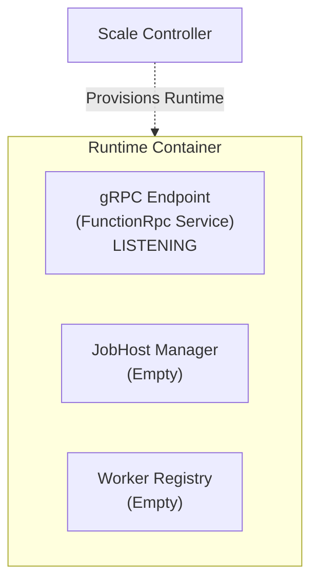
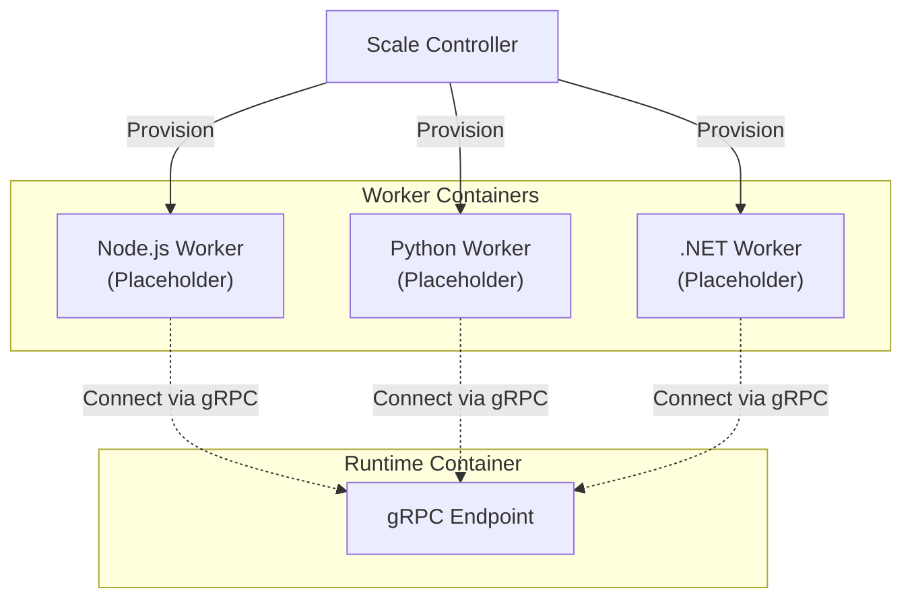
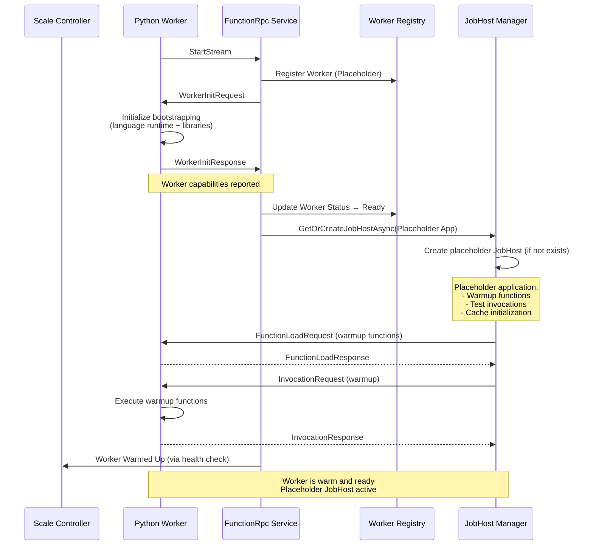
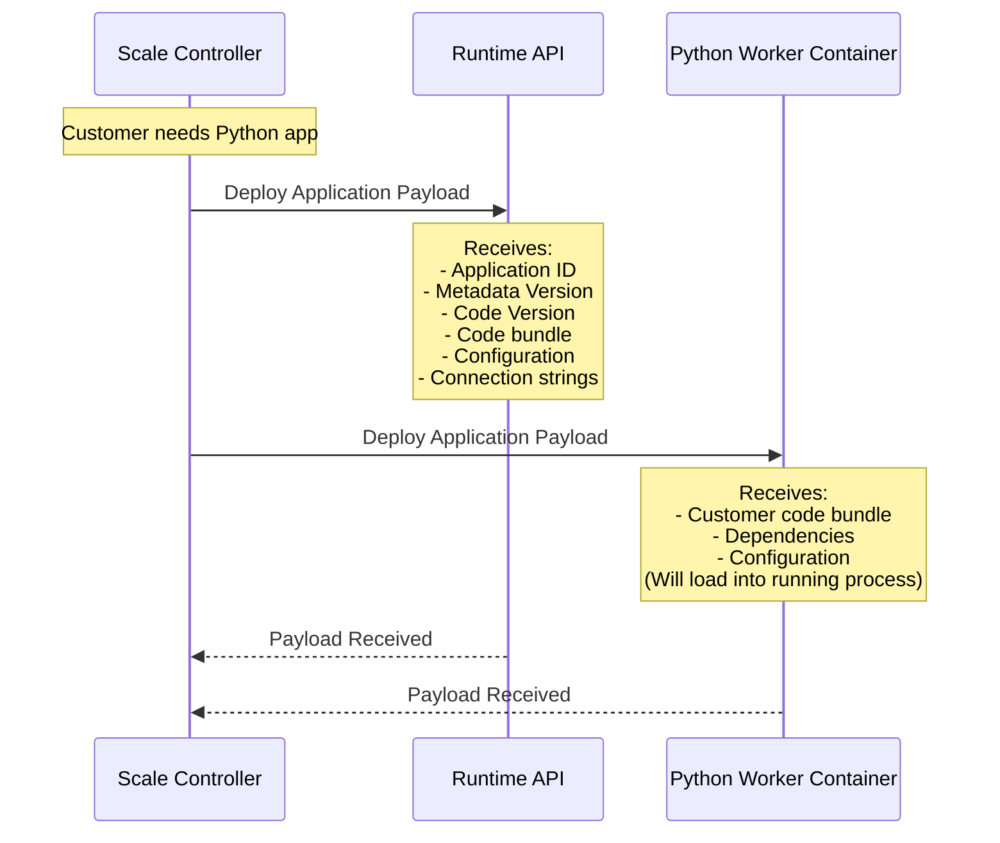
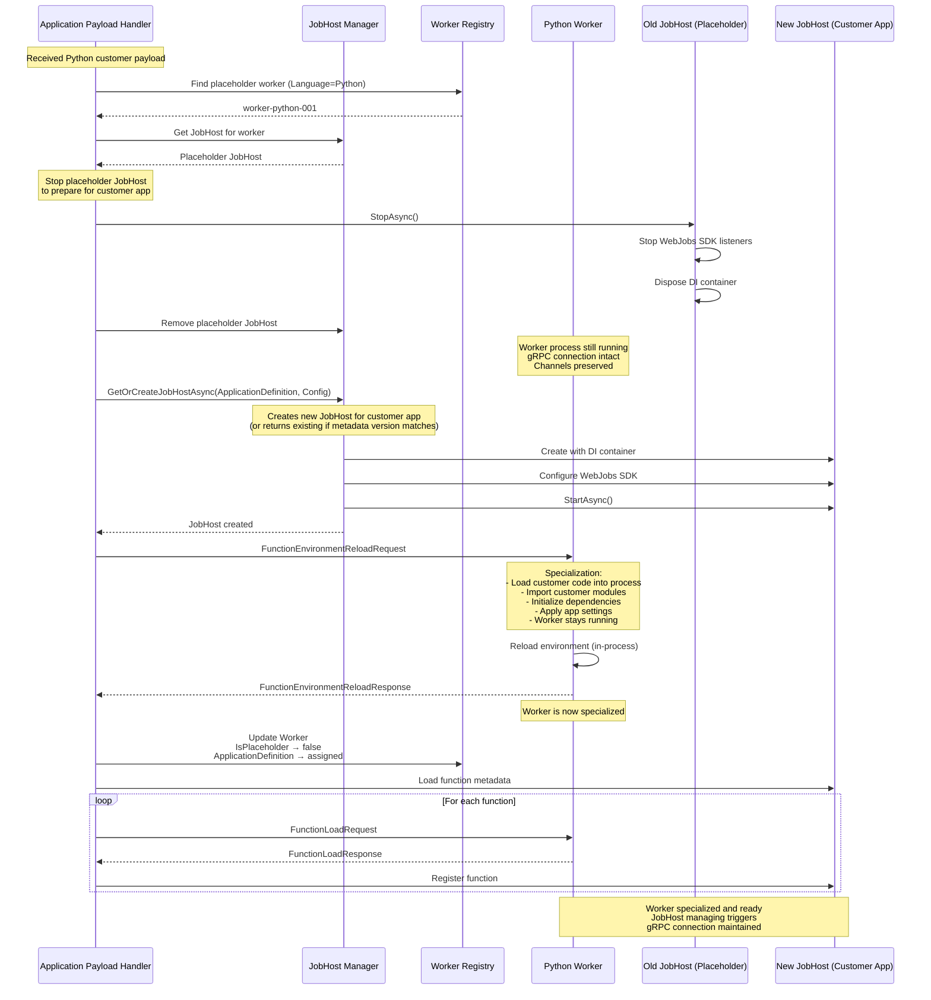
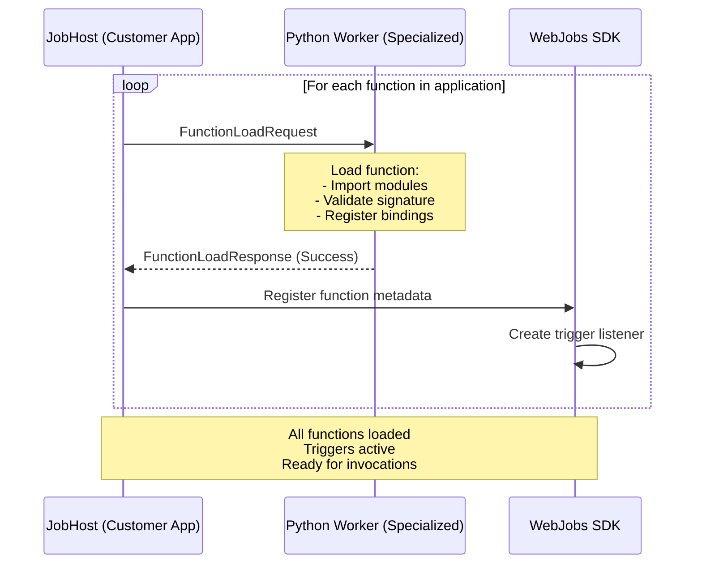
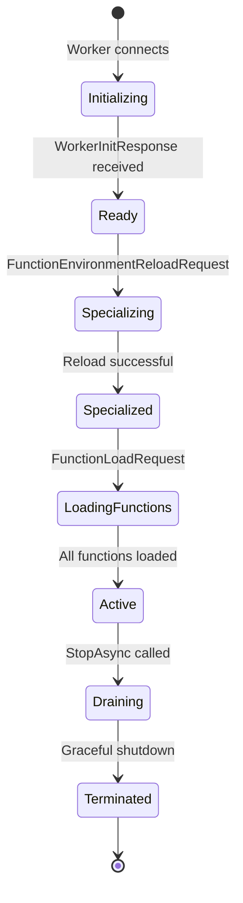
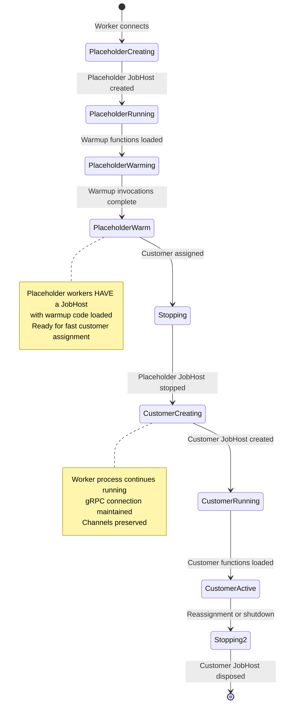
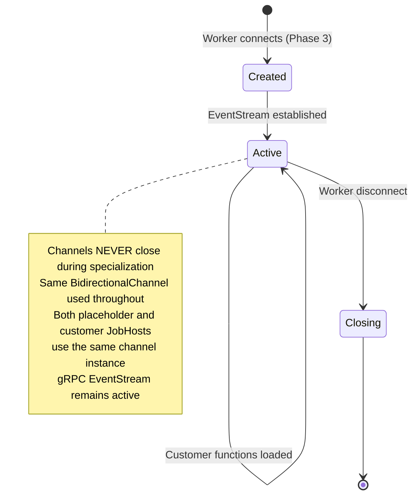

# Placeholder and Specialization Flow

## Overview

This document describes the initialization and specialization workflow for the Runtime, including how placeholder workers are managed and specialized for customer applications in a multi-tenant environment.

---

## Lifecycle Phases

### Phase 1: Runtime Initialization

**State**: Empty Runtime with gRPC endpoint ready



**Key Characteristics:**
- Runtime process is started and healthy
- gRPC server is listening on configured port
- No JobHosts exist yet
- No workers are connected
- Ready to accept worker connections

---

### Phase 2: Placeholder Worker Provisioning

**State**: Infrastructure provisions multiple placeholder workers

The Scale Controller provisions several worker containers, each for a different language runtime:



**Provisioning Steps:**

1. **Scale Controller** provisions worker containers for each language
2. Each worker container starts with language-specific bootstrapping code
3. Workers are configured to connect to Runtime's gRPC endpoint
4. Workers have NO customer-specific application code yet (will load during specialization)

---

### Phase 3: Worker Initialization

**State**: Workers connect and initialize as placeholders



**Initialization Details:**

```csharp
// When worker connects with StartStream
public override async Task EventStream(
    IAsyncStreamReader<StreamingMessage> requestStream,
    IServerStreamWriter<StreamingMessage> responseStream,
    ServerCallContext context)
{
    // Read StartStream message
    var startStream = await requestStream.Current.StartStream;
    
    // Create channels for this worker
    var bidirectionalChannel = new BidirectionalChannel();
    
    // Register placeholder worker
    var workerState = new WorkerState
    {
        WorkerId = startStream.WorkerId,
        Status = WorkerStatus.Initializing,
        IsPlaceholder = true,
        Language = DetermineLanguage(startStream.WorkerCapabilities),
        Channel = bidirectionalChannel
    };
    
    await _workerRegistry.RegisterWorkerAsync(workerState);
    
    // Send WorkerInitRequest
    await responseStream.WriteAsync(new StreamingMessage
    {
        WorkerInitRequest = new WorkerInitRequest
        {
            // Placeholder initialization - no app-specific config
        }
    });
    
    // Wait for WorkerInitResponse
    var initResponse = await requestStream.ReadNextAsync();
    
    // Update worker status
    workerState.Status = WorkerStatus.Ready;
    workerState.Capabilities = initResponse.WorkerInitResponse.Capabilities;
    
    // Create placeholder JobHost for warmup
    var placeholderAppDef = new ApplicationDefinition(
        applicationId: $"_Placeholder_{workerState.Language}",
        metadataVersion: "1.0.0",
        codeVersion: "1.0.0");
    
    var placeholderConfig = new JobHostConfiguration
    {
        ApplicationDefinition = placeholderAppDef,
        // Placeholder application with warmup functions
        Functions = GetWarmupFunctions(workerState.Language)
    };
    
    var placeholderJobHost = await _jobHostManager.GetOrCreateJobHostAsync(placeholderConfig);
    workerState.JobHostId = placeholderJobHost.Id;
    workerState.ApplicationDefinition = placeholderAppDef;
    
    // Load warmup functions and execute them
    await WarmupWorkerAsync(placeholderJobHost, workerState);
    
    // Start bidirectional message processing
    await ProcessWorkerMessagesAsync(requestStream, responseStream, workerState);
}
```

**Worker Registry State After Initialization:**

| Worker ID | Language | Status | Is Placeholder | JobHost | Application | Metadata | Code |
|-----------|----------|--------|----------------|---------|-------------|----------|------|
| worker-node-001 | Node.js | Warm | ✅ Yes | jobhost-placeholder-node | _Placeholder_node | 1.0.0 | 1.0.0 |
| worker-python-001 | Python | Warm | ✅ Yes | jobhost-placeholder-python | _Placeholder_python | 1.0.0 | 1.0.0 |
| worker-dotnet-001 | .NET | Warm | ✅ Yes | jobhost-placeholder-dotnet | _Placeholder_dotnet | 1.0.0 | 1.0.0 |

**Key Points:**
- Workers contain language-specific bootstrapping code (runtime, libraries, framework)
- Placeholder application provides warmup functions to exercise the worker
- Customer-specific code is loaded during specialization (Phase 5)
- Worker processes remain running throughout specialization - they load customer code into themselves
- Workers report their capabilities (language, features, etc.)
- Workers are marked as `IsPlaceholder = true`
- Each worker HAS a placeholder JobHost with warmup functions
- Warmup invocations are executed to prime the worker process
- Workers are cached with initialized dependencies and warm runtime
- Scale Controller can query Runtime health to verify all workers are warmed up

---

### Phase 4: Customer Assignment

**State**: Scale Controller assigns customer application to Runtime



**Payload Structure:**

```csharp
public class ApplicationPayload
{
    // Application Identity
    public ApplicationDefinition ApplicationDefinition { get; set; } // ID + MetadataVersion + CodeVersion
    
    // Code and Dependencies
    public string CodeBundlePath { get; set; }
    public Dictionary<string, string> Dependencies { get; set; }
    
    // Configuration
    public Dictionary<string, string> AppSettings { get; set; }
    public Dictionary<string, string> ConnectionStrings { get; set; }
    
    // Function Metadata
    public List<FunctionMetadata> Functions { get; set; }
    
    // Worker Requirements
    public string RequiredLanguage { get; set; } // "python", "node", "dotnet"
    public string RequiredVersion { get; set; } // "3.11", "20", "8.0"
}
```

---

### Phase 5: Specialization

**State**: Runtime specializes placeholder worker for customer application

This is the most complex phase where the Runtime:
1. Identifies which placeholder worker to use
2. **Stops the placeholder JobHost**
3. **Creates a new JobHost for the customer application**
4. Sends environment reload to the worker
5. **Worker process loads customer code into itself** (without restarting)
6. **Maintains gRPC connection and channels (critical!)**



**Critical Implementation Details:**

#### 5.1: Identifying the Correct Worker

```csharp
public async Task SpecializeAsync(ApplicationPayload payload)
{
    // Find placeholder worker matching required language
    var placeholderWorker = await _workerRegistry.GetPlaceholderWorkerAsync(
        payload.RequiredLanguage, 
        payload.RequiredVersion);
    
    if (placeholderWorker == null)
    {
        throw new InvalidOperationException(
            $"No placeholder worker available for {payload.RequiredLanguage}");
    }
    
    // Worker should have a placeholder JobHost
    if (!placeholderWorker.IsPlaceholder)
    {
        throw new InvalidOperationException(
            $"Worker {placeholderWorker.WorkerId} is already specialized");
    }
    
    // Stop and remove the placeholder JobHost
    var oldAppDef = placeholderWorker.ApplicationDefinition;
    if (oldAppDef != null)
    {
        await _jobHostManager.StopJobHostAsync(oldAppDef);
    }
    
    // Critical: Worker's channel remains intact
    // Only the JobHost is being replaced
}
```

#### 5.2: Creating the New JobHost

```csharp
// Create JobHost for the customer application
var jobHostConfig = new JobHostConfiguration
{
    ApplicationDefinition = payload.ApplicationDefinition,
    ConnectionStrings = payload.ConnectionStrings,
    EnvironmentVariables = payload.AppSettings,
    Triggers = ExtractTriggerConfigurations(payload.Functions)
};

// Create and start the JobHost (or get existing if metadata version matches)
var appDef = payload.ApplicationDefinition;
var jobHost = await _jobHostManager.GetOrCreateJobHostAsync(jobHostConfig);

// IMPORTANT: Associate worker with this JobHost
placeholderWorker.ApplicationDefinition = appDef;
placeholderWorker.JobHostId = jobHost.Id;
```

#### 5.3: Preserving gRPC Connection and Channels

**Key Insight**: The worker's gRPC stream and bidirectional channels MUST remain intact:

```csharp
// The worker's BidirectionalChannel was created during Phase 3
// It remains the same throughout specialization
public class WorkerState
{
    public string WorkerId { get; set; }
    public WorkerStatus Status { get; set; }
    public bool IsPlaceholder { get; set; }
    public ApplicationDefinition? ApplicationDefinition { get; set; }
    
    // THIS CHANNEL IS PRESERVED ACROSS SPECIALIZATION
    public BidirectionalChannel Channel { get; set; }
    
    // gRPC stream context (never changes)
    public IServerStreamWriter<StreamingMessage> ResponseStream { get; set; }
}
```

**Why This Matters:**
- The gRPC `EventStream` call is still active from Phase 3
- The bidirectional channels are already being read/written by both sides
- Specialization happens "in place" without breaking the connection
- The new JobHost simply starts using the existing channels

#### 5.4: Sending FunctionEnvironmentReloadRequest

**Critical**: The worker process remains running and loads customer code into itself:

```csharp
// Send specialization request to worker
var reloadRequest = new StreamingMessage
{
    RequestId = Guid.NewGuid().ToString(),
    FunctionEnvironmentReloadRequest = new FunctionEnvironmentReloadRequest
    {
        EnvironmentVariables = payload.AppSettings
            .Select(kvp => new KeyValuePair<string, string>(kvp.Key, kvp.Value))
            .ToRepeatedField(),
        FunctionAppDirectory = payload.CodeBundlePath
    }
};

// Write to worker's channel (same channel from Phase 3)
await placeholderWorker.Channel.WorkerMessageWriter.WriteAsync(
    new MessageToWorker(reloadRequest));

// Worker receives this and:
// 1. Loads customer code bundle into the running process
// 2. Imports customer modules (Python) or loads assemblies (.NET)
// 3. Initializes customer dependencies
// 4. Applies customer app settings
// 5. Worker process NEVER restarts - code loaded in-process

// Wait for response
var reloadResponse = await WaitForMessageAsync<FunctionEnvironmentReloadResponse>(
    placeholderWorker.Channel.HostMessageReader,
    timeout: TimeSpan.FromSeconds(30));

if (!reloadResponse.Result.IsSuccessful)
{
    throw new SpecializationException(
        $"Worker failed to specialize: {reloadResponse.Result.Exception}");
}

// Update worker state
placeholderWorker.IsPlaceholder = false;
placeholderWorker.Status = WorkerStatus.Specialized;
```

#### 5.5: JobHost Channel Integration

The new JobHost needs to integrate with the existing worker channels:

```csharp
public class JobHost : IHost
{
    private readonly ApplicationDefinition _applicationDefinition;
    private readonly IHost _innerHost;
    
    // Background task that processes messages from workers
    private Task _messageProcessingTask;
    
    public async Task StartAsync(CancellationToken cancellationToken)
    {
        await _innerHost.StartAsync(cancellationToken);
        
        // Get all workers assigned to this application
        var workers = await _workerRegistry.GetWorkersByApplicationAsync(
            _applicationDefinition);
        
        // Start processing messages from each worker
        foreach (var worker in workers)
        {
            // Read from worker's existing channel (created in Phase 3)
            _messageProcessingTask = Task.Run(async () =>
            {
                await foreach (var message in worker.Channel.HostMessageReader.ReadAllAsync())
                {
                    await ProcessWorkerMessageAsync(message);
                }
            }, cancellationToken);
        }
    }
    
    private async Task ProcessWorkerMessageAsync(MessageFromWorker message)
    {
        switch (message.Message.ContentCase)
        {
            case StreamingMessage.ContentOneofCase.InvocationResponse:
                await HandleInvocationResponseAsync(message);
                break;
            case StreamingMessage.ContentOneofCase.FunctionLoadResponse:
                await HandleFunctionLoadResponseAsync(message);
                break;
            // ... other message types
        }
    }
    
    public async Task SendToWorkerAsync(string workerId, MessageToWorker message)
    {
        var worker = await _workerRegistry.GetWorkerAsync(workerId);
        
        // Write to the SAME channel created in Phase 3
        await worker.Channel.WorkerMessageWriter.WriteAsync(message);
    }
}
```

---

### Phase 6: Function Loading

**State**: Load customer functions into the specialized worker



**Function Load Request:**

```csharp
foreach (var function in payload.Functions)
{
    var loadRequest = new StreamingMessage
    {
        RequestId = Guid.NewGuid().ToString(),
        FunctionLoadRequest = new FunctionLoadRequest
        {
            FunctionId = function.FunctionId,
            Metadata = new RpcFunctionMetadata
            {
                Name = function.Name,
                ScriptFile = function.ScriptFile,
                EntryPoint = function.EntryPoint,
                // Bindings (trigger, input, output)
            }
        }
    };
    
    await jobHost.SendToWorkerAsync(worker.WorkerId, new MessageToWorker(loadRequest));
    
    var loadResponse = await WaitForFunctionLoadResponseAsync(function.FunctionId);
    
    if (!loadResponse.Result.IsSuccessful)
    {
        throw new FunctionLoadException(
            $"Failed to load function {function.Name}: {loadResponse.Result.Exception}");
    }
    
    // Register with JobHost's function catalog
    await jobHost.RegisterFunctionAsync(function);
}
```

---

## State Transitions Summary

### Worker State Transitions



### JobHost Lifecycle During Specialization

**Important**: Placeholder workers HAVE a JobHost that must be stopped during specialization:



### Channel Lifecycle (Critical!)



---

## Key Design Principles

### 1. Channel Preservation

**Critical**: The `BidirectionalChannel` created when the worker first connects MUST be preserved throughout specialization.

```csharp
// Phase 3: Worker connects
var channel = new BidirectionalChannel();
workerState.Channel = channel; // Stored in worker registry

// Phase 5: Specialization happens
// THE SAME CHANNEL IS USED - no re-creation

// Phase 6: JobHost uses the existing channel
await jobHost.SendToWorkerAsync(workerId, message); // Uses same channel
```

### 2. JobHost Independence

Each JobHost (placeholder or customer) is isolated with its own:
- DI container (IServiceProvider)
- WebJobs SDK instance
- Function metadata catalog
- Trigger listeners
- Connection strings and configuration

But they share:
- Worker Registry (global)
- gRPC server (global)
- Message routing infrastructure (global)
- **Worker channels (preserved across JobHost transitions)**

### 3. Worker Reusability

A worker can be reused if a customer is unassigned:
1. Customer JobHost is stopped and disposed
2. New placeholder JobHost is created with warmup code
3. Worker is marked as `IsPlaceholder = true` again
4. Warmup invocations re-executed to keep worker warm
5. Worker's channel remains intact throughout
6. Worker can be reassigned to a new customer

This allows efficient resource utilization in multi-tenant scenarios.

---

## Error Handling

### Specialization Failures

```csharp
public async Task<SpecializationResult> SpecializeAsync(ApplicationPayload payload)
{
    WorkerState? worker = null;
    JobHost? jobHost = null;
    
    try
    {
        // Find worker
        worker = await _workerRegistry.GetPlaceholderWorkerAsync(
            payload.RequiredLanguage);
        
        if (worker == null)
        {
            return SpecializationResult.Failed("No placeholder worker available");
        }
        
        // Create JobHost (or get existing if same metadata version)
        jobHost = await _jobHostManager.GetOrCreateJobHostAsync(
            CreateJobHostConfiguration(payload));
        
        // Send environment reload
        var reloadResponse = await SendEnvironmentReloadAsync(worker, payload);
        
        if (!reloadResponse.Result.IsSuccessful)
        {
            // Rollback: Stop JobHost, keep worker as placeholder
            await _jobHostManager.StopJobHostAsync(payload.ApplicationDefinition);
            return SpecializationResult.Failed(reloadResponse.Result.Exception);
        }
        
        // Load functions
        foreach (var function in payload.Functions)
        {
            var loadResult = await LoadFunctionAsync(jobHost, worker, function);
            if (!loadResult.IsSuccessful)
            {
                // Rollback: Stop JobHost, reset worker
                await _jobHostManager.StopJobHostAsync(payload.ApplicationDefinition);
                worker.IsPlaceholder = true;
                worker.ApplicationDefinition = null;
                return SpecializationResult.Failed(loadResult.Exception);
            }
        }
        
        // Success
        worker.IsPlaceholder = false;
        worker.ApplicationDefinition = payload.ApplicationDefinition;
        worker.Status = WorkerStatus.Active;
        
        return SpecializationResult.Success();
    }
    catch (Exception ex)
    {
        // Cleanup on unexpected error
        if (jobHost != null)
        {
            await _jobHostManager.StopJobHostAsync(payload.ApplicationDefinition);
        }
        
        if (worker != null)
        {
            worker.IsPlaceholder = true;
            worker.ApplicationDefinition = null;
            worker.Status = WorkerStatus.Ready;
        }
        
        return SpecializationResult.Failed(ex.Message);
    }
}
```

---

## Multi-Tenant Considerations

When multiple customers are assigned to the same Runtime:

```
Runtime Container
├── Worker Registry
│   ├── Python Worker (App A, v1.0)
│   ├── Python Worker (App B, v2.0)
│   └── Node Worker (Placeholder)
└── JobHost Manager
    ├── JobHost (App A, v1.0)
    └── JobHost (App B, v2.0)
```

Each customer gets:
- Their own JobHost (isolated DI, config, triggers)
- Their own specialized worker process
- Shared gRPC infrastructure (but isolated channels)

---

## Performance Characteristics

### Cold Start Time Breakdown

| Phase | Duration | Notes |
|-------|----------|-------|
| Phase 1: Runtime Init | ~2-5s | One-time cost |
| Phase 2: Worker Provision | ~3-10s | Parallel provisioning |
| Phase 3: Worker Init | ~1-2s | Per worker |
| Phase 4: Payload Deploy | ~0.5-1s | Network transfer |
| Phase 5: Specialization | ~2-5s | Language-dependent |
| Phase 6: Function Load | ~0.5-2s | Per function |
| **Total Cold Start** | **~9-25s** | Varies by language/complexity |

### Warm Start (Reusing Specialized Worker)

If a specialized worker already exists for an application:
- No Phase 2-5 needed
- Only trigger activation: ~100-500ms

---

## Comparison to Legacy Model

### Legacy (Current Functions Host)

- Each worker is tied to a single app from the start
- No placeholder mode
- Cold start includes worker process launch
- Every scale-out requires full worker initialization

### New Worker Model

- Placeholder workers pre-provisioned
- Specialization is faster than full worker init
- Can reuse workers across customer assignments
- Better multi-tenant density

