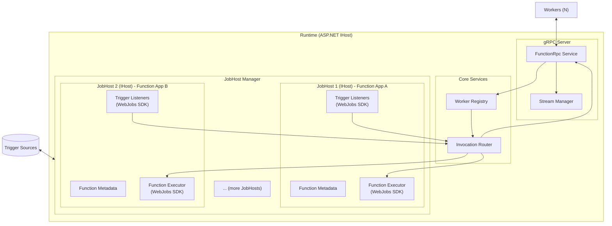
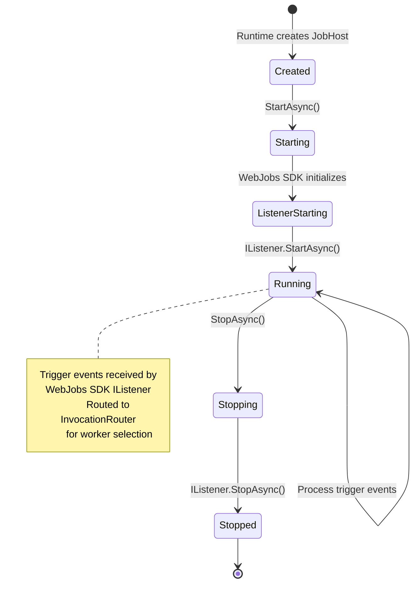
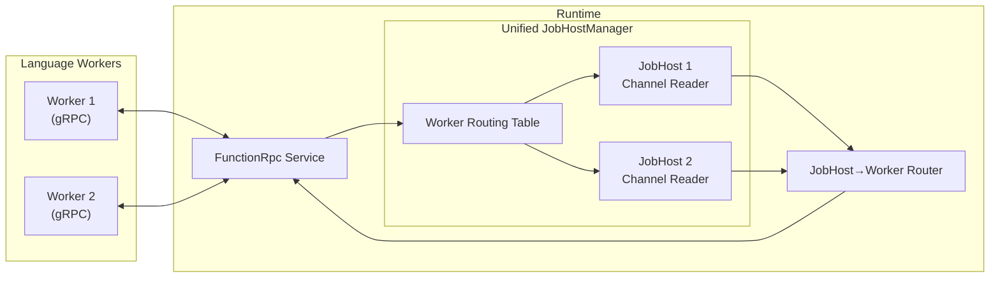
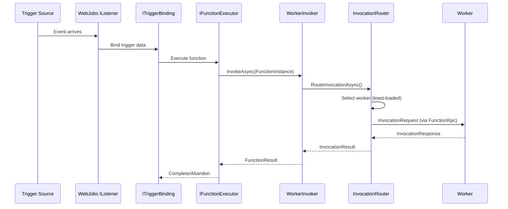
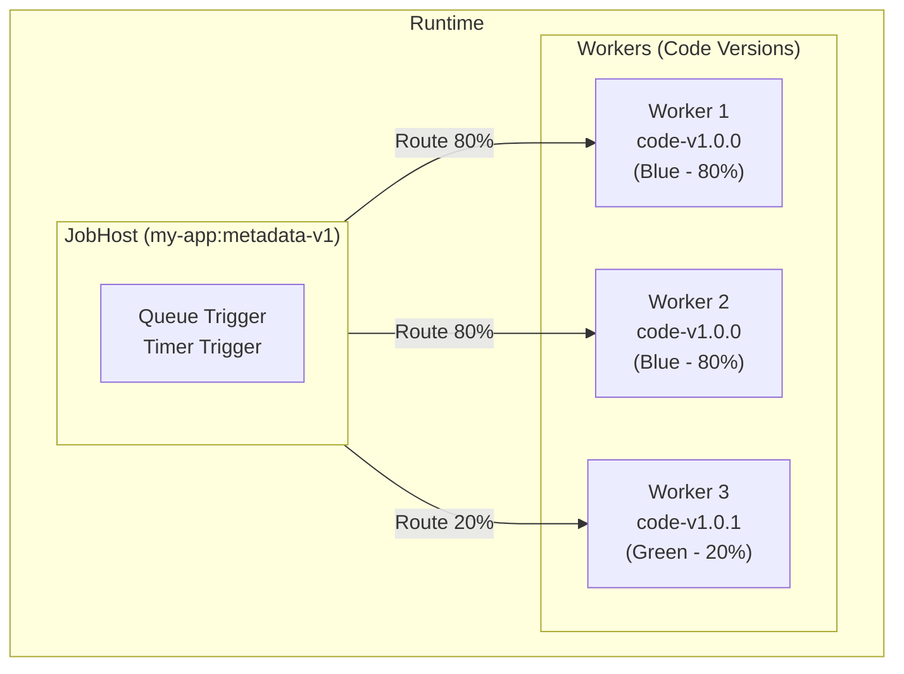

# Runtime Component - Detailed Design

## Overview

The Runtime is the central orchestration component that bridges trigger sources and worker execution. It listens for events from Azure services, manages a pool of workers, and routes invocations for efficient processing.

**Technology Stack:**
- Platform: .NET 8+
- Framework: ASP.NET Core
- Language: C#
- gRPC: Grpc.AspNetCore
- Protocol: Azure Functions Language Worker Protocol (FunctionRpc)

---

## Responsibilities

| Responsibility | Description |
|---------------|-------------|
| **Trigger Listening** | Listen for events from Azure Queue, Service Bus, Event Hub |
| **Worker Pool Management** | Maintain registry of connected workers, track health and capacity |
| **FunctionRpc Host** | Implement Azure Functions protobuf protocol server |
| **Invocation Routing** | Route trigger events to workers using load balancing strategies |
| **Message Lifecycle** | Complete/abandon/dead-letter messages based on execution results |
| **Function Orchestration** | Coordinate function loading across worker pool |
| **Placeholder Specialization** | Trigger worker specialization via EnvironmentReload |
| **Observability** | Emit metrics, logs, and traces for monitoring |

---

## High-Level Architecture



---

## Runtime Architecture: IHost and JobHost

### ASP.NET IHost (Main Runtime Host)

The Runtime is built on ASP.NET Core's `IHost` pattern, which provides:
- Dependency injection container
- Configuration management
- Logging infrastructure
- Hosted services lifecycle
- Graceful shutdown coordination

**Key Responsibilities:**
- Host gRPC server for FunctionRpc protocol
- Manage worker registry and routing
- Coordinate multiple JobHost instances (multi-tenant support)
- Provide shared services (logging, metrics, tracing)

### JobHost (One per Function Application)

Each JobHost is an `IHost` instance that:
- Maps to a single customer's **Function Application**
- Uses **Azure WebJobs SDK** internally
- Manages all triggers for that specific Function App
- Runs all trigger listeners via WebJobs SDK
- Executes function invocations via WebJobs SDK
- Reports to parent IHost for invocation routing

**Multi-Tenant Support:**
The Runtime can host multiple JobHost instances simultaneously, enabling multi-tenant scenarios where each tenant's Function App runs in isolation within the same Runtime process.

**WebJobs SDK Integration:**

```csharp
// JobHost uses WebJobs SDK components:
- IListener (from WebJobs SDK) - Listens to trigger sources
- IFunctionExecutor - Executes function invocations
- IFunctionInvoker - Invokes customer code (via worker)
- ITriggerBinding - Binds trigger data to function parameters
```

**JobHost Lifecycle:**



**Relationship:**

```
ASP.NET IHost (Runtime)
├── FunctionRpc gRPC Service
├── Worker Registry
├── Invocation Router
└── JobHost Manager
    ├── JobHost 1 (IHost) - Function App A
    │   ├── Function Metadata
    │   └── WebJobs SDK
    │       ├── Queue Listener
    │       ├── Service Bus Listener
    │       └── ... (all triggers for App A)
    ├── JobHost 2 (IHost) - Function App B
    │   ├── Function Metadata
    │   └── WebJobs SDK
    │       ├── Event Hub Listener
    │       ├── HTTP Listener
    │       └── ... (all triggers for App B)
    └── ... (more JobHosts)
```

**Key Design Points:**

1. **Multi-Tenant Support**: Multiple JobHosts run simultaneously, each managing a separate Function Application
2. **Isolation**: Each JobHost runs in isolation with its own DI scope and configuration
3. **Per-App Management**: Single JobHost manages all triggers for its Function App
4. **Lifecycle**: Each JobHost can be started/stopped independently
3. **WebJobs SDK**: Leverages existing, battle-tested trigger infrastructure
4. **Extensibility**: New trigger types added via WebJobs SDK extensions
5. **Compatibility**: Maintains compatibility with existing Azure Functions extensions

---

## Communication Flow Architecture

All internal communication between Runtime components uses **System.Threading.Channels** for efficient, asynchronous message passing.

### Channel-Based Message Routing



> **Design Note**: The `JobHostManager` combines both JobHost lifecycle management and worker-to-JobHost message routing into a single component. This enables atomic routing cutover during specialization and eliminates state synchronization issues between separate router and manager classes. See [Channel Routing During Specialization](#channel-routing-during-specialization) for full details.

### Message Flow: Worker → JobHost

When a message arrives from a worker via gRPC, it must be routed to the correct JobHost. This routing is handled by `JobHostManager.RouteMessageAsync()` (see [Channel Routing During Specialization](#channel-routing-during-specialization) for the unified design):

```csharp
// Simplified view - routing is integrated into JobHostManager
// Worker registration creates the routing entry
await _jobHostManager.RegisterWorkerRoutingAsync(workerId, jobHostKey, ct);

// Messages are routed via the unified interface
await _jobHostManager.RouteMessageAsync(workerId, message, ct);

// During specialization, routing switches atomically
await _jobHostManager.SwitchWorkerRoutingAsync(
    workerId, fromJobHostKey, toJobHostKey, ct);
```

### Message Types Handled

```csharp
public class WorkerMessage
{
    public string MessageId { get; set; }
    public MessageType MessageType { get; set; }
    public string? WorkerId { get; set; }
    public string? FunctionId { get; set; }
    public string? InvocationId { get; set; }
    public StreamingMessage GrpcMessage { get; set; }
}
```

### Message Flow: JobHost → Worker

When a JobHost needs to send a message to a worker, it must be routed through the correct worker's gRPC stream:

```csharp
public class JobHostToWorkerRouter
{
    // Each worker has a dedicated channel for receiving messages from JobHosts
    private readonly ConcurrentDictionary<string, ChannelWriter<JobHostMessage>> _workerChannels = new();
    private readonly IWorkerRegistry _workerRegistry;
    
    public void RegisterWorker(string workerId, ChannelWriter<JobHostMessage> channelWriter)
    {
        _workerChannels[workerId] = channelWriter;
    }
    
    public void UnregisterWorker(string workerId)
    {
        _workerChannels.TryRemove(workerId, out _);
    }
    
    public async Task RouteMessageToWorkerAsync(
        JobHostMessage message, 
        CancellationToken cancellationToken)
    {
        // Determine target worker (could be specific worker ID or selected by routing strategy)
        var workerId = message.TargetWorkerId ?? await SelectWorkerAsync(message);
        
        if (_workerChannels.TryGetValue(workerId, out var channelWriter))
        {
            await channelWriter.WriteAsync(message, cancellationToken);
        }
        else
        {
            throw new InvalidOperationException($"No worker found with ID {workerId}");
        }
    }
    
    private async Task<string> SelectWorkerAsync(JobHostMessage message)
    {
        // Use worker selection strategy (round-robin, least-loaded, etc.)
        var availableWorkers = await _workerRegistry.GetReadyWorkersAsync(message.FunctionId);
        
        if (!availableWorkers.Any())
        {
            throw new InvalidOperationException(
                $"No ready workers available for function {message.FunctionId}");
        }
        
        // Simple round-robin for now
        return availableWorkers.First().WorkerId;
    }
}

public class JobHostMessage
{
    public string MessageId { get; set; }
    public MessageType MessageType { get; set; }
    public ApplicationDefinition SourceApplication { get; set; }
    public string? TargetWorkerId { get; set; }
    public string? FunctionId { get; set; }
    public string? InvocationId { get; set; }
    public StreamingMessage GrpcMessage { get; set; }
}
```

### JobHost Channel Integration

Each JobHost has bidirectional channels for communication:

```csharp
public class JobHost : IHost
{
    private readonly Channel<WorkerMessage> _inboundChannel;
    private readonly ChannelWriter<JobHostMessage> _outboundChannelWriter;
    private readonly ApplicationDefinition _applicationDefinition;
    
    public JobHost(
        JobHostConfiguration config,
        ChannelWriter<JobHostMessage> outboundChannelWriter)
    {
        _applicationDefinition = config.ApplicationDefinition;
        _outboundChannelWriter = outboundChannelWriter;
        
        // Create unbounded channel for inbound messages
        _inboundChannel = Channel.CreateUnbounded<WorkerMessage>(new UnboundedChannelOptions
        {
            SingleReader = true,
            SingleWriter = false
        });
    }
    
    public ChannelReader<WorkerMessage> InboundReader => _inboundChannel.Reader;
    public ChannelWriter<WorkerMessage> InboundWriter => _inboundChannel.Writer;
    
    protected override async Task ExecuteAsync(CancellationToken stoppingToken)
    {
        // Process inbound messages from workers
        await foreach (var message in _inboundChannel.Reader.ReadAllAsync(stoppingToken))
        {
            await ProcessInboundMessageAsync(message, stoppingToken);
        }
    }
    
    private async Task ProcessInboundMessageAsync(WorkerMessage message, CancellationToken cancellationToken)
    {
        switch (message.MessageType)
        {
            case MessageType.InvocationResponse:
                await HandleInvocationResponseAsync(message, cancellationToken);
                break;
            case MessageType.FunctionLoadResponse:
                await HandleFunctionLoadResponseAsync(message, cancellationToken);
                break;
            // ... other message types
        }
    }
    
    // Send message to worker
    public async Task SendToWorkerAsync(JobHostMessage message, CancellationToken cancellationToken)
    {
        message.SourceApplication = _applicationDefinition;
        await _outboundChannelWriter.WriteAsync(message, cancellationToken);
    }
}
```

### FunctionRpc Service Integration

The FunctionRpc service bridges gRPC streams and internal channels:

```csharp
public class FunctionRpcService : FunctionRpc.FunctionRpcBase
{
    private readonly WorkerToJobHostRouter _workerToJobHostRouter;
    private readonly JobHostToWorkerRouter _jobHostToWorkerRouter;
    
    public override async Task EventStream(
        IAsyncStreamReader<StreamingMessage> requestStream,
        IServerStreamWriter<StreamingMessage> responseStream,
        ServerCallContext context)
    {
        var workerId = await InitializeWorkerAsync(requestStream, responseStream, context);
        
        // Create channel for this worker to receive messages from JobHosts
        var workerChannel = Channel.CreateUnbounded<JobHostMessage>(new UnboundedChannelOptions
        {
            SingleReader = true,
            SingleWriter = false
        });
        
        _jobHostToWorkerRouter.RegisterWorker(workerId, workerChannel.Writer);
        
        try
        {
            // Bidirectional communication using channels
            var receiveTask = ReceiveFromWorkerAsync(requestStream, workerId, context.CancellationToken);
            var sendTask = SendToWorkerAsync(responseStream, workerChannel.Reader, context.CancellationToken);
            
            await Task.WhenAny(receiveTask, sendTask);
        }
        finally
        {
            _jobHostToWorkerRouter.UnregisterWorker(workerId);
        }
    }
    
    private async Task ReceiveFromWorkerAsync(
        IAsyncStreamReader<StreamingMessage> requestStream,
        string workerId,
        CancellationToken cancellationToken)
    {
        await foreach (var grpcMessage in requestStream.ReadAllAsync(cancellationToken))
        {
            var workerMessage = new WorkerMessage
            {
                MessageId = grpcMessage.RequestId,
                MessageType = DetermineMessageType(grpcMessage),
                WorkerId = workerId,
                GrpcMessage = grpcMessage
            };
            
            // Route to appropriate JobHost via channel
            await _workerToJobHostRouter.RouteMessageToJobHostAsync(workerMessage, cancellationToken);
        }
    }
    
    private async Task SendToWorkerAsync(
        IServerStreamWriter<StreamingMessage> responseStream,
        ChannelReader<JobHostMessage> channelReader,
        CancellationToken cancellationToken)
    {
        await foreach (var message in channelReader.ReadAllAsync(cancellationToken))
        {
            // Send message from JobHost to worker via gRPC
            await responseStream.WriteAsync(message.GrpcMessage, cancellationToken);
        }
    }
}
```

### Key Benefits of Channel-Based Architecture

1. **Decoupling**: JobHosts don't need direct references to worker gRPC streams
2. **Backpressure**: Channels naturally handle flow control and backpressure
3. **Testability**: Easy to mock channels for unit testing
4. **Performance**: Efficient, lock-free message passing
5. **Cancellation**: Built-in support for cancellation tokens
6. **Multi-Tenant Isolation**: Each JobHost has dedicated channels preventing cross-tenant communication

---

## Channel Routing During Specialization

### The Problem

During specialization, we need to:
1. **Shut down** the Placeholder JobHost
2. **Start** a new Customer JobHost
3. **Transfer** the worker's channel to the new JobHost

The challenge is that these operations happen in parallel. The Placeholder JobHost may still be reading from the channel while we're setting up the new JobHost. If we're not careful:
- Messages could be lost during the transition
- The Placeholder JobHost could process messages meant for the Customer JobHost
- Race conditions could cause unexpected behavior

```
┌─────────────────────────────────────────────────────────────────────────┐
│  The Problem: Parallel Shutdown and Startup                             │
├─────────────────────────────────────────────────────────────────────────┤
│                                                                         │
│  Time ─────────────────────────────────────────────────────────────►    │
│                                                                         │
│  Placeholder JobHost:  [────Reading from Channel────][Shutdown]         │
│                                                      ↑                  │
│                                                      │ Race condition!  │
│                                                      │ Who owns channel?│
│  Customer JobHost:                        [Starting][Reading Channel]   │
│                                                                         │
│  Worker Messages:     ──►M1──►M2──►M3──►M4──►M5──►M6──►M7──►            │
│                                         ↑                               │
│                                         │                               │
│                              Which JobHost receives M4, M5, M6?         │
│                                                                         │
└─────────────────────────────────────────────────────────────────────────┘
```

### Solution: Unified JobHostManager with Integrated Routing

Rather than having separate `WorkerChannelRouter` and `JobHostManager` classes, we combine them into a single `JobHostManager` that owns both:
1. **JobHost lifecycle** (create, start, stop)
2. **Worker-to-JobHost routing** (message forwarding, cutover during specialization)

This design ensures:
- **Single source of truth** for JobHost state and routing
- **Atomic operations** during specialization (create JobHost + switch routing in one operation)
- **Simpler coordination** - no need to keep separate classes in sync

```
┌─────────────────────────────────────────────────────────────────────────┐
│  Unified JobHostManager Architecture                                    │
├─────────────────────────────────────────────────────────────────────────┤
│                                                                         │
│  ┌─────────────────────────────────────────────────────────────────┐   │
│  │  gRPC Layer (Worker Connections)                                 │   │
│  │  Worker 1 ──────┐                                                │   │
│  │  Worker 2 ──────┼─► Messages                                     │   │
│  │  Worker 3 ──────┘                                                │   │
│  └────────────────────────────┬────────────────────────────────────┘   │
│                               │                                         │
│                               ▼                                         │
│  ┌─────────────────────────────────────────────────────────────────┐   │
│  │  JobHostManager                                                  │   │
│  │  ┌───────────────────────────────────────────────────────────┐  │   │
│  │  │  JobHost Registry (lifecycle management)                   │  │   │
│  │  │  - CreateJobHostAsync() / GetOrCreateJobHostAsync()       │  │   │
│  │  │  - StopJobHostAsync()                                      │  │   │
│  │  │  - GetJobHostAsync()                                       │  │   │
│  │  ├───────────────────────────────────────────────────────────┤  │   │
│  │  │  Worker Routing Table (per-worker → JobHost mapping)       │  │   │
│  │  │  - RegisterWorkerRouting()                                 │  │   │
│  │  │  - RouteMessageAsync()                                     │  │   │
│  │  │  - SwitchWorkerRoutingAsync() ← Atomic cutover            │  │   │
│  │  └───────────────────────────────────────────────────────────┘  │   │
│  └───────────────┬──────────────────────────────────┬──────────────┘   │
│                  │                                  │                   │
│                  ▼                                  ▼                   │
│  ┌─────────────────────────────┐    ┌─────────────────────────────┐   │
│  │  Placeholder JobHost        │    │  Customer JobHost           │   │
│  │  (owns its Channel)         │    │  (owns its Channel)         │   │
│  └─────────────────────────────┘    └─────────────────────────────┘   │
│                                                                         │
└─────────────────────────────────────────────────────────────────────────┘
```

### JobHostManager: Combined Interface

```csharp
public interface IJobHostManager
{
    // ═══════════════════════════════════════════════════════════════════
    // JobHost Lifecycle Management
    // ═══════════════════════════════════════════════════════════════════
    
    /// <summary>
    /// Creates a new JobHost for an application's metadata version.
    /// Returns existing JobHost if one exists for the same metadata version.
    /// </summary>
    Task<JobHost> GetOrCreateJobHostAsync(JobHostConfiguration config);
    
    /// <summary>
    /// Gets a JobHost by its key (ApplicationId:MetadataVersion)
    /// </summary>
    Task<JobHost?> GetJobHostAsync(string jobHostKey);
    
    Task<IEnumerable<JobHost>> GetAllJobHostsAsync();
    
    Task StopJobHostAsync(string jobHostKey);
    
    // ═══════════════════════════════════════════════════════════════════
    // Worker-to-JobHost Routing
    // ═══════════════════════════════════════════════════════════════════
    
    /// <summary>
    /// Register a worker's initial routing to a JobHost.
    /// Called when worker first connects or during specialization.
    /// </summary>
    Task RegisterWorkerRoutingAsync(
        string workerId,
        string jobHostKey,
        CancellationToken cancellationToken);
    
    /// <summary>
    /// Route a message from a worker to its assigned JobHost.
    /// </summary>
    ValueTask RouteMessageAsync(
        string workerId,
        WorkerMessage message,
        CancellationToken cancellationToken);
    
    /// <summary>
    /// Atomically switch a worker's routing from one JobHost to another.
    /// Used during specialization to cutover from Placeholder to Customer JobHost.
    /// Handles: draining pending messages, completing old channel, starting new routing.
    /// </summary>
    Task SwitchWorkerRoutingAsync(
        string workerId,
        string fromJobHostKey,
        string toJobHostKey,
        CancellationToken cancellationToken);
    
    /// <summary>
    /// Remove a worker's routing (worker disconnected).
    /// </summary>
    Task UnregisterWorkerAsync(string workerId);
}
```

### JobHostManager Implementation

```csharp
public class JobHostManager : IJobHostManager
{
    // ═══════════════════════════════════════════════════════════════════
    // State
    // ═══════════════════════════════════════════════════════════════════
    
    // JobHost registry: keyed by ApplicationId:MetadataVersion
    private readonly ConcurrentDictionary<string, JobHostEntry> _jobHosts = new();
    
    // Worker routing: keyed by WorkerId
    private readonly ConcurrentDictionary<string, WorkerRoutingEntry> _workerRouting = new();
    
    private readonly ILogger<JobHostManager> _logger;
    
    // ═══════════════════════════════════════════════════════════════════
    // JobHost Lifecycle
    // ═══════════════════════════════════════════════════════════════════
    
    public async Task<JobHost> GetOrCreateJobHostAsync(JobHostConfiguration config)
    {
        var appDef = config.ApplicationDefinition;
        var jobHostKey = appDef.GetJobHostKey();
        
        // Check for existing
        if (_jobHosts.TryGetValue(jobHostKey, out var existing))
        {
            _logger.LogInformation(
                "Reusing existing JobHost {JobHostKey}",
                jobHostKey);
            return existing.JobHost;
        }
        
        // Create new JobHost with its own inbound channel
        var inboundChannel = Channel.CreateBounded<WorkerMessage>(
            new BoundedChannelOptions(1000)
            {
                SingleReader = true,
                SingleWriter = false,
                FullMode = BoundedChannelFullMode.Wait
            });
        
        var jobHost = new JobHost(config, inboundChannel.Reader, _logger);
        
        var entry = new JobHostEntry
        {
            JobHostKey = jobHostKey,
            JobHost = jobHost,
            InboundChannel = inboundChannel,
            ApplicationDefinition = appDef,
            CreatedAt = DateTimeOffset.UtcNow
        };
        
        if (!_jobHosts.TryAdd(jobHostKey, entry))
        {
            // Another thread created it first
            return _jobHosts[jobHostKey].JobHost;
        }
        
        // Start the JobHost
        await jobHost.StartAsync(CancellationToken.None);
        
        _logger.LogInformation(
            "Created and started JobHost {JobHostKey}",
            jobHostKey);
        
        return jobHost;
    }
    
    public async Task StopJobHostAsync(string jobHostKey)
    {
        if (!_jobHosts.TryRemove(jobHostKey, out var entry))
        {
            _logger.LogWarning(
                "Attempted to stop non-existent JobHost {JobHostKey}",
                jobHostKey);
            return;
        }
        
        // Complete the inbound channel - signals JobHost to stop processing
        entry.InboundChannel.Writer.Complete();
        
        // Stop the JobHost
        await entry.JobHost.StopAsync(CancellationToken.None);
        
        _logger.LogInformation(
            "Stopped JobHost {JobHostKey}",
            jobHostKey);
    }
    
    // ═══════════════════════════════════════════════════════════════════
    // Worker Routing
    // ═══════════════════════════════════════════════════════════════════
    
    public Task RegisterWorkerRoutingAsync(
        string workerId,
        string jobHostKey,
        CancellationToken cancellationToken)
    {
        if (!_jobHosts.TryGetValue(jobHostKey, out var jobHostEntry))
        {
            throw new InvalidOperationException(
                $"Cannot register routing: JobHost {jobHostKey} not found");
        }
        
        var routingEntry = new WorkerRoutingEntry
        {
            WorkerId = workerId,
            CurrentJobHostKey = jobHostKey,
            ChannelWriter = jobHostEntry.InboundChannel.Writer,
            PendingMessages = Channel.CreateBounded<WorkerMessage>(100)
        };
        
        _workerRouting[workerId] = routingEntry;
        
        _logger.LogInformation(
            "Registered worker {WorkerId} routing to JobHost {JobHostKey}",
            workerId,
            jobHostKey);
        
        return Task.CompletedTask;
    }
    
    public async ValueTask RouteMessageAsync(
        string workerId,
        WorkerMessage message,
        CancellationToken cancellationToken)
    {
        if (!_workerRouting.TryGetValue(workerId, out var routingEntry))
        {
            _logger.LogWarning(
                "No routing entry for worker {WorkerId}, dropping message {MessageId}",
                workerId,
                message.MessageId);
            return;
        }
        
        // Route to the worker's currently assigned JobHost channel
        try
        {
            await routingEntry.ChannelWriter.WriteAsync(message, cancellationToken);
        }
        catch (ChannelClosedException)
        {
            // Channel was closed during cutover - queue for later
            await routingEntry.PendingMessages.Writer.WriteAsync(message, cancellationToken);
        }
    }
    
    public async Task SwitchWorkerRoutingAsync(
        string workerId,
        string fromJobHostKey,
        string toJobHostKey,
        CancellationToken cancellationToken)
    {
        if (!_workerRouting.TryGetValue(workerId, out var routingEntry))
        {
            throw new InvalidOperationException(
                $"Cannot switch routing: Worker {workerId} not registered");
        }
        
        if (routingEntry.CurrentJobHostKey != fromJobHostKey)
        {
            throw new InvalidOperationException(
                $"Worker {workerId} not routed to {fromJobHostKey} (currently: {routingEntry.CurrentJobHostKey})");
        }
        
        if (!_jobHosts.TryGetValue(toJobHostKey, out var newJobHostEntry))
        {
            throw new InvalidOperationException(
                $"Cannot switch routing: Target JobHost {toJobHostKey} not found");
        }
        
        _logger.LogInformation(
            "Switching worker {WorkerId} routing: {FromJobHost} → {ToJobHost}",
            workerId,
            fromJobHostKey,
            toJobHostKey);
        
        // Get old channel writer for completion
        var oldChannelWriter = routingEntry.ChannelWriter;
        
        // Atomic switch to new channel
        routingEntry.ChannelWriter = newJobHostEntry.InboundChannel.Writer;
        routingEntry.CurrentJobHostKey = toJobHostKey;
        
        // Drain any pending messages to new JobHost
        while (routingEntry.PendingMessages.Reader.TryRead(out var pendingMessage))
        {
            await routingEntry.ChannelWriter.WriteAsync(pendingMessage, cancellationToken);
        }
        
        // Complete old channel (signals old JobHost to finish processing)
        // Note: We don't complete if other workers are still using this JobHost
        var workersOnOldJobHost = _workerRouting.Values
            .Count(r => r.CurrentJobHostKey == fromJobHostKey);
        
        if (workersOnOldJobHost == 0)
        {
            _logger.LogDebug(
                "No workers remaining on JobHost {JobHostKey}, can be stopped",
                fromJobHostKey);
            // Caller should call StopJobHostAsync if appropriate
        }
        
        _logger.LogInformation(
            "Worker {WorkerId} routing switched to JobHost {ToJobHost}",
            workerId,
            toJobHostKey);
    }
    
    public Task UnregisterWorkerAsync(string workerId)
    {
        if (_workerRouting.TryRemove(workerId, out var entry))
        {
            _logger.LogInformation(
                "Unregistered worker {WorkerId} (was routed to {JobHostKey})",
                workerId,
                entry.CurrentJobHostKey);
        }
        
        return Task.CompletedTask;
    }
    
    // ═══════════════════════════════════════════════════════════════════
    // Internal Types
    // ═══════════════════════════════════════════════════════════════════
    
    private class JobHostEntry
    {
        public string JobHostKey { get; set; }
        public JobHost JobHost { get; set; }
        public Channel<WorkerMessage> InboundChannel { get; set; }
        public ApplicationDefinition ApplicationDefinition { get; set; }
        public DateTimeOffset CreatedAt { get; set; }
    }
    
    private class WorkerRoutingEntry
    {
        public string WorkerId { get; set; }
        public string CurrentJobHostKey { get; set; }
        public ChannelWriter<WorkerMessage> ChannelWriter { get; set; }
        public Channel<WorkerMessage> PendingMessages { get; set; }
    }
}
```

### Specialization Flow with Unified JobHostManager

The specialization process is simplified because one component handles everything:

```csharp
public class SpecializationOrchestrator
{
    private readonly IJobHostManager _jobHostManager;
    
    public async Task SpecializeWorkerAsync(
        WorkerState worker,
        ApplicationDefinition customerApp,
        CancellationToken cancellationToken)
    {
        var placeholderJobHostKey = worker.JobHostKey;
        var customerJobHostKey = customerApp.GetJobHostKey();
        
        _logger.LogInformation(
            "Specializing worker {WorkerId}: {PlaceholderJobHost} → {CustomerJobHost}",
            worker.WorkerId,
            placeholderJobHostKey,
            customerJobHostKey);
        
        // Step 1: Create Customer JobHost (JobHostManager handles channel creation)
        var customerJobHost = await _jobHostManager.GetOrCreateJobHostAsync(
            new JobHostConfiguration
            {
                ApplicationDefinition = customerApp,
                // ... other config
            });
        
        // Step 2: Atomic routing switch (JobHostManager handles channel cutover)
        await _jobHostManager.SwitchWorkerRoutingAsync(
            worker.WorkerId,
            fromJobHostKey: placeholderJobHostKey,
            toJobHostKey: customerJobHostKey,
            cancellationToken);
        
        // Step 3: Update worker state
        worker.JobHostKey = customerJobHostKey;
        worker.ApplicationDefinition = customerApp;
        worker.IsPlaceholder = false;
        
        // Step 4: Check if Placeholder JobHost can be stopped
        // (only if no other workers are using it)
        var placeholderJobHost = await _jobHostManager.GetJobHostAsync(placeholderJobHostKey);
        if (placeholderJobHost != null && !HasActiveWorkers(placeholderJobHostKey))
        {
            await _jobHostManager.StopJobHostAsync(placeholderJobHostKey);
        }
        
        _logger.LogInformation(
            "Specialization complete. Worker {WorkerId} now serving {AppId}",
            worker.WorkerId,
            customerApp.ApplicationId);
    }
}
```

### Benefits of Unified Design

| Aspect | Separate Classes | Unified JobHostManager |
|--------|-----------------|------------------------|
| **State consistency** | Must keep router + manager in sync | Single source of truth |
| **Atomic operations** | Requires coordination | Built-in atomicity |
| **Specialization** | Multiple components involved | Single method call |
| **Testing** | Mock multiple dependencies | Mock one interface |
| **Code complexity** | More indirection | Direct, clear flow |
| **Debugging** | State split across classes | All state in one place |

### Message Ordering Guarantees

The unified design preserves all message ordering guarantees:

| Guarantee | How It's Achieved |
|-----------|-------------------|
| **No message loss** | Pending queue captures messages during switch |
| **No duplicate delivery** | Atomic channel writer swap |
| **Ordering preserved** | Single-writer channel + sequential drain |
| **Clean shutdown** | Channel completion on JobHost stop |

---

## Component Details

### 1. FunctionRpc Service (gRPC Server)

**Purpose**: Implement the Azure Functions Language Worker Protocol server.

**Key Operations:**

#### EventStream (Bidirectional Streaming)
```csharp
public override async Task EventStream(
    IAsyncStreamReader<StreamingMessage> requestStream,
    IServerStreamWriter<StreamingMessage> responseStream,
    ServerCallContext context)
{
    // Handle bidirectional streaming with worker
    // - Receive: StartStream, WorkerInitResponse, FunctionLoadResponse, InvocationResponse
    // - Send: WorkerInitRequest, FunctionLoadRequest, InvocationRequest, WorkerTerminate
}
```

**Responsibilities:**
- Accept incoming worker connections
- Process `StartStream` to identify worker
- Send `WorkerInitRequest` and receive `WorkerInitResponse`
- Coordinate function loading via `FunctionLoadRequest/Response`
- Route `InvocationRequest` to workers
- Handle `InvocationResponse` from workers
- Forward `RpcLog` messages to observability pipeline
- Manage stream lifecycle and error handling

**Protocol Messages Handled:**

| Message Type | Direction | Purpose |
|-------------|-----------|---------|
| `StartStream` | Worker → Runtime | Worker identifies itself |
| `WorkerInitRequest` | Runtime → Worker | Initialize worker with capabilities |
| `WorkerInitResponse` | Worker → Runtime | Worker reports capabilities and metadata |
| `FunctionEnvironmentReloadRequest` | Runtime → Worker | Trigger specialization |
| `FunctionEnvironmentReloadResponse` | Worker → Runtime | Specialization result |
| `FunctionLoadRequest` | Runtime → Worker | Load function definition |
| `FunctionLoadResponse` | Worker → Runtime | Function load result |
| `InvocationRequest` | Runtime → Worker | Execute function |
| `InvocationResponse` | Worker → Runtime | Execution result |
| `RpcLog` | Worker → Runtime | Structured log entry |
| `WorkerStatusRequest` | Runtime → Worker | Health check |
| `WorkerStatusResponse` | Worker → Runtime | Health status |
| `WorkerTerminate` | Runtime → Worker | Graceful shutdown |

---

### 2. Worker Registry

**Purpose**: Track all connected workers and their state.

**Data Structure:**
```csharp
public class WorkerRegistry
{
    private readonly ConcurrentDictionary<string, WorkerConnection> _workers;
    
    public interface IWorkerRegistry
    {
        Task RegisterWorkerAsync(WorkerConnection worker);
        Task<WorkerConnection?> GetWorkerAsync(string workerId);
        Task<IEnumerable<WorkerConnection>> GetReadyWorkersAsync(string functionId);
        Task UpdateWorkerStateAsync(string workerId, WorkerState state);
        Task IncrementInFlightAsync(string workerId);
        Task DecrementInFlightAsync(string workerId);
        Task RemoveWorkerAsync(string workerId);
    }
}
```

**Worker Connection Model:**
```csharp
public class WorkerConnection
{
    public string WorkerId { get; set; }
    public WorkerState State { get; set; } // Placeholder, Specializing, Specialized, Ready, Draining
    public IServerStreamWriter<StreamingMessage> ResponseStream { get; set; }
    public WorkerMetadata Metadata { get; set; }
    public Dictionary<string, string> Capabilities { get; set; }
    public HashSet<string> LoadedFunctions { get; set; }
    public int InFlightInvocations { get; set; }
    public DateTime LastHeartbeat { get; set; }
    public DateTime ConnectedAt { get; set; }
    public SpecializationInfo? Specialization { get; set; }
}

public enum WorkerState
{
    Placeholder,      // Connected, no code loaded
    Specializing,     // EnvironmentReload in progress
    Specialized,      // Code loaded, functions loading
    Ready,           // All functions loaded, can process invocations
    Draining,        // Graceful shutdown in progress
    Disconnected     // Stream closed
}

public class SpecializationInfo
{
    public string CustomerId { get; set; }
    public string TriggerId { get; set; }
    public DateTime SpecializedAt { get; set; }
    public TimeSpan SpecializationDuration { get; set; }
}
```

**Operations:**
- Register new worker connections
- Track worker state transitions
- Maintain in-flight invocation counts
- Query workers by state and loaded functions
- Monitor worker health (heartbeat tracking)
- Handle worker disconnection

---

### 3. Invocation Router

**Purpose**: Route trigger events to appropriate workers using load balancing.

**Interface:**
```csharp
public interface IInvocationRouter
{
    Task<InvocationResult> RouteInvocationAsync(
        string functionId, 
        TriggerEvent triggerEvent,
        CancellationToken cancellationToken);
    
    Task<WorkerConnection?> SelectWorkerAsync(
        string functionId, 
        RoutingStrategy strategy);
    
    Task HandleInvocationResponseAsync(
        string invocationId, 
        InvocationResponse response);
}
```

**Routing Strategies:**

```csharp
public enum RoutingStrategy
{
    RoundRobin,      // Even distribution
    LeastLoaded,     // Fewest in-flight invocations (default)
    StickySession    // Affinity-based (future)
}
```

**Routing Algorithm (Least-Loaded):**
```csharp
public async Task<WorkerConnection?> SelectWorkerAsync(string functionId, RoutingStrategy strategy)
{
    // 1. Get all workers with function loaded and in Ready state
    var eligibleWorkers = await _workerRegistry.GetReadyWorkersAsync(functionId);
    
    if (!eligibleWorkers.Any())
        return null;
    
    // 2. Apply routing strategy
    return strategy switch
    {
        RoutingStrategy.LeastLoaded => eligibleWorkers
            .OrderBy(w => w.InFlightInvocations)
            .FirstOrDefault(),
            
        RoutingStrategy.RoundRobin => eligibleWorkers
            .Skip(_roundRobinIndex++ % eligibleWorkers.Count())
            .FirstOrDefault(),
            
        _ => eligibleWorkers.First()
    };
}
```

**Invocation Tracking:**
```csharp
public class InvocationTracker
{
    // Maps invocation_id -> (worker_id, function_id, start_time)
    private readonly ConcurrentDictionary<string, InvocationContext> _inFlightInvocations;
    
    public Task TrackInvocationAsync(string invocationId, string workerId, string functionId);
    public Task<InvocationContext?> GetInvocationAsync(string invocationId);
    public Task CompleteInvocationAsync(string invocationId);
    public Task<IEnumerable<InvocationContext>> GetInvocationsForWorkerAsync(string workerId);
}
```

**Backpressure Handling:**
- Monitor worker pool saturation
- Pause trigger listeners when all workers at capacity
- Signal Scale Controller for worker pool expansion
- Queue pending invocations (bounded queue)
- Resume when capacity available

---

### 4. JobHost and Trigger Listeners (WebJobs SDK)

**Purpose**: Each JobHost uses the Azure WebJobs SDK to manage trigger listeners and function execution.

**WebJobs SDK IListener Interface:**
```csharp
// From Microsoft.Azure.WebJobs.Host namespace
public interface IListener
{
    Task StartAsync(CancellationToken cancellationToken);
    Task StopAsync(CancellationToken cancellationToken);
    void Cancel(); // Immediate cancellation
}
```

**JobHost Configuration:**
```csharp
public class JobHost : IHost
{
    private readonly IHost _innerHost;
    private readonly IListener _listener; // WebJobs SDK listener
    private readonly IInvocationRouter _router;
    
    public JobHost(JobHostConfiguration config, IInvocationRouter router)
    {
        _router = router;
        
        // Build inner IHost with WebJobs SDK
        var builder = new HostBuilder()
            .ConfigureWebJobs(webJobs =>
            {
                // Register trigger extensions based on config
                if (config.TriggerType == "queueTrigger")
                    webJobs.AddAzureStorageQueues();
                else if (config.TriggerType == "serviceBusTrigger")
                    webJobs.AddServiceBus();
                else if (config.TriggerType == "eventHubTrigger")
                    webJobs.AddEventHubs();
            })
            .ConfigureServices(services =>
            {
                // Replace default IFunctionInvoker with router-based invoker
                services.AddSingleton<IFunctionInvoker>(new WorkerInvoker(_router));
            });
        
        _innerHost = builder.Build();
        _listener = _innerHost.Services.GetRequiredService<IListener>();
    }
    
    public async Task StartAsync(CancellationToken cancellationToken)
    {
        await _innerHost.StartAsync(cancellationToken);
        await _listener.StartAsync(cancellationToken);
    }
}
```

**Trigger Binding to Worker Invocation:**



**WorkerInvoker Implementation:**
```csharp
// Custom IFunctionInvoker that routes to workers instead of in-process execution
public class WorkerInvoker : IFunctionInvoker
{
    private readonly IInvocationRouter _router;
    
    public async Task<object> InvokeAsync(FunctionInstance instance, CancellationToken cancellationToken)
    {
        // Extract trigger data from FunctionInstance
        var triggerValue = instance.Arguments["triggerValue"];
        var triggerEvent = TransformToTriggerEvent(triggerValue);
        
        // Route to worker pool
        var result = await _router.RouteInvocationAsync(
            functionId: instance.FunctionDescriptor.Id,
            triggerEvent: triggerEvent,
            cancellationToken);
        
        if (result.Status == InvocationStatus.Success)
            return result.ReturnValue;
        
        throw new FunctionInvocationException(result.ErrorMessage);
    }
}
```

**WebJobs SDK Extensions Used:**
- **Microsoft.Azure.WebJobs.Extensions.Storage.Queues** - Queue trigger listener
- **Microsoft.Azure.WebJobs.Extensions.ServiceBus** - Service Bus trigger listener
- **Microsoft.Azure.WebJobs.Extensions.EventHubs** - Event Hub trigger listener

**Benefits of WebJobs SDK Integration:**
- ✅ Battle-tested trigger implementations
- ✅ Built-in retry policies and error handling
- ✅ Message visibility and lease management
- ✅ Checkpoint management for Event Hubs
- ✅ Session support for Service Bus
- ✅ Extension ecosystem compatibility
- ✅ Configuration and connection string management

---

### 5. Function Catalog

**Purpose**: Maintain registry of function definitions and metadata.

```csharp
public class FunctionCatalog
{
    private readonly ConcurrentDictionary<string, FunctionDefinition> _functions;
    
    public interface IFunctionCatalog
    {
        Task<FunctionDefinition?> GetFunctionAsync(string functionId);
        Task RegisterFunctionAsync(FunctionDefinition function);
        Task<IEnumerable<FunctionDefinition>> GetAllFunctionsAsync();
        Task<FunctionDefinition?> GetFunctionByTriggerAsync(string triggerType, string triggerName);
    }
}

public class FunctionDefinition
{
    public string FunctionId { get; set; }
    public string FunctionName { get; set; }
    public string ScriptFile { get; set; }
    public string EntryPoint { get; set; }
    public Dictionary<string, BindingInfo> Bindings { get; set; }
    public string TriggerType { get; set; }
    public string TriggerName { get; set; }
}
```

---

## Placeholder and Specialization

### Specialization Coordinator

```csharp
public interface ISpecializationCoordinator
{
    Task<SpecializationResult> SpecializeWorkerAsync(
        string workerId, 
        CustomerPayload payload,
        CancellationToken cancellationToken);
}

public class SpecializationCoordinator : ISpecializationCoordinator
{
    private readonly IWorkerRegistry _workerRegistry;
    private readonly IFunctionCatalog _functionCatalog;
    
    public async Task<SpecializationResult> SpecializeWorkerAsync(
        string workerId, 
        CustomerPayload payload,
        CancellationToken cancellationToken)
    {
        var worker = await _workerRegistry.GetWorkerAsync(workerId);
        if (worker == null || worker.State != WorkerState.Placeholder)
            return SpecializationResult.Failed("Worker not in placeholder state");
        
        // Update state
        await _workerRegistry.UpdateWorkerStateAsync(workerId, WorkerState.Specializing);
        
        var startTime = DateTime.UtcNow;
        
        try
        {
            // Send FunctionEnvironmentReloadRequest
            var reloadRequest = new StreamingMessage
            {
                RequestId = Guid.NewGuid().ToString(),
                FunctionEnvironmentReloadRequest = new FunctionEnvironmentReloadRequest
                {
                    EnvironmentVariables = payload.EnvironmentVariables,
                    FunctionAppDirectory = payload.CodeDirectory
                }
            };
            
            await worker.ResponseStream.WriteAsync(reloadRequest);
            
            // Wait for FunctionEnvironmentReloadResponse
            // (handled in EventStream response processing)
            
            // Load all functions
            foreach (var function in payload.Functions)
            {
                await LoadFunctionAsync(worker, function);
            }
            
            // Update state to Ready
            await _workerRegistry.UpdateWorkerStateAsync(workerId, WorkerState.Ready);
            
            var duration = DateTime.UtcNow - startTime;
            
            return SpecializationResult.Success(duration);
        }
        catch (Exception ex)
        {
            await _workerRegistry.UpdateWorkerStateAsync(workerId, WorkerState.Disconnected);
            return SpecializationResult.Failed(ex.Message);
        }
    }
}
```

---

## Configuration

### Runtime Configuration Model

```csharp
public class RuntimeConfiguration
{
    public List<JobHostConfiguration> Triggers { get; set; }
    public WorkerPoolConfiguration WorkerPool { get; set; }
    public RoutingConfiguration Routing { get; set; }
    public GrpcConfiguration Grpc { get; set; }
    public ObservabilityConfiguration Observability { get; set; }
}

public class JobHostConfiguration
{
    public string JobHostId { get; set; }
    public string TriggerType { get; set; } // "queueTrigger", "serviceBusTrigger", "eventHubTrigger"
    public string TriggerName { get; set; }
    public string ConnectionString { get; set; }
    public string FunctionId { get; set; }
    
    // Queue-specific settings (when TriggerType = "queueTrigger")
    public int BatchSize { get; set; } = 16;
    public TimeSpan VisibilityTimeout { get; set; } = TimeSpan.FromMinutes(5);
    public int MaxDequeueCount { get; set; } = 5;
    
    // Service Bus-specific settings (when TriggerType = "serviceBusTrigger")
    public int MaxConcurrentCalls { get; set; } = 16;
    public TimeSpan LockRenewalDuration { get; set; } = TimeSpan.FromMinutes(5);
    public bool IsSessionsEnabled { get; set; } = false;
    
    // Event Hub-specific settings (when TriggerType = "eventHubTrigger")
    public int CheckpointFrequency { get; set; } = 10;
    public int MaxBatchSize { get; set; } = 10;
    public string ConsumerGroup { get; set; } = "$Default";
}

public class WorkerPoolConfiguration
{
    public int MinWorkers { get; set; } = 1;
    public int MaxWorkers { get; set; } = 10;
    public TimeSpan WorkerHealthCheckInterval { get; set; } = TimeSpan.FromSeconds(30);
    public TimeSpan WorkerTimeout { get; set; } = TimeSpan.FromMinutes(5);
    public int MaxConcurrentInvocationsPerWorker { get; set; } = 10;
}

public class RoutingConfiguration
{
    public RoutingStrategy Strategy { get; set; } = RoutingStrategy.LeastLoaded;
    public int MaxInvocationRetries { get; set; } = 3;
    public TimeSpan InvocationTimeout { get; set; } = TimeSpan.FromMinutes(5);
}

public class GrpcConfiguration
{
    public string Host { get; set; } = "0.0.0.0";
    public int Port { get; set; } = 50051;
    public bool EnableDetailedErrors { get; set; } = true;
    public int MaxConcurrentStreams { get; set; } = 100;
}
```

**Example appsettings.json:**
```json
{
  "Runtime": {
    "Triggers": [
      {
        "jobHostId": "jobhost-queue-1",
        "triggerType": "queueTrigger",
        "triggerName": "myqueue-items",
        "connectionString": "...",
        "functionId": "func-1",
        "batchSize": 16,
        "visibilityTimeout": "00:05:00",
        "maxDequeueCount": 5
      },
      {
        "jobHostId": "jobhost-servicebus-1",
        "triggerType": "serviceBusTrigger",
        "triggerName": "mytopic/subscriptions/mysub",
        "connectionString": "...",
        "functionId": "func-2",
        "maxConcurrentCalls": 16,
        "isSessionsEnabled": false
      }
    ],
    "WorkerPool": {
      "minWorkers": 2,
      "maxWorkers": 10,
      "maxConcurrentInvocationsPerWorker": 10
    },
    "Routing": {
      "strategy": "LeastLoaded"
    },
    "Grpc": {
      "port": 50051
    }
  }
}
```

---

## ASP.NET Core Integration

### Program.cs (Main Runtime IHost)

```csharp
var builder = WebApplication.CreateBuilder(args);

// Add gRPC services for FunctionRpc protocol
builder.Services.AddGrpc(options =>
{
    options.EnableDetailedErrors = true;
    options.MaxReceiveMessageSize = 4 * 1024 * 1024; // 4MB
});

// Add Runtime core services
builder.Services.AddSingleton<IWorkerRegistry, WorkerRegistry>();
builder.Services.AddSingleton<IInvocationRouter, InvocationRouter>();
builder.Services.AddSingleton<IFunctionCatalog, FunctionCatalog>();
builder.Services.AddSingleton<ISpecializationCoordinator, SpecializationCoordinator>();

// Add JobHost Manager to create and manage the JobHost
builder.Services.AddSingleton<IJobHostManager, JobHostManager>();

// Add hosted service to manage JobHost lifecycle
builder.Services.AddHostedService<JobHostManagerHostedService>();

var app = builder.Build();

// Map gRPC service for worker communication
app.MapGrpcService<FunctionRpcService>();

app.Run();
```

### Application Definition and Versioning

The application versioning model supports **blue/green deployments** by separating the metadata version (triggers, bindings, configuration) from the code version (customer function implementations).

#### Versioning Concepts

```
┌─────────────────────────────────────────────────────────────────────┐
│                    Application Versioning Model                     │
├─────────────────────────────────────────────────────────────────────┤
│                                                                     │
│  ApplicationId          Unique identifier for the Function App     │
│       │                                                             │
│       ├── MetadataVersion    Defines triggers, bindings, config    │
│       │       │              (changes require new JobHost)          │
│       │       │                                                     │
│       │       └── CodeVersion    Customer function code             │
│       │               │          (can deploy without new JobHost)   │
│       │               │                                             │
│       │               ├── v1.0.0  (old code)                       │
│       │               └── v1.0.1  (new code, same metadata)        │
│       │                                                             │
│       └── MetadataVersion 2  (new triggers/bindings)               │
│               │                                                     │
│               └── CodeVersion                                       │
│                       └── v2.0.0                                   │
│                                                                     │
└─────────────────────────────────────────────────────────────────────┘
```

**Key Insight**: 
- **MetadataVersion** changes require a new JobHost (triggers, bindings changed)
- **CodeVersion** changes can reuse existing JobHost (only code changed)
- This enables side-by-side execution for blue/green deployments

#### ApplicationDefinition

```csharp
public class ApplicationDefinition
{
    /// <summary>
    /// Unique identifier for the Function Application (e.g., "my-function-app")
    /// </summary>
    public string ApplicationId { get; set; }
    
    /// <summary>
    /// Version of the function metadata (triggers, bindings, configuration).
    /// Changes to this require a new JobHost.
    /// </summary>
    public string MetadataVersion { get; set; }
    
    /// <summary>
    /// Version of the customer function code.
    /// Changes to this can reuse existing JobHost with same MetadataVersion.
    /// </summary>
    public string CodeVersion { get; set; }
    
    public ApplicationDefinition(string applicationId, string metadataVersion, string codeVersion)
    {
        ApplicationId = applicationId;
        MetadataVersion = metadataVersion;
        CodeVersion = codeVersion;
    }
    
    /// <summary>
    /// Key for JobHost lookup - based on ApplicationId + MetadataVersion only.
    /// Multiple CodeVersions can share the same JobHost.
    /// </summary>
    public string GetJobHostKey() => $"{ApplicationId}:{MetadataVersion}";
    
    /// <summary>
    /// Full unique key including CodeVersion for worker assignment.
    /// </summary>
    public string GetFullKey() => $"{ApplicationId}:{MetadataVersion}:{CodeVersion}";
    
    public override string ToString() => GetFullKey();
    
    /// <summary>
    /// Check if two definitions can share the same JobHost
    /// (same ApplicationId and MetadataVersion)
    /// </summary>
    public bool CanShareJobHost(ApplicationDefinition other)
    {
        return ApplicationId == other.ApplicationId &&
               MetadataVersion == other.MetadataVersion;
    }
    
    public override bool Equals(object? obj)
    {
        return obj is ApplicationDefinition other &&
               ApplicationId == other.ApplicationId &&
               MetadataVersion == other.MetadataVersion &&
               CodeVersion == other.CodeVersion;
    }
    
    public override int GetHashCode() => HashCode.Combine(ApplicationId, MetadataVersion, CodeVersion);
}
```

#### Blue/Green Deployment Support

With separated versioning, the Runtime can support blue/green deployments:



**Deployment Scenarios:**

| Scenario | MetadataVersion | CodeVersion | JobHost Action | Worker Action |
|----------|-----------------|-------------|----------------|---------------|
| Code-only update | Same | Changed | **Reuse existing** | Deploy new workers |
| Binding change | Changed | Changed | Create new JobHost | Deploy new workers |
| New trigger added | Changed | Changed | Create new JobHost | Deploy new workers |
| Config change (connection string) | Depends | Same | May require new JobHost | Reload config |
| Rollback code | Same | Reverted | **Reuse existing** | Route to old workers |

**Blue/Green Workflow:**

```csharp
public async Task DeployBlueGreenAsync(
    string applicationId,
    string metadataVersion,
    string newCodeVersion,
    int greenPercentage)
{
    var blueAppDef = await GetCurrentDeploymentAsync(applicationId);
    
    var greenAppDef = new ApplicationDefinition(
        applicationId,
        metadataVersion,
        newCodeVersion);
    
    // Check if we can reuse JobHost
    if (blueAppDef.CanShareJobHost(greenAppDef))
    {
        // Code-only change - reuse JobHost, add green workers
        var jobHost = await _jobHostManager.GetJobHostAsync(blueAppDef.GetJobHostKey());
        
        // Provision new workers with green code
        var greenWorkers = await _scaleController.ProvisionWorkersAsync(
            greenAppDef,
            count: CalculateGreenWorkerCount(greenPercentage));
        
        // Update routing weights
        await _invocationRouter.SetTrafficSplitAsync(
            blueAppDef, weight: 100 - greenPercentage,
            greenAppDef, weight: greenPercentage);
        
        _logger.LogInformation(
            "Blue/Green deployment: {Blue} ({BlueWeight}%) / {Green} ({GreenWeight}%)",
            blueAppDef.CodeVersion, 100 - greenPercentage,
            greenAppDef.CodeVersion, greenPercentage);
    }
    else
    {
        // Metadata changed - need new JobHost
        await DeployNewJobHostAsync(greenAppDef);
    }
}
```

### JobHost Manager

The JobHost Manager is the central component for managing both JobHost lifecycle AND worker-to-JobHost routing. It uses the unified `IJobHostManager` interface defined in the [Channel Routing During Specialization](#channel-routing-during-specialization) section.

Key responsibilities:
- **JobHost Lifecycle**: Create, start, and stop JobHosts (keyed by `ApplicationId:MetadataVersion`)
- **Worker Routing**: Register workers, route messages, and atomically switch routing during specialization
- **Blue/Green Support**: Multiple code versions can share a JobHost when only `CodeVersion` differs

See the `JobHostManager` implementation above for the full combined interface.

### JobHost Configuration

```csharp
public class JobHostConfiguration
{
    public ApplicationDefinition ApplicationDefinition { get; set; }
    public string? CustomerId { get; set; }
    public Dictionary<string, string> ConnectionStrings { get; set; }
    public List<TriggerConfiguration> Triggers { get; set; }
    public Dictionary<string, string> EnvironmentVariables { get; set; }
}
```

### JobHost Implementation

```csharp
public class JobHost : IHost
{
    private readonly IHost _innerHost;
    private readonly ILogger<JobHost> _logger;
    
    public JobHost(
        JobHostConfiguration config,
        IInvocationRouter router,
        ILogger<JobHost> logger)
    {
        _logger = logger;
        
        // Build WebJobs-based IHost
        var builder = new HostBuilder()
            .ConfigureWebJobs(webJobs =>
            {
                // Configure based on trigger type
                switch (config.TriggerType)
                {
                    case "queueTrigger":
                        webJobs.AddAzureStorageQueues(options =>
                        {
                            options.BatchSize = config.BatchSize;
                            options.MaxDequeueCount = config.MaxDequeueCount;
                            options.VisibilityTimeout = config.VisibilityTimeout;
                        });
                        break;
                    
                    case "serviceBusTrigger":
                        webJobs.AddServiceBus(options =>
                        {
                            options.MaxConcurrentCalls = config.MaxConcurrentCalls;
                            options.MaxAutoLockRenewalDuration = config.LockRenewalDuration;
                        });
                        break;
                    
                    case "eventHubTrigger":
                        webJobs.AddEventHubs(options =>
                        {
                            options.BatchCheckpointFrequency = config.CheckpointFrequency;
                        });
                        break;
                }
            })
            .ConfigureServices(services =>
            {
                // Replace IFunctionInvoker to route to workers
                services.AddSingleton<IFunctionInvoker>(new WorkerInvoker(router));
                
                // Add trigger-specific connection strings
                services.Configure<AzureStorageOptions>(options =>
                {
                    options.ConnectionString = config.ConnectionString;
                });
            })
            .ConfigureLogging(logging =>
            {
                logging.AddConsole();
                logging.AddApplicationInsights();
            });
        
        _innerHost = builder.Build();
    }
    
    public IServiceProvider Services => _innerHost.Services;
    
    public async Task StartAsync(CancellationToken cancellationToken)
    {
        _logger.LogInformation("Starting JobHost with WebJobs SDK");
        await _innerHost.StartAsync(cancellationToken);
    }
    
    public async Task StopAsync(CancellationToken cancellationToken)
    {
        _logger.LogInformation("Stopping JobHost");
        await _innerHost.StopAsync(cancellationToken);
    }
    
    public void Dispose() => _innerHost.Dispose();
}
```

### JobHostManagerHostedService

```csharp
public class JobHostManagerHostedService : IHostedService
{
    private readonly IJobHostManager _jobHostManager;
    private readonly RuntimeConfiguration _config;
    private readonly ILogger<JobHostManagerHostedService> _logger;
    
    public async Task StartAsync(CancellationToken cancellationToken)
    {
        _logger.LogInformation("Starting JobHost Manager");
        
        // Create JobHosts for configured triggers
        foreach (var triggerConfig in _config.Triggers)
        {
            var jobHost = await _jobHostManager.GetOrCreateJobHostAsync(triggerConfig);
            _logger.LogInformation(
                "Created/obtained JobHost {JobHostId} for trigger {TriggerName}",
                jobHost.Id, triggerConfig.TriggerName);
        }
    }
    
    public async Task StopAsync(CancellationToken cancellationToken)
    {
        _logger.LogInformation("Stopping all JobHosts");
        
        var jobHosts = await _jobHostManager.GetAllJobHostsAsync();
        var stopTasks = jobHosts.Select(jh => _jobHostManager.StopJobHostAsync(jh.Id));
        
        await Task.WhenAll(stopTasks);
    }
}
```

---

## Observability

### Metrics

```csharp
public class RuntimeMetrics
{
    // Worker Pool
    public static readonly Counter<int> WorkerConnections;
    public static readonly Histogram<double> WorkerSpecializationDuration;
    public static readonly Gauge<int> WorkerPoolSize;
    
    // Invocations
    public static readonly Counter<int> InvocationsRouted;
    public static readonly Counter<int> InvocationsCompleted;
    public static readonly Counter<int> InvocationsFailed;
    public static readonly Histogram<double> InvocationDuration;
    
    // Trigger Listener
    public static readonly Counter<int> MessagesReceived;
    public static readonly Counter<int> MessagesCompleted;
    public static readonly Counter<int> MessagesAbandoned;
    public static readonly Counter<int> MessagesDeadLettered;
    
    // Load Balancing
    public static readonly Histogram<int> WorkerInFlightInvocations;
    public static readonly Counter<int> BackpressureEvents;
}
```

### Logging

```csharp
public partial class RuntimeLogger
{
    [LoggerMessage(Level = LogLevel.Information, Message = "Worker {WorkerId} connected")]
    public static partial void WorkerConnected(ILogger logger, string workerId);
    
    [LoggerMessage(Level = LogLevel.Information, Message = "Worker {WorkerId} specializing for customer {CustomerId}")]
    public static partial void WorkerSpecializing(ILogger logger, string workerId, string customerId);
    
    [LoggerMessage(Level = LogLevel.Information, Message = "Routing invocation {InvocationId} to worker {WorkerId}")]
    public static partial void InvocationRouted(ILogger logger, string invocationId, string workerId);
    
    [LoggerMessage(Level = LogLevel.Warning, Message = "Worker {WorkerId} disconnected unexpectedly")]
    public static partial void WorkerDisconnected(ILogger logger, string workerId);
    
    [LoggerMessage(Level = LogLevel.Error, Message = "Invocation {InvocationId} failed: {ErrorMessage}")]
    public static partial void InvocationFailed(ILogger logger, string invocationId, string errorMessage);
}
```

### Distributed Tracing

- Use OpenTelemetry for distributed tracing
- Propagate `trace_context` from `InvocationRequest` to workers
- Correlation across: Trigger Source → Runtime → Worker → Customer Code

---

## Deployment

### Container Image

```dockerfile
FROM mcr.microsoft.com/dotnet/aspnet:8.0 AS base
WORKDIR /app
EXPOSE 50051

FROM mcr.microsoft.com/dotnet/sdk:8.0 AS build
WORKDIR /src
COPY ["Runtime/Runtime.csproj", "Runtime/"]
RUN dotnet restore "Runtime/Runtime.csproj"
COPY . .
WORKDIR "/src/Runtime"
RUN dotnet build "Runtime.csproj" -c Release -o /app/build

FROM build AS publish
RUN dotnet publish "Runtime.csproj" -c Release -o /app/publish

FROM base AS final
WORKDIR /app
COPY --from=publish /app/publish .
ENTRYPOINT ["dotnet", "Runtime.dll"]
```

### Kubernetes Deployment

```yaml
apiVersion: apps/v1
kind: Deployment
metadata:
  name: runtime-queuetrigger-myqueue
spec:
  replicas: 1
  selector:
    matchLabels:
      app: runtime
      trigger: queuetrigger-myqueue
  template:
    metadata:
      labels:
        app: runtime
        trigger: queuetrigger-myqueue
    spec:
      containers:
      - name: runtime
        image: runtime:latest
        ports:
        - containerPort: 50051
          name: grpc
        env:
        - name: Runtime__Trigger__TriggerType
          value: "queueTrigger"
        - name: Runtime__Trigger__ConnectionString
          valueFrom:
            secretKeyRef:
              name: queue-connection
              key: connectionString
        resources:
          requests:
            cpu: 100m
            memory: 256Mi
          limits:
            cpu: 500m
            memory: 512Mi
```

---

## Open Design Questions

1. **Worker Pool Scaling**: Should Runtime request worker scaling from Scale Controller, or does Scale Controller monitor Runtime metrics?
2. **Invocation Timeouts**: How to handle hung invocations? Force-kill worker or just mark as failed?
3. **Stream Reconnection**: Should Runtime support worker reconnection with state recovery?
4. ✅ **Multi-Trigger Support**: Resolved - Each JobHost manages all triggers for its Function App using WebJobs SDK
5. ✅ **Multi-Tenant Architecture**: Resolved - Multiple JobHosts run simultaneously, each representing a customer's Function Application
6. **Settlement Service**: Should Runtime expose the Azure Functions Settlement RPC service for Service Bus operations?
6. **Shared Memory**: When/how to leverage `RpcSharedMemory` for large payloads?
7. **Function Updates**: How to handle rolling updates of function code without dropping invocations?
8. **Worker Affinity**: Should certain workers be preferred for certain functions (e.g., based on cached dependencies)?
9. **JobHost Lifecycle**: How should Function Apps trigger JobHost creation/deletion? Via API or automatic detection?
10. **Function Loading**: How should JobHost coordinate function loading across all triggers?
11. **Tenant Isolation**: What additional isolation mechanisms are needed between JobHosts for different customers?
12. **Resource Limits**: How to enforce per-tenant resource limits (memory, CPU, connections) across JobHosts?

---

## Next Steps

1. Define detailed class hierarchy and interfaces
2. Specify error handling and retry policies
3. Design health check and liveness probe implementations
4. Document performance tuning guidelines
5. Create sequence diagrams for error scenarios
6. Define integration test strategy
