# Distributed Trigger Processing System - Design Document

## Overview

This document describes the architecture of a distributed system designed to process events from various triggers (queues, Service Bus, etc.) in a scalable and decoupled manner.

## System Components

| Component | Responsibility |
|-----------|---------------|
| **Scale Controller** | Monitors trigger metadata, starts/stops Runtime instances and coordinates worker pool scaling based on demand |
| **Runtime** | Listens for trigger events via Trigger Listener, manages worker pool (1:N relationship), exposes FunctionRpc gRPC service for worker communication, routes invocations to workers |
| **Worker** | Connects to Runtime via FunctionRpc protocol, advertises capabilities for multiple trigger types, executes customer code in response to trigger events |

---

## High-Level Architecture

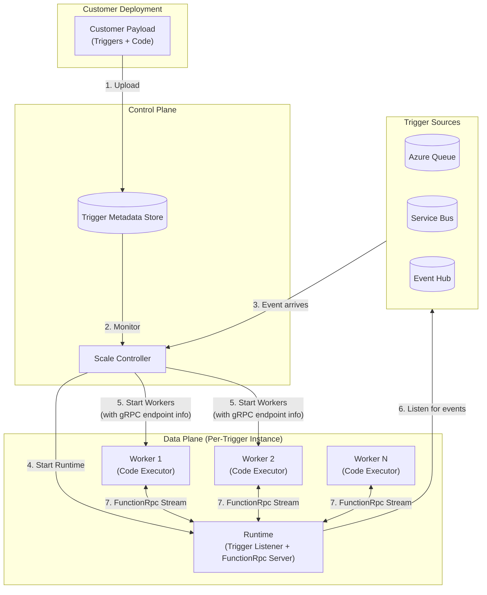

---

## Component Details

### 1. Scale Controller

The Scale Controller is the orchestrator of the system. It:

- **Monitors trigger metadata** uploaded by customers
- **Detects scaling signals** (e.g., queue depth > 0)
- **Starts Runtime instances** when events are detected
- **Starts Worker instances** and provides them with Runtime gRPC connection details
- **Manages lifecycle** of Runtime and Worker instances

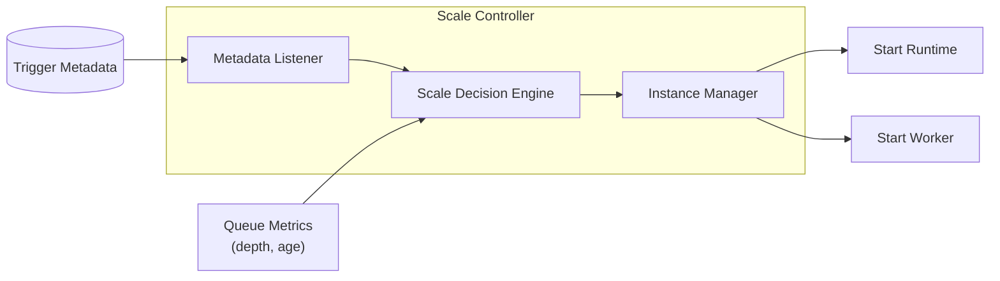

#### Scale Controller Responsibilities

| Function | Description |
|----------|-------------|
| `RegisterTrigger()` | Accepts trigger metadata from customer payloads |
| `MonitorTriggerSources()` | Polls/subscribes to trigger sources for scaling signals |
| `ScaleUp()` | Starts new Runtime instances and coordinates worker pool scaling |
| `ScaleDown()` | Terminates idle Runtime instances and drains worker pools |
| `ProvideConnectionInfo()` | Passes Runtime gRPC endpoint to Workers |
| `ScaleWorkerPool()` | Adjusts worker count per Runtime based on load and backpressure |

---

### 2. Runtime

The Runtime is the event listener and FunctionRpc host that manages a pool of workers. It:

- **Listens for trigger events** via the Trigger Listener component
- **Manages worker pool** (1:N relationship) with connection registry and health monitoring
- **Exposes FunctionRpc gRPC service** for duplex streaming with multiple Workers
- **Routes invocations** to available workers using load balancing strategies
- **Transforms trigger events** into InvocationRequest messages
- **Manages message lifecycle** (visibility, completion, abandonment)
- **Tracks in-flight invocations** and correlates responses from workers

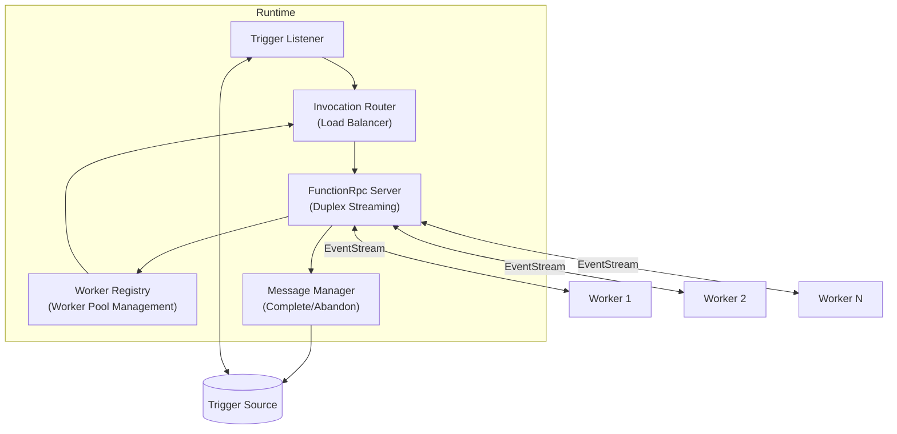

#### Runtime gRPC Service Definition

The Runtime implements the **Azure Functions Language Worker Protocol** from [azure-functions-language-worker-protobuf](https://github.com/Azure/azure-functions-language-worker-protobuf/tree/dev/src/proto).

**Primary Service:**
```protobuf
service FunctionRpc {
  rpc EventStream (stream StreamingMessage) returns (stream StreamingMessage) {}
}
```

**Key Message Types:**

- **StreamingMessage**: Envelope containing `request_id` and a `oneof content` with 30+ message types
- **Worker Initialization Flow:**
  - `StartStream`: Worker initiates connection with `worker_id`
  - `WorkerInitRequest` (Runtime → Worker): Host capabilities, log categories, directories
  - `WorkerInitResponse` (Worker → Runtime): Worker capabilities, metadata (runtime_name, runtime_version, worker_bitness)
  
- **Function Loading Flow:**
  - `FunctionLoadRequest` (Runtime → Worker): Contains `function_id`, `RpcFunctionMetadata` with bindings, script_file, entry_point
  - `FunctionLoadResponse` (Worker → Runtime): Load status and result
  
- **Invocation Flow:**
  - `InvocationRequest` (Runtime → Worker): Contains `invocation_id`, `function_id`, `input_data`, `trigger_metadata`, `trace_context`
  - `InvocationResponse` (Worker → Runtime): Contains `invocation_id`, `output_data`, `return_value`, `result` (Success/Failure/Cancelled)
  - `InvocationCancel` (Runtime → Worker): Cancel in-flight invocation
  
- **Supporting Messages:**
  - `RpcLog`: Worker sends structured logs to Runtime
  - `WorkerStatusRequest/Response`: Health check mechanism
  - `WorkerTerminate`: Graceful shutdown request
  - `FunctionEnvironmentReloadRequest/Response`: Trigger worker specialization with customer payload
  - `RpcHttp`: HTTP-specific request/response data
  - `TypedData`: Rich data type system (primitives, json, http, collections, shared memory)

**Trigger Event Mapping:**
The Trigger Listener transforms trigger-specific events into `InvocationRequest` messages:
- Trigger payload → `input_data` (array of `ParameterBinding`)
- Trigger properties → `trigger_metadata` (map of `TypedData`)
- Event ID → `invocation_id`
- Function definition → `function_id`

---

### 3. Worker

The Worker executes customer code using the FunctionRpc protocol. A single worker can handle multiple trigger types. Workers support **Placeholder mode** for cold start optimization. It:

- **Starts in Placeholder mode** (optional) - warm, generic worker without customer code
- **Connects to Runtime** via FunctionRpc using connection info from Scale Controller
- **Initiates EventStream** by sending `StartStream` with unique `worker_id`
- **Advertises capabilities** via `WorkerInitResponse` (runtime name, version, features)
- **Specializes on demand** by responding to `FunctionEnvironmentReloadRequest` with customer code loading
- **Loads functions** by responding to `FunctionLoadRequest` for multiple trigger types
- **Receives invocation requests** via `InvocationRequest` messages on the duplex stream
- **Executes customer code** with concurrent invocation support
- **Returns results** via `InvocationResponse` to Runtime
- **Sends logs** via `RpcLog` messages for observability

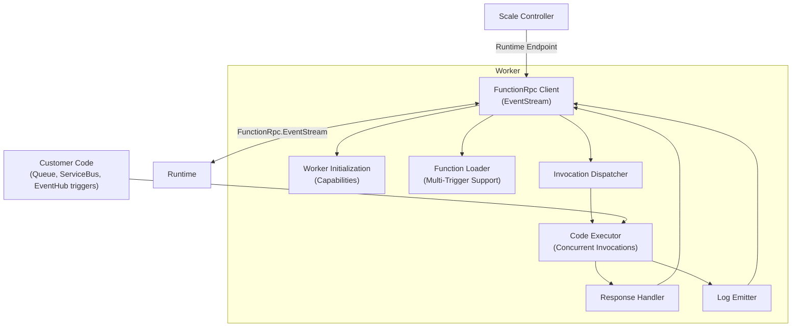

---

## Placeholder and Specialization

### Overview

To minimize cold start latency, the system implements a **Placeholder and Specialization** pattern. Workers can start in a generic "placeholder" state without customer code, then be rapidly "specialized" with customer payload when work is assigned.

### Worker Lifecycle States

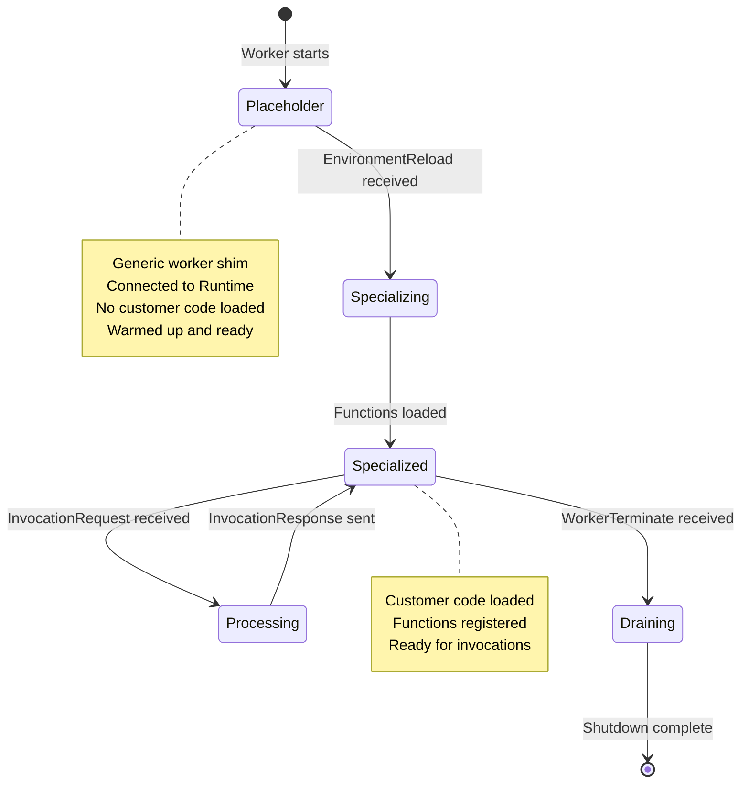

### Placeholder Mode

**Purpose**: Pre-provision a pool of warm, generic workers ready for instant specialization.

**Characteristics:**
- Worker process starts without customer code
- Connects to Runtime via FunctionRpc EventStream
- Sends `StartStream` with `worker_id`
- Completes `WorkerInitRequest/Response` handshake
- **Does NOT load any functions** (no `FunctionLoadRequest` yet)
- Sits idle in a warm, ready state
- Minimal resource footprint

**Warmup Activities:**
- Initialize language runtime (Node.js, Python, .NET, etc.)
- Load common dependencies and libraries
- Establish gRPC connection
- Pre-allocate memory pools
- Warm up JIT compiler (if applicable)

### Specialization Process

**Trigger**: Scale Controller assigns customer workload to a placeholder worker

**Steps:**

1. **Payload Provisioning**
   - Scale Controller detects trigger with pending events
   - Selects an available placeholder worker from pool
   - Provisions customer payload to both Runtime and Worker containers:
     - Code package (zip/container image)
     - Function metadata (bindings, entry points)
     - Configuration and secrets
     - Connection strings

2. **Environment Reload**
   - Runtime sends `FunctionEnvironmentReloadRequest` to worker
   - Message contains:
     - `environment_variables`: Customer-specific config
     - `function_app_directory`: Path to customer code
     - Metadata about functions to load

3. **Code Loading**
   - Worker receives `FunctionEnvironmentReloadRequest`
   - Loads customer code from provided directory
   - Initializes customer dependencies
   - Prepares function execution environment
   - Responds with `FunctionEnvironmentReloadResponse` (success/failure)

4. **Function Metadata Exchange**
   - Runtime sends `FunctionLoadRequest` for each function
   - Worker loads function definitions and bindings
   - Worker responds with `FunctionLoadResponse` for each
   - Worker transitions to "Specialized" state

5. **Ready for Invocations**
   - Worker is now specialized for this customer
   - Runtime adds worker to active pool
   - `InvocationRequest` messages can be sent

### Specialization Sequence Flow

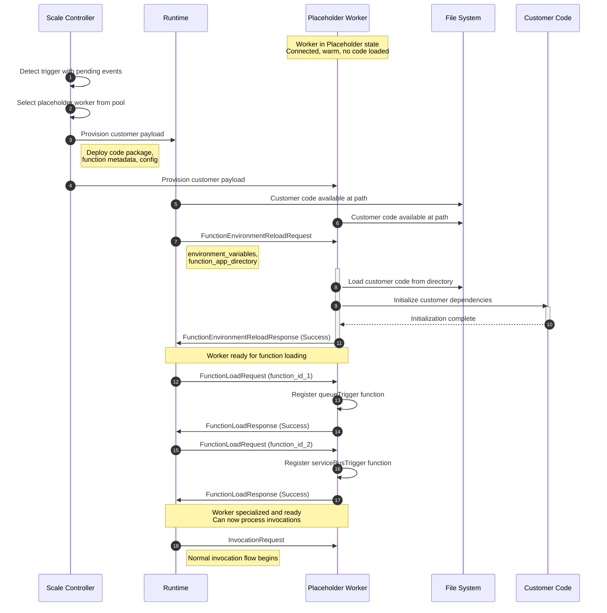

### Benefits

| Benefit | Description |
|---------|-------------|
| **Reduced Cold Start** | Placeholder workers pre-warmed, only customer code loading time remains |
| **Resource Efficiency** | Pool of generic workers shared across customers |
| **Rapid Scaling** | Specialization (1-3s) vs full cold start (5-15s) |
| **Cost Optimization** | Placeholder workers can be overprovisioned at low cost |
| **Burst Handling** | Large pool of placeholders enables rapid response to traffic spikes |

### Scale Controller Integration

**Placeholder Pool Management:**

```
Scale Controller maintains:
- Placeholder pool size per region/availability zone
- Target pool size based on historical demand patterns
- Minimum pool size for instant response
- Maximum pool size for cost control
```

**Provisioning Strategy:**

1. **Steady State**: Maintain minimum placeholder pool
2. **Demand Spike Detected**: 
   - Specialize placeholders from pool
   - Replenish placeholder pool in background
3. **Pool Exhausted**: 
   - Fall back to cold start (provision new worker)
   - Increase placeholder pool size for future demand
4. **Low Demand**: Scale down placeholder pool to minimum

**Placeholder Lifecycle:**

```
Placeholder Worker TTL: 15-30 minutes
- If not specialized within TTL, terminate and restart
- Prevents memory leaks and ensures fresh state
- Replaced with new placeholder automatically
```

### Specialization Scenarios

#### Scenario 1: First Invocation (Cold Start)
```
1. Event arrives in queue
2. No Runtime or Workers exist
3. Scale Controller:
   - Starts Runtime for trigger
   - Selects placeholder from pool
   - Provisions customer payload
   - Triggers specialization
4. Worker specializes (1-3s)
5. Invocation processed
```

#### Scenario 2: Scale Up (Warm Start)
```
1. Existing Runtime has 5 workers, all saturated
2. Queue depth increasing
3. Scale Controller:
   - Selects placeholder from pool
   - Provisions customer payload (already on Runtime)
   - Triggers specialization via Runtime
4. Worker specializes (1-2s, code cached)
5. Added to worker pool
```

#### Scenario 3: Multi-Tenant Optimization
```
1. Customer A's trigger becomes idle
2. Worker specialized for Customer A becomes available
3. Customer B's trigger has spike
4. Options:
   - Keep Customer A's worker (may reuse later)
   - De-specialize and reuse for Customer B (future enhancement)
   - Use fresh placeholder for Customer B (current approach)
```

### Worker Registry Updates

The Worker Registry tracks worker state:

```json
{
    "workerId": "worker-1-guid",
    "state": "Placeholder" | "Specializing" | "Specialized" | "Draining",
    "specialization": {
        "customerId": "customer-guid",
        "triggerId": "trigger-guid",
        "specializationTime": "2026-01-28T10:30:00Z",
        "specializationDurationMs": 1250
    },
    "connectionState": "Connected",
    "inFlightInvocations": 0,
    "loadedFunctions": []
}
```

### Future Enhancements

1. **Re-specialization**: Allow specialized workers to be re-specialized for different customers
2. **Partial Specialization**: Load common dependencies first, customer-specific code second
3. **Smart Placement**: Specialize workers on nodes with customer code already cached
4. **Predictive Scaling**: Pre-specialize workers based on predicted demand patterns
5. **Multi-Customer Workers**: Single worker handles multiple customers (isolation permitting)

---

## Communication Flows

### Flow 1: Customer Payload Upload

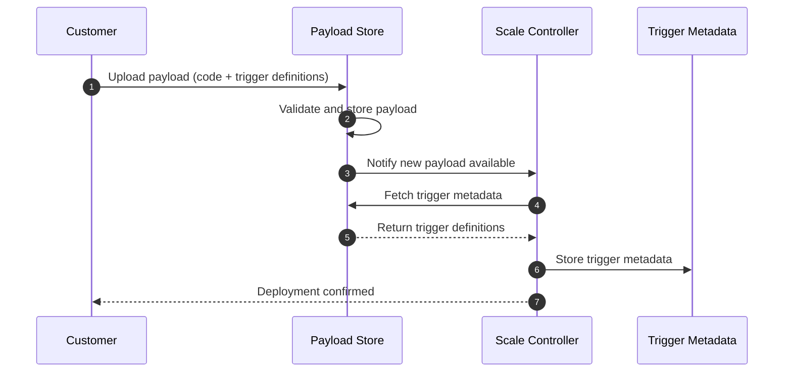

### Flow 2: Event-Driven Scaling

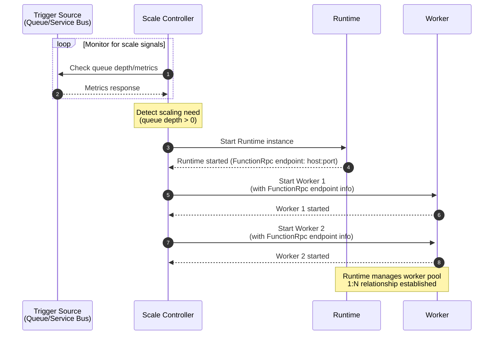

### Flow 3: FunctionRpc Connection and Initialization

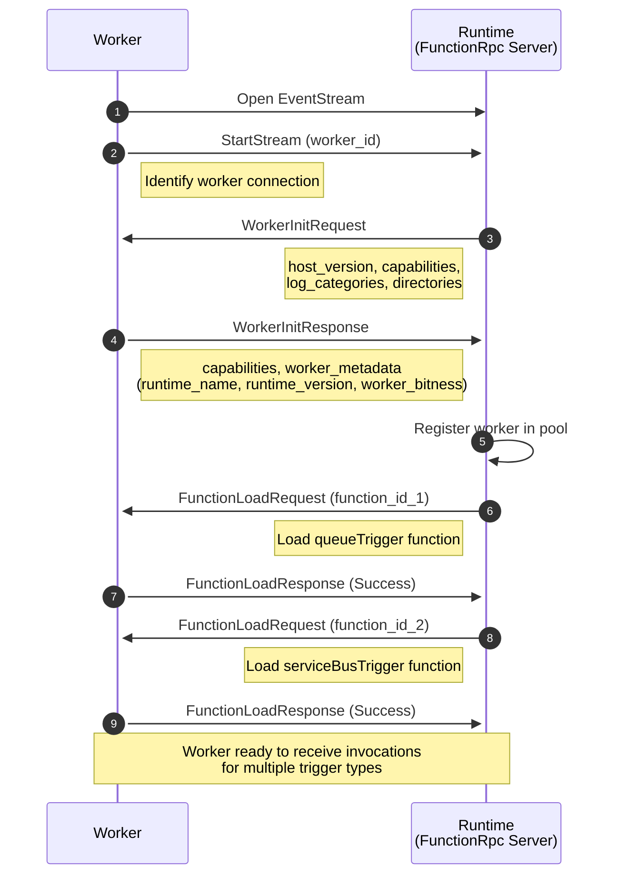

### Flow 4: Event Processing with Worker Pool

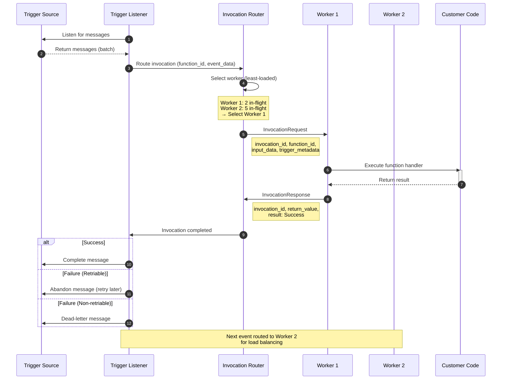

### Flow 5: Complete End-to-End Flow with Worker Pool

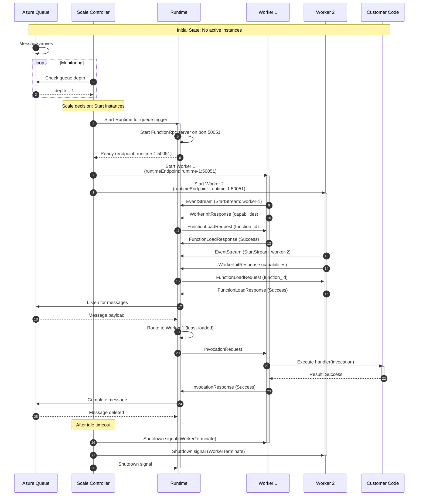

---

## Data Models

### Trigger Metadata

```json
{
    "triggerId": "guid",
    "triggerType": "queueTrigger",
    "triggerName": "myqueue-items",
    "connectionString": "encrypted-connection-string",
    "configuration": {
        "queueName": "myqueue",
        "batchSize": 16,
        "visibilityTimeout": "00:05:00",
        "maxDequeueCount": 5
    },
    "functionMetadata": {
        "functionId": "guid",
        "entryPoint": "MyFunction.Run",
        "payloadLocation": "blob://functions/myfunc.zip"
    }
}
```

### Runtime Instance State

```json
{
    "instanceId": "runtime-instance-guid",
    "triggerId": "associated-trigger-guid",
    "status": "Running",
    "functionRpcEndpoint": {
        "host": "runtime-pod-1.internal",
        "port": 50051
    },
    "workerPool": {
        "workers": [
            {
                "workerId": "worker-1-guid",
                "status": "Connected",
                "inFlightInvocations": 5,
                "loadedFunctions": ["func-1", "func-2"]
            },
            {
                "workerId": "worker-2-guid",
                "status": "Connected",
                "inFlightInvocations": 3,
                "loadedFunctions": ["func-1", "func-2"]
            }
        ],
        "routingStrategy": "least-loaded",
        "totalCapacity": 32
    },
    "metrics": {
        "eventsProcessed": 1523,
        "eventsInFlight": 8,
        "workerPoolUtilization": 0.25,
        "lastEventTime": "2026-01-15T10:30:00Z"
    }
}
```

### Worker Instance State

```json
{
    "instanceId": "worker-instance-guid",
    "workerId": "worker-1",
    "runtimeEndpoint": "runtime-pod-1.internal:50051",
    "status": "Connected",
    "workerMetadata": {
        "runtimeName": "node",
        "runtimeVersion": "20.0.0",
        "workerVersion": "4.0.0",
        "workerBitness": "X64"
    },
    "capabilities": {
        "RpcHttpBodyOnly": "true",
        "RpcHttpTriggerMetadataRemoved": "true",
        "TypedDataCollection": "true",
        "WorkerStatus": "true"
    },
    "loadedFunctions": [
        {
            "functionId": "func-1",
            "functionName": "ProcessQueueMessage",
            "triggerType": "queueTrigger"
        },
        {
            "functionId": "func-2",
            "functionName": "ProcessServiceBusMessage",
            "triggerType": "serviceBusTrigger"
        }
    ],
    "metrics": {
        "invocationsProcessed": 1520,
        "invocationsInProgress": 3,
        "averageExecutionTimeMs": 245,
        "failureCount": 12
    }
}
```

---

## Scaling Strategy

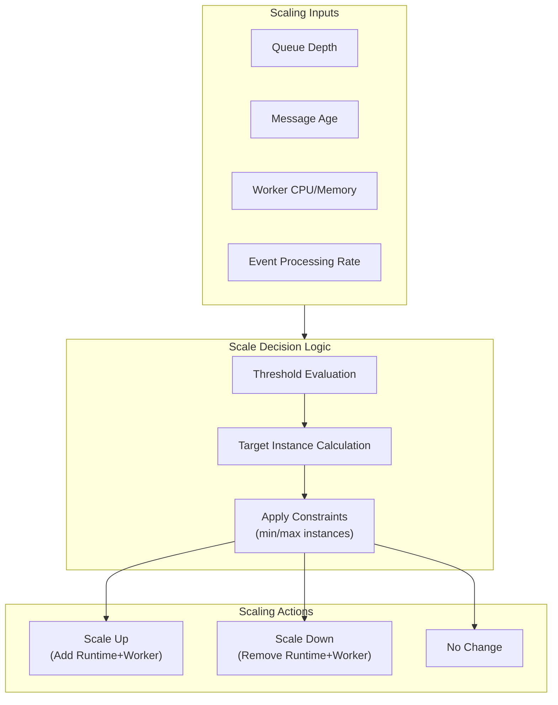

### Scaling Rules

| Metric | Scale Up Condition | Scale Down Condition |
|--------|-------------------|---------------------|
| Queue Depth | `depth > 0 && instances == 0` | `depth == 0 && idle_time > 5min` |
| Message Age | `oldest_message_age > 30s` | N/A |
| Worker Load | `avg_cpu > 70%` | `avg_cpu < 20% && instances > 1` |
| Event Rate | `events_per_sec > capacity` | `events_per_sec < 10% capacity` |

---

## Error Handling

### Runtime Failures

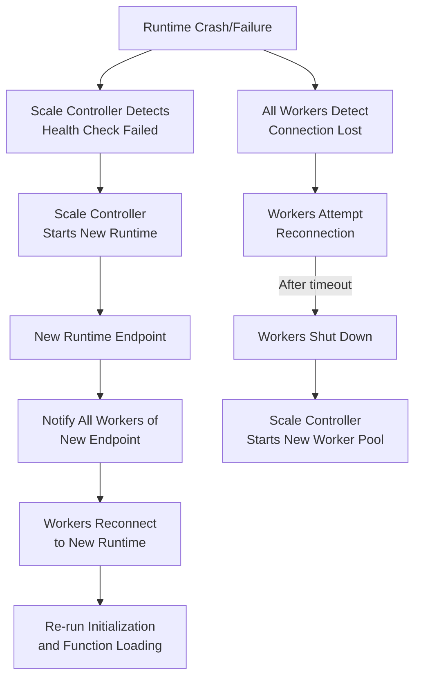

### Worker Failures

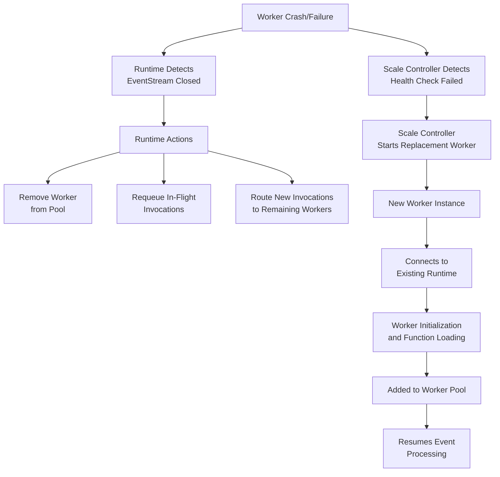

---

## Security Considerations

| Aspect | Implementation |
|--------|---------------|
| **gRPC Transport** | mTLS for all Runtime-Worker communication |
| **Authentication** | Certificate-based identity for Runtime and Worker |
| **Authorization** | Workers can only process events for their assigned triggers |
| **Secrets** | Connection strings encrypted at rest, injected via secure environment |
| **Network Isolation** | Runtime and Worker in isolated network segment |
| **Code Execution** | Worker runs in sandboxed container with limited permissions |

---

## Deployment Topology

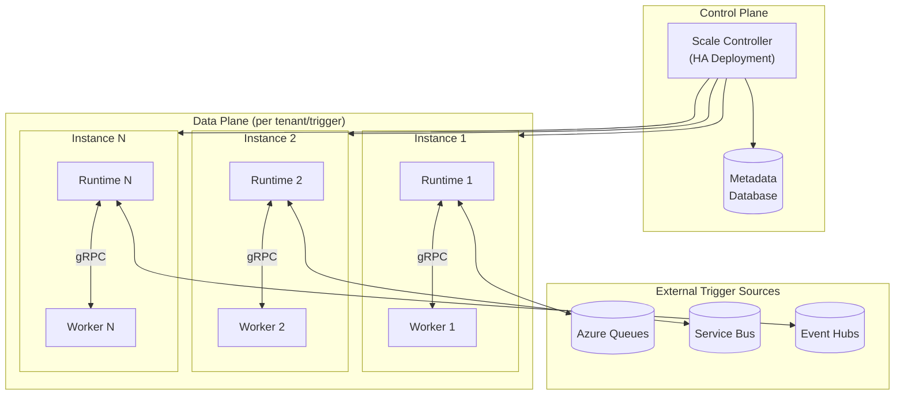

---

## Architecture Decisions

### Resolved Decisions

1. ✅ **Multi-trigger Workers**: Yes, a single Worker can handle multiple trigger types via function loading
2. ✅ **Runtime-Worker Ratio**: 1:N - One Runtime serves multiple Workers with pool management
3. ✅ **Protocol**: Use Azure Functions Language Worker Protocol (FunctionRpc) for compatibility and feature richness
4. ✅ **Cold Start Optimization**: Use Placeholder and Specialization pattern with pre-warmed generic worker pools

### Worker Pool Management

The Runtime implements worker pool management with the following components:

#### Worker Registry
- **Purpose**: Track all connected workers and their state
- **Data Structure**: `Map<worker_id, WorkerConnection>`
- **Tracked Information**:
  - EventStream connection handle
  - Worker metadata (runtime_name, runtime_version, worker_bitness)
  - Capabilities map
  - Loaded functions (function_id list)
  - Connection state (Initializing, Ready, Draining, Disconnected)
  - Health status (last heartbeat, response time)
  - In-flight invocation count

#### Invocation Routing Strategies

**1. Round-Robin**
- Distribute invocations evenly across all workers with function loaded
- Simple, fair distribution
- Best for homogeneous workloads

**2. Least-Loaded (Recommended)**
- Route to worker with fewest in-flight invocations
- Tracks `invocation_count` per worker
- Automatically adapts to worker performance differences
- Better resource utilization

**3. Sticky-Session (Future)**
- Affinity-based routing for stateful scenarios
- Requires session tracking in trigger metadata

#### Load Balancing Implementation

```
For each trigger event:
  1. Trigger Listener receives event from source
  2. Identify function_id for the event
  3. Query Worker Registry: Which workers have function_id loaded?
  4. Filter: Only include workers in "Ready" state
  5. Apply routing strategy (least-loaded):
     - Sort workers by in_flight_invocations ascending
     - Select first worker
  6. Create InvocationRequest with:
     - invocation_id (unique UUID)
     - function_id
     - input_data (trigger payload)
     - trigger_metadata (event properties)
  7. Send InvocationRequest to selected worker via EventStream
  8. Track: invocation_id → worker_id mapping
  9. Increment worker's in_flight_invocations counter
```

#### Backpressure Handling

When all workers are saturated:
- **Detection**: All workers at max concurrency limit
- **Action**: 
  - Pause Trigger Listener polling/listening
  - Queue pending invocations in memory (bounded queue)
  - Signal Scale Controller for worker pool expansion
- **Resume**: When worker capacity becomes available

#### Function Loading Orchestration

When Runtime starts or new worker connects:
```
1. Worker connects via EventStream
2. Worker sends StartStream (worker_id)
3. Runtime sends WorkerInitRequest
4. Worker responds with WorkerInitResponse (capabilities)
5. Runtime registers worker in Worker Registry
6. For each function in function catalog:
   7. Runtime sends FunctionLoadRequest to worker
   8. Worker loads function and responds with FunctionLoadResponse
9. Mark worker as "Ready" when all functions loaded
```

**Function Distribution Policy**: Load all functions on all workers (ensures any worker can handle any invocation)

### Trigger Listener Component

The Trigger Listener is responsible for:
- Listening to trigger sources (Azure Queue, Service Bus, Event Hub)
- Pulling events in batches for efficiency
- Managing message visibility and leases
- Transforming trigger-specific data into InvocationRequest format
- Handling message lifecycle based on InvocationResponse results:
  - Success → Complete/Delete message
  - Failure (retriable) → Abandon message (returns to queue)
  - Failure (non-retriable) → Dead-letter message

**Supported Trigger Types** (initial scope):
- Azure Queue Storage (`queueTrigger`)
- Azure Service Bus Queue/Topic (`serviceBusTrigger`)
- Azure Event Hub (`eventHubTrigger`)

### Scale Controller Coordination

#### Runtime Instance Scaling
- Scale Controller monitors trigger source metrics (queue depth, partition lag)
- Starts/stops Runtime instances per trigger source
- Each Runtime is dedicated to a specific trigger source

#### Worker Pool Scaling
- Runtime monitors worker pool utilization
- Requests worker pool changes via Scale Controller API
- Scale Controller provisions/deprovisions workers
- Workers are provided with Runtime's FunctionRpc endpoint at startup

**Scaling Triggers:**
- Worker pool utilization > 70% → Request scale up
- Worker pool utilization < 20% for 5 minutes → Request scale down
- Worker failure detected → Request replacement worker
- Trigger Listener backpressure → Request immediate scale up

---

## Failure Handling and Recovery

This section details failure scenarios specific to the **Runtime** component and strategies for detection, recovery, and graceful degradation.

### Failure Categories

```mermaid
flowchart TB
    subgraph Failures["Runtime Failure Categories"]
        direction TB
        WorkerFailures["Worker Failures"]
        RuntimeFailures["Runtime Process Failures"]
        CommunicationFailures["Communication Failures"]
        ResourceFailures["Resource Exhaustion"]
        InvocationFailures["Invocation Failures"]
    end
    
    WorkerFailures --> WF1["Worker Process Crash"]
    WorkerFailures --> WF2["Worker Unresponsive/Hung"]
    WorkerFailures --> WF3["Worker Disconnection"]
    WorkerFailures --> WF4["Worker Corrupted State"]
    
    RuntimeFailures --> RF1["Runtime Process Crash"]
    RuntimeFailures --> RF2["JobHost Failure"]
    RuntimeFailures --> RF3["gRPC Server Failure"]
    
    CommunicationFailures --> CF1["Channel Backpressure"]
    CommunicationFailures --> CF2["gRPC Stream Errors"]
    CommunicationFailures --> CF3["Network Partitions"]
    
    ResourceFailures --> RE1["Memory Exhaustion"]
    ResourceFailures --> RE2["Channel Buffer Overflow"]
    ResourceFailures --> RE3["Connection Pool Exhaustion"]
    
    InvocationFailures --> IF1["Invocation Timeout"]
    InvocationFailures --> IF2["Function Execution Error"]
    InvocationFailures --> IF3["Orphaned Invocations"]
```

---

### 1. Worker Process Failures

#### 1.1 Worker Process Crash

**Detection:**
- gRPC EventStream terminates unexpectedly
- `StreamReader.ReadAllAsync()` throws `RpcException` with `StatusCode.Cancelled` or `StatusCode.Unavailable`
- Worker Registry health check fails (no heartbeat response)

**Impact:**
- All in-flight invocations on that worker are lost
- Worker's channel becomes unusable
- Pending messages in worker's outbound channel are lost

**Recovery Strategy:**

```csharp
public async Task OnWorkerDisconnectedAsync(string workerId, Exception? exception)
{
    _logger.LogWarning(exception, 
        "Worker {WorkerId} disconnected unexpectedly", workerId);
    
    // 1. Get worker state before removal
    var worker = await _workerRegistry.GetWorkerAsync(workerId);
    if (worker == null) return;
    
    // 2. Get all in-flight invocations for this worker
    var orphanedInvocations = await _invocationTracker.GetInvocationsForWorkerAsync(workerId);
    
    // 3. Mark worker as disconnected (remove from routing pool)
    await _workerRegistry.UpdateWorkerStateAsync(workerId, WorkerStatus.Disconnected);
    
    // 4. Fail all in-flight invocations (trigger retry via message abandonment)
    foreach (var invocation in orphanedInvocations)
    {
        await FailInvocationAsync(invocation, 
            new WorkerDisconnectedException($"Worker {workerId} crashed"));
        
        // Message will be abandoned → returns to queue → redelivered
    }
    
    // 5. Close and dispose worker's channels
    worker.Channel.WorkerMessageWriter.Complete();
    
    // 6. Remove worker from registry
    await _workerRegistry.RemoveWorkerAsync(workerId);
    
    // 7. Notify Scale Controller to provision replacement
    await _scaleControllerClient.RequestWorkerReplacementAsync(
        worker.ApplicationDefinition,
        reason: "WorkerCrash");
}
```

**Message Lifecycle:**
- Invocations using queue-based triggers → Abandon message (returns to queue for retry)
- Invocations using at-most-once triggers → Lost (caller must retry)
- Event Hub invocations → Checkpoint NOT advanced (reprocessed on recovery)

---

#### 1.2 Worker Unresponsive (Hung)

**Detection:**
- Worker stops responding to `WorkerStatusRequest` heartbeats
- Invocations timeout without response
- gRPC stream is open but no messages flow

**Thresholds:**
- Heartbeat interval: 15 seconds
- Heartbeat timeout: 45 seconds (3 missed heartbeats)
- Invocation timeout: Configurable per function (default 5 minutes)

**Recovery Strategy:**

```csharp
public class WorkerHealthMonitor : BackgroundService
{
    private readonly TimeSpan _heartbeatInterval = TimeSpan.FromSeconds(15);
    private readonly TimeSpan _heartbeatTimeout = TimeSpan.FromSeconds(45);
    
    protected override async Task ExecuteAsync(CancellationToken stoppingToken)
    {
        while (!stoppingToken.IsCancellationRequested)
        {
            await Task.Delay(_heartbeatInterval, stoppingToken);
            
            foreach (var worker in await _workerRegistry.GetAllWorkersAsync())
            {
                if (worker.Status == WorkerStatus.Disconnected) continue;
                
                try
                {
                    // Send heartbeat
                    var request = new StreamingMessage
                    {
                        RequestId = Guid.NewGuid().ToString(),
                        WorkerStatusRequest = new WorkerStatusRequest()
                    };
                    
                    await worker.Channel.WorkerMessageWriter.WriteAsync(
                        new MessageToWorker(request),
                        stoppingToken);
                    
                    // Wait for response with timeout
                    using var cts = CancellationTokenSource.CreateLinkedTokenSource(stoppingToken);
                    cts.CancelAfter(_heartbeatTimeout);
                    
                    var response = await WaitForWorkerStatusResponseAsync(
                        worker.WorkerId, 
                        cts.Token);
                    
                    // Update last heartbeat time
                    worker.LastHeartbeat = DateTime.UtcNow;
                    worker.LastHeartbeatLatency = response.Latency;
                }
                catch (OperationCanceledException)
                {
                    // Heartbeat timeout - worker is unresponsive
                    _logger.LogWarning(
                        "Worker {WorkerId} failed to respond to heartbeat", 
                        worker.WorkerId);
                    
                    await HandleUnresponsiveWorkerAsync(worker);
                }
            }
        }
    }
    
    private async Task HandleUnresponsiveWorkerAsync(WorkerState worker)
    {
        worker.MissedHeartbeats++;
        
        if (worker.MissedHeartbeats >= 3)
        {
            _logger.LogError(
                "Worker {WorkerId} unresponsive after {MissedCount} missed heartbeats, " +
                "treating as crashed",
                worker.WorkerId,
                worker.MissedHeartbeats);
            
            // Treat as crash - same recovery path
            await OnWorkerDisconnectedAsync(worker.WorkerId, 
                new WorkerUnresponsiveException("Heartbeat timeout"));
        }
    }
}
```

---

#### 1.3 Worker Corrupted State (Post-Invocation Timeout)

**Problem:**
When an invocation times out, the worker's internal state may be corrupted:
- Customer code may have leaked resources
- Global state may be inconsistent
- Thread pool may be exhausted
- Memory may be leaked

**Current Behavior (Legacy):**
Today, we restart the worker after invocation timeout because the worker state cannot be trusted.

**New Model Strategy:**

```csharp
public async Task HandleInvocationTimeoutAsync(InvocationContext invocation)
{
    var worker = await _workerRegistry.GetWorkerAsync(invocation.WorkerId);
    
    _logger.LogWarning(
        "Invocation {InvocationId} timed out on worker {WorkerId} after {Timeout}",
        invocation.InvocationId,
        worker.WorkerId,
        invocation.Timeout);
    
    // 1. Mark invocation as failed
    await FailInvocationAsync(invocation, 
        new FunctionTimeoutException(invocation.Timeout));
    
    // 2. Worker state may be corrupted - mark as "Draining"
    await _workerRegistry.UpdateWorkerStateAsync(
        worker.WorkerId, 
        WorkerStatus.Draining);
    
    // 3. Stop routing new invocations to this worker
    //    (Draining status excludes from routing pool)
    
    // 4. Send cancellation for the timed-out invocation
    await SendInvocationCancelAsync(worker, invocation.InvocationId);
    
    // 5. Wait for in-flight invocations to complete (with timeout)
    var drainTimeout = TimeSpan.FromSeconds(30);
    var drained = await WaitForWorkerDrainAsync(worker, drainTimeout);
    
    if (!drained)
    {
        _logger.LogWarning(
            "Worker {WorkerId} did not drain within timeout, forcing disconnect",
            worker.WorkerId);
    }
    
    // 6. Request worker termination and replacement
    await SendWorkerTerminateAsync(worker);
    await _scaleControllerClient.RequestWorkerReplacementAsync(
        worker.ApplicationDefinition,
        reason: "InvocationTimeout_PotentialCorruption");
    
    // 7. Remove worker from registry after termination
    await OnWorkerDisconnectedAsync(worker.WorkerId, null);
}
```

**Configuration Options:**

| Setting | Default | Description |
|---------|---------|-------------|
| `WorkerRecycleOnTimeout` | `true` | Recycle worker after any invocation timeout |
| `WorkerRecycleOnConsecutiveTimeouts` | `3` | Recycle after N consecutive timeouts (if above is false) |
| `WorkerDrainTimeout` | `30s` | Time to wait for in-flight invocations during drain |

---

### 2. Runtime Process Failures

#### 2.1 Runtime Process Crash

**Impact:**
- All connected workers lose their connection
- All JobHosts are terminated
- All in-flight invocations are lost
- Trigger listeners stop

**Detection:**
- Infrastructure (Kubernetes, Azure) detects process exit
- Scale Controller loses Runtime health endpoint

**Recovery (Infrastructure Responsibility):**
1. Infrastructure restarts Runtime container
2. Runtime initializes fresh (no state recovery)
3. Workers detect disconnection, reconnect to new Runtime instance
4. Scale Controller reprovisions workers if needed

**Runtime State Recovery:**

```csharp
// Runtime startup - no persistent state required
public class RuntimeStartup
{
    public async Task StartAsync()
    {
        // 1. Initialize gRPC server
        await _grpcServer.StartAsync();
        
        // 2. Initialize JobHost Manager (empty)
        _jobHostManager = new JobHostManager();
        
        // 3. Initialize Worker Registry (empty)
        _workerRegistry = new WorkerRegistry();
        
        // 4. Signal readiness to Scale Controller
        await _healthEndpoint.SetHealthyAsync();
        
        // Workers will reconnect and re-register
        // JobHosts will be created on-demand when workers connect
        // No persistent state needed - state is rebuilt from worker connections
    }
}
```

---

#### 2.2 JobHost Failure

**Cause:**
- Unhandled exception in WebJobs SDK
- Trigger listener failure
- DI container corruption

**Detection:**
- JobHost throws exception during operation
- WebJobs SDK listener reports failure
- Health check on JobHost fails

**Recovery Strategy:**

```csharp
public async Task HandleJobHostFailureAsync(
    ApplicationDefinition appDef, 
    Exception exception)
{
    _logger.LogError(exception, 
        "JobHost for {AppId}:{MetadataVersion} failed", 
        appDef.ApplicationId, 
        appDef.MetadataVersion);
    
    // 1. Get affected workers
    var workers = await _workerRegistry.GetWorkersByApplicationAsync(appDef);
    
    // 2. Mark all workers as unhealthy (stop routing)
    foreach (var worker in workers)
    {
        await _workerRegistry.UpdateWorkerStateAsync(
            worker.WorkerId, 
            WorkerStatus.Unhealthy);
    }
    
    // 3. Fail all in-flight invocations for this JobHost
    var invocations = await _invocationTracker.GetInvocationsByApplicationAsync(appDef);
    foreach (var invocation in invocations)
    {
        await FailInvocationAsync(invocation, exception);
    }
    
    // 4. Stop and dispose the failed JobHost
    await _jobHostManager.StopJobHostAsync(appDef.GetJobHostKey());
    
    // 5. Attempt to recreate JobHost
    try
    {
        var newJobHost = await _jobHostManager.GetOrCreateJobHostAsync(
            new JobHostConfiguration
            {
                ApplicationDefinition = appDef,
                // ... rebuild from worker metadata
            });
        
        // 6. Restore workers to Ready state
        foreach (var worker in workers)
        {
            await _workerRegistry.UpdateWorkerStateAsync(
                worker.WorkerId, 
                WorkerStatus.Ready);
        }
        
        _logger.LogInformation(
            "JobHost for {AppId}:{MetadataVersion} recovered successfully",
            appDef.ApplicationId,
            appDef.MetadataVersion);
    }
    catch (Exception recreateEx)
    {
        _logger.LogError(recreateEx,
            "Failed to recreate JobHost for {AppId}:{MetadataVersion}, " +
            "workers will need to reconnect",
            appDef.ApplicationId,
            appDef.MetadataVersion);
        
        // 7. If recreation fails, terminate workers and request replacements
        foreach (var worker in workers)
        {
            await SendWorkerTerminateAsync(worker);
            await _scaleControllerClient.RequestWorkerReplacementAsync(
                appDef,
                reason: "JobHostRecreationFailed");
        }
    }
}
```

---

### 3. Communication Failures

#### 3.1 Channel Backpressure

**Problem:**
`System.Threading.Channels` can experience backpressure when:
- Worker is slow to process messages
- Network latency causes message buildup
- Worker is blocked on long-running customer code

**Detection:**
- `Channel.Writer.WaitToWriteAsync()` blocks or returns `false`
- Unbounded channel memory grows excessively
- Bounded channel rejects writes

**Channel Configuration Strategy:**

```csharp
public class BidirectionalChannel
{
    // Messages FROM worker TO host - can bound this
    // Worker controls the rate (responses come back as invocations complete)
    private readonly Channel<MessageFromWorker> _hostMessageChannel;
    
    // Messages FROM host TO worker - MUST be careful
    // Host controls the rate (invocations sent based on load)
    private readonly Channel<MessageToWorker> _workerMessageChannel;
    
    public BidirectionalChannel(ChannelOptions options)
    {
        // Host → Worker: Bounded with backpressure signaling
        _workerMessageChannel = Channel.CreateBounded<MessageToWorker>(
            new BoundedChannelOptions(options.WorkerChannelCapacity)
            {
                FullMode = BoundedChannelFullMode.Wait,
                SingleReader = true,
                SingleWriter = false
            });
        
        // Worker → Host: Unbounded (worker shouldn't be blocked sending responses)
        _hostMessageChannel = Channel.CreateUnbounded<MessageFromWorker>(
            new UnboundedChannelOptions
            {
                SingleReader = true,
                SingleWriter = true
            });
    }
}
```

**Backpressure Handling:**

```csharp
public async Task SendToWorkerAsync(
    WorkerState worker, 
    MessageToWorker message,
    CancellationToken cancellationToken)
{
    var channel = worker.Channel.WorkerMessageWriter;
    
    // Try immediate write
    if (channel.TryWrite(message))
    {
        return; // Success - no backpressure
    }
    
    // Channel is full - backpressure detected
    _logger.LogWarning(
        "Backpressure detected on worker {WorkerId} channel, " +
        "current capacity: {Capacity}",
        worker.WorkerId,
        worker.Channel.PendingMessageCount);
    
    // Update worker metrics
    worker.BackpressureCount++;
    worker.LastBackpressureTime = DateTime.UtcNow;
    
    // Option 1: Wait with timeout
    using var cts = CancellationTokenSource.CreateLinkedTokenSource(cancellationToken);
    cts.CancelAfter(TimeSpan.FromSeconds(5));
    
    try
    {
        await channel.WriteAsync(message, cts.Token);
    }
    catch (OperationCanceledException)
    {
        // Backpressure persisted too long
        _logger.LogError(
            "Worker {WorkerId} channel backpressure timeout, " +
            "marking worker as unhealthy",
            worker.WorkerId);
        
        // Mark worker as unhealthy - stop sending new invocations
        await _workerRegistry.UpdateWorkerStateAsync(
            worker.WorkerId, 
            WorkerStatus.Unhealthy);
        
        // Route this invocation to different worker
        throw new WorkerBackpressureException(worker.WorkerId);
    }
}
```

**Routing with Backpressure Awareness:**

```csharp
public async Task<WorkerState> SelectWorkerAsync(string functionId)
{
    var candidates = await _workerRegistry.GetReadyWorkersAsync(functionId);
    
    // Filter out workers with backpressure
    var healthyWorkers = candidates
        .Where(w => !w.HasBackpressure)
        .OrderBy(w => w.InFlightInvocations)
        .ToList();
    
    if (healthyWorkers.Count == 0)
    {
        // All workers have backpressure - system is overloaded
        _logger.LogWarning("All workers experiencing backpressure");
        
        // Signal Scale Controller to add more workers
        await _scaleControllerClient.RequestScaleUpAsync(
            reason: "AllWorkersBackpressure");
        
        // Either wait for capacity or fail fast
        throw new NoAvailableWorkersException();
    }
    
    return healthyWorkers.First();
}
```

---

#### 3.2 gRPC Stream Errors

**Error Types:**

| Status Code | Meaning | Recovery |
|-------------|---------|----------|
| `Unavailable` | Worker process died | Treat as crash |
| `Cancelled` | Stream cancelled (shutdown) | Clean disconnect |
| `DeadlineExceeded` | Message timeout | Retry or fail invocation |
| `ResourceExhausted` | Worker overwhelmed | Apply backpressure |
| `Internal` | Worker-side error | Log and continue |

**Recovery by Error Type:**

```csharp
public async Task HandleGrpcErrorAsync(
    WorkerState worker, 
    RpcException exception)
{
    switch (exception.StatusCode)
    {
        case StatusCode.Unavailable:
        case StatusCode.Cancelled:
            // Worker disconnected - treat as crash
            await OnWorkerDisconnectedAsync(worker.WorkerId, exception);
            break;
            
        case StatusCode.DeadlineExceeded:
            // Single message timeout - may be recoverable
            _logger.LogWarning(
                "gRPC deadline exceeded for worker {WorkerId}",
                worker.WorkerId);
            worker.TimeoutCount++;
            
            if (worker.TimeoutCount > 5)
            {
                // Too many timeouts - mark unhealthy
                await _workerRegistry.UpdateWorkerStateAsync(
                    worker.WorkerId, 
                    WorkerStatus.Unhealthy);
            }
            break;
            
        case StatusCode.ResourceExhausted:
            // Worker is overloaded
            _logger.LogWarning(
                "Worker {WorkerId} resource exhausted",
                worker.WorkerId);
            await _workerRegistry.UpdateWorkerStateAsync(
                worker.WorkerId, 
                WorkerStatus.Unhealthy);
            break;
            
        default:
            // Log and continue
            _logger.LogError(exception,
                "gRPC error from worker {WorkerId}: {Status}",
                worker.WorkerId,
                exception.StatusCode);
            break;
    }
}
```

---

### 4. Resource Exhaustion

#### 4.1 Memory Exhaustion in Runtime

**Detection:**
- GC pressure metrics (Gen2 collections)
- Process memory approaching limit
- `OutOfMemoryException` thrown

**Prevention:**

```csharp
public class MemoryPressureMonitor : BackgroundService
{
    private readonly long _memoryThresholdBytes;
    
    protected override async Task ExecuteAsync(CancellationToken stoppingToken)
    {
        while (!stoppingToken.IsCancellationRequested)
        {
            var memoryInfo = GC.GetGCMemoryInfo();
            var currentMemory = memoryInfo.HeapSizeBytes;
            var utilization = (double)currentMemory / _memoryThresholdBytes;
            
            if (utilization > 0.9)
            {
                _logger.LogWarning(
                    "Memory pressure critical: {Usage:P0}, initiating protective measures",
                    utilization);
                
                // 1. Pause accepting new invocations
                await _invocationRouter.PauseAsync();
                
                // 2. Force GC
                GC.Collect(2, GCCollectionMode.Aggressive, true, true);
                
                // 3. If still high, start draining workers
                memoryInfo = GC.GetGCMemoryInfo();
                if ((double)memoryInfo.HeapSizeBytes / _memoryThresholdBytes > 0.85)
                {
                    await DrainOldestWorkersAsync(count: 2);
                }
                
                // 4. Resume if memory recovered
                await _invocationRouter.ResumeAsync();
            }
            else if (utilization > 0.7)
            {
                _logger.LogInformation(
                    "Memory pressure elevated: {Usage:P0}",
                    utilization);
                
                // Request Scale Controller to reduce workers
                await _scaleControllerClient.RequestScaleDownAsync(
                    reason: "MemoryPressure");
            }
            
            await Task.Delay(TimeSpan.FromSeconds(10), stoppingToken);
        }
    }
}
```

#### 4.2 Invocation Tracking Memory

**Problem:**
Tracking many in-flight invocations consumes memory

**Mitigation:**

```csharp
public class InvocationTracker
{
    // Bounded tracking - reject new invocations if at limit
    private readonly int _maxTrackedInvocations;
    private readonly ConcurrentDictionary<string, InvocationContext> _invocations;
    
    public async Task<bool> TryTrackInvocationAsync(InvocationContext invocation)
    {
        if (_invocations.Count >= _maxTrackedInvocations)
        {
            _logger.LogWarning(
                "Invocation tracking limit reached ({Max}), rejecting new invocation",
                _maxTrackedInvocations);
            
            return false; // Caller should apply backpressure to trigger listener
        }
        
        return _invocations.TryAdd(invocation.InvocationId, invocation);
    }
}
```

---

### 5. Invocation Failures

#### 5.1 Invocation Timeout

**Configuration:**

```csharp
public class InvocationTimeoutOptions
{
    public TimeSpan DefaultTimeout { get; set; } = TimeSpan.FromMinutes(5);
    public TimeSpan MaxTimeout { get; set; } = TimeSpan.FromMinutes(10);
    public bool RecycleWorkerOnTimeout { get; set; } = true;
}
```

**Timeout Handling:**

```csharp
public async Task ExecuteWithTimeoutAsync(
    InvocationContext invocation,
    CancellationToken cancellationToken)
{
    using var timeoutCts = CancellationTokenSource.CreateLinkedTokenSource(cancellationToken);
    timeoutCts.CancelAfter(invocation.Timeout);
    
    try
    {
        // Track invocation
        var tcs = new TaskCompletionSource<InvocationResponse>();
        _pendingInvocations[invocation.InvocationId] = tcs;
        
        // Send to worker
        await SendInvocationRequestAsync(invocation, cancellationToken);
        
        // Wait for response with timeout
        var response = await tcs.Task.WaitAsync(timeoutCts.Token);
        
        // Process successful response
        await ProcessInvocationResponseAsync(invocation, response);
    }
    catch (OperationCanceledException) when (timeoutCts.IsCancellationRequested)
    {
        // Invocation timed out
        await HandleInvocationTimeoutAsync(invocation);
    }
    finally
    {
        _pendingInvocations.TryRemove(invocation.InvocationId, out _);
    }
}
```

#### 5.2 Orphaned Invocations

**Problem:**
Invocations that were sent but never got a response (worker crash, network issue)

**Detection:**
- Worker disconnects with pending invocations
- Invocation tracking shows entries older than max timeout
- Response received for unknown invocation ID

**Cleanup:**

```csharp
public class OrphanedInvocationCleaner : BackgroundService
{
    private readonly TimeSpan _cleanupInterval = TimeSpan.FromMinutes(1);
    private readonly TimeSpan _orphanThreshold = TimeSpan.FromMinutes(15);
    
    protected override async Task ExecuteAsync(CancellationToken stoppingToken)
    {
        while (!stoppingToken.IsCancellationRequested)
        {
            await Task.Delay(_cleanupInterval, stoppingToken);
            
            var now = DateTime.UtcNow;
            var orphaned = _invocationTracker.GetAll()
                .Where(i => now - i.StartTime > _orphanThreshold)
                .ToList();
            
            foreach (var invocation in orphaned)
            {
                _logger.LogWarning(
                    "Cleaning up orphaned invocation {InvocationId} " +
                    "(age: {Age}, worker: {WorkerId})",
                    invocation.InvocationId,
                    now - invocation.StartTime,
                    invocation.WorkerId);
                
                await FailInvocationAsync(invocation, 
                    new OrphanedInvocationException());
            }
        }
    }
}
```

---

### Failure Recovery Summary

| Failure Type | Detection | Recovery | Message Handling |
|--------------|-----------|----------|------------------|
| Worker Crash | gRPC stream terminates | Remove worker, fail invocations, request replacement | Abandon (retry) |
| Worker Hung | Heartbeat timeout | Terminate worker, fail invocations, request replacement | Abandon (retry) |
| Invocation Timeout | Timer expires | Cancel invocation, optionally recycle worker | Abandon (retry) |
| Worker Corrupted | Post-timeout heuristic | Drain and terminate worker | N/A |
| Channel Backpressure | Write blocks/fails | Mark unhealthy, route elsewhere | Route to other worker |
| gRPC Error | RpcException | Depends on status code | Varies |
| JobHost Failure | Exception thrown | Recreate JobHost or terminate workers | Abandon (retry) |
| Runtime Crash | Process exits | Infrastructure restarts, workers reconnect | Abandon (retry) |
| Memory Exhaustion | GC metrics | Pause intake, GC, scale down | Apply backpressure |

---

### Health Check Endpoints

```csharp
public class RuntimeHealthCheck : IHealthCheck
{
    public async Task<HealthCheckResult> CheckHealthAsync(
        HealthCheckContext context,
        CancellationToken cancellationToken)
    {
        var data = new Dictionary<string, object>();
        
        // Check gRPC server
        var grpcHealthy = _grpcServer.IsListening;
        data["grpc_server"] = grpcHealthy ? "healthy" : "unhealthy";
        
        // Check worker registry
        var workerCount = await _workerRegistry.GetWorkerCountAsync();
        var readyWorkers = await _workerRegistry.GetReadyWorkerCountAsync();
        data["total_workers"] = workerCount;
        data["ready_workers"] = readyWorkers;
        
        // Check JobHosts
        var jobHostCount = await _jobHostManager.GetJobHostCountAsync();
        data["active_jobhosts"] = jobHostCount;
        
        // Check memory
        var memoryInfo = GC.GetGCMemoryInfo();
        var memoryUtilization = (double)memoryInfo.HeapSizeBytes / memoryInfo.TotalAvailableMemoryBytes;
        data["memory_utilization"] = $"{memoryUtilization:P0}";
        
        // Check invocation backlog
        var pendingInvocations = _invocationTracker.Count;
        data["pending_invocations"] = pendingInvocations;
        
        // Determine overall health
        if (!grpcHealthy)
        {
            return HealthCheckResult.Unhealthy("gRPC server not listening", data: data);
        }
        
        if (readyWorkers == 0 && workerCount > 0)
        {
            return HealthCheckResult.Degraded("No ready workers", data: data);
        }
        
        if (memoryUtilization > 0.9)
        {
            return HealthCheckResult.Degraded("High memory pressure", data: data);
        }
        
        return HealthCheckResult.Healthy("Runtime healthy", data: data);
    }
}
```

## Open Questions / Future Considerations

1. **Stateful Triggers**: How to handle Service Bus sessions requiring ordered processing?
2. ✅ **Cold Start Optimization**: Resolved - Using Placeholder and Specialization pattern with pre-warmed worker pools
3. **Observability**: Distributed tracing correlation across Scale Controller → Runtime → Worker
4. **Multi-region**: Active-active or active-passive deployment patterns?
5. ✅ **Function Versioning**: Resolved - Separated MetadataVersion (JobHost lifecycle) from CodeVersion (worker code) to support blue/green deployments
6. **Settlement Service**: Should Runtime expose Azure Functions Settlement RPC service for Service Bus operations?
7. **Worker Affinity**: Benefits of routing specific functions to specific workers vs full distribution?
8. **Shared Memory**: Leverage RpcSharedMemory for large payload optimization?
---

## Open Question: Worker Lifecycle Management

### Problem Statement

In the current Functions architecture, the Runtime has full control over worker processes:
- **Crash detection**: Runtime detects worker crash and immediately restarts it
- **Timeout handling**: If a function execution times out, Runtime kills the worker process (can't determine if hung or in bad state)
- **Graceful shutdown**: Runtime sends shutdown signal, waits briefly, then force-kills

In the new decoupled architecture:
- **Runtime and Worker are separate containers** - Runtime cannot directly kill Worker
- **Both are untrusted components** - Cannot talk directly to infrastructure
- **Only communication path**: Log messages (slow, several seconds processing time)
- **gRPC is the control channel** - But what if Worker ignores shutdown requests?

### Specific Scenarios

#### Scenario 1: Function Timeout
A function exceeds its configured timeout (e.g., 5 minutes for Consumption plan).

**Current behavior**: Runtime kills worker process, restarts it.

**New architecture challenges**:
- Runtime detects timeout, sends `WorkerTerminate` message via gRPC
- Worker is supposed to cancel execution and shut down
- **What if Worker doesn't respond?** (hung, infinite loop, deadlock)

#### Scenario 2: Worker Unresponsive
Worker stops responding to heartbeats but gRPC connection remains open.

**Current behavior**: Runtime kills worker process after heartbeat timeout.

**New architecture challenges**:
- Runtime can't force-kill a separate container
- gRPC connection might stay open even if worker is hung

#### Scenario 3: Malicious or Buggy Worker
Worker code enters infinite loop or consumes excessive resources.

**Current behavior**: Runtime kills process, protects host.

**New architecture challenges**:
- Runtime has no process-level control
- Worker could ignore all shutdown requests

### Proposed Solutions

#### Option A: gRPC Disconnection + Container Health Probes

```
┌─────────────────────────────────────────────────────────────────┐
│  Runtime detects timeout/hang                                    │
├─────────────────────────────────────────────────────────────────┤
│  1. Send WorkerTerminate via gRPC                               │
│  2. Start grace period timer (e.g., 30 seconds)                 │
│  3. If worker doesn't disconnect:                               │
│     a. Runtime forcibly closes gRPC connection                  │
│     b. Mark worker as "abandoned" in registry                   │
│  4. Container orchestrator detects:                             │
│     - Liveness probe fails (worker reports unhealthy when       │
│       disconnected from Runtime)                                 │
│     - Container gets killed and replaced                        │
└─────────────────────────────────────────────────────────────────┘
```

**Pros**:
- Uses existing container orchestration
- No new infrastructure communication needed
- Worker can implement health probe that checks gRPC connection

**Cons**:
- Slow - container probe intervals add latency
- Worker must cooperate (implement proper health probe)
- Abandoned worker could continue consuming resources until killed

**Worker Health Probe Implementation**:
```csharp
public class WorkerHealthCheck : IHealthCheck
{
    private readonly IGrpcConnectionManager _connectionManager;
    
    public Task<HealthCheckResult> CheckHealthAsync(
        HealthCheckContext context,
        CancellationToken cancellationToken)
    {
        // If disconnected from Runtime, report unhealthy
        // This causes container orchestrator to kill us
        if (!_connectionManager.IsConnected)
        {
            return Task.FromResult(
                HealthCheckResult.Unhealthy("Disconnected from Runtime"));
        }
        
        return Task.FromResult(HealthCheckResult.Healthy());
    }
}
```

#### Option B: Shared Termination Signal via Storage

```
┌─────────────────────────────────────────────────────────────────┐
│  Runtime writes termination signal to shared storage            │
│  (blob, file share, or other mechanism visible to Worker)       │
├─────────────────────────────────────────────────────────────────┤
│  Worker periodically checks for termination signal              │
│  If found: graceful shutdown                                     │
│  If ignored: falls back to Option A                             │
└─────────────────────────────────────────────────────────────────┘
```

**Pros**:
- Provides backup communication channel
- Works even if gRPC is hung

**Cons**:
- Adds complexity
- Polling introduces latency
- Still requires worker cooperation

#### Option C: Dedicated Sidecar for Lifecycle Management

```
┌──────────────────────────────────────────────────────────────────┐
│  Pod/Container Group                                              │
├──────────────┬──────────────┬──────────────────────────────────────┤
│   Runtime    │    Worker    │   Lifecycle Sidecar                │
│              │              │   (privileged, trusted)            │
│              │              │                                    │
│   ─────gRPC────────────────►│                                    │
│              │              │                                    │
│   ─────────────────────────────────── control ─────────────────►│
│              │              │    Can force-kill Worker           │
└──────────────┴──────────────┴──────────────────────────────────────┘
```

**Pros**:
- Trusted component can force-kill worker
- Fast response to termination requests
- Works even if worker is completely unresponsive

**Cons**:
- Additional component to deploy and manage
- Sidecar itself could fail
- Increased resource overhead

#### Option D: Scale Controller Mediated Termination

```
┌─────────────────────────────────────────────────────────────────┐
│  Runtime                     Scale Controller                   │
├─────────────────────────────────────────────────────────────────┤
│  1. Detect timeout/hang                                         │
│  2. Write "worker-unhealthy" log/event                          │
│  3. Scale Controller processes event (seconds delay)            │
│  4. Scale Controller terminates worker container                │
│  5. Scale Controller starts replacement worker                  │
└─────────────────────────────────────────────────────────────────┘
```

**Pros**:
- No new communication channels needed (uses existing logs)
- Scale Controller has infrastructure access
- Clean separation of concerns

**Cons**:
- **Slow** - log processing delay (several seconds)
- Critical path depends on log pipeline health
- May not meet SLA requirements for timeout handling

#### Option E: Immediate Replacement + Eventual Cleanup (Recommended)

```
┌─────────────────────────────────────────────────────────────────┐
│  "Don't wait, replace immediately"                              │
├─────────────────────────────────────────────────────────────────┤
│  1. Runtime detects timeout/hang                                │
│  2. Send WorkerTerminate via gRPC (best effort)                 │
│  3. Immediately close gRPC connection                           │
│  4. Mark worker as "abandoned" (don't wait for confirmation)    │
│  5. Request replacement worker via existing channel             │
│     (if only 1 worker, priority request)                        │
│  6. Abandoned worker eventually cleaned up by:                  │
│     a. Its own health probe failing (sees disconnection)        │
│     b. Container orchestrator timeout                           │
│     c. Resource limits (OOM, CPU throttle)                      │
└─────────────────────────────────────────────────────────────────┘
```

**Implementation**:
```csharp
public async Task HandleFunctionTimeoutAsync(
    WorkerState worker,
    string invocationId,
    CancellationToken cancellationToken)
{
    _logger.LogWarning(
        "Function timeout for invocation {InvocationId} on worker {WorkerId}",
        invocationId,
        worker.WorkerId);
    
    // 1. Best-effort termination request
    try
    {
        var terminateMessage = new StreamingMessage
        {
            WorkerTerminate = new WorkerTerminate
            {
                GracePeriod = Duration.FromTimeSpan(TimeSpan.FromSeconds(5))
            }
        };
        
        // Fire and forget - don't await
        _ = worker.Channel.SendAsync(terminateMessage);
    }
    catch (Exception ex)
    {
        _logger.LogDebug(ex, "Failed to send terminate message");
    }
    
    // 2. Immediately close gRPC connection
    await worker.Channel.CompleteAsync();
    
    // 3. Mark as abandoned (don't remove yet, for tracking)
    worker.Status = WorkerStatus.Abandoned;
    worker.AbandonedAt = DateTimeOffset.UtcNow;
    
    // 4. Fail any pending invocations on this worker
    await FailPendingInvocationsAsync(worker, "Worker terminated due to timeout");
    
    // 5. Request replacement based on current capacity
    var activeWorkers = await _workerRegistry.GetActiveWorkerCountAsync(
        worker.ApplicationDefinition);
    
    if (activeWorkers == 0)
    {
        // Critical - no workers for this app
        _logger.LogCritical(
            "No active workers for {AppId}, requesting urgent replacement",
            worker.ApplicationDefinition.ApplicationId);
        
        // Priority replacement request
        await _scaleController.RequestWorkerAsync(
            worker.ApplicationDefinition,
            WorkerPriority.Urgent);
    }
    else
    {
        _logger.LogInformation(
            "{ActiveWorkers} workers still active for {AppId}, " +
            "requesting normal replacement",
            activeWorkers,
            worker.ApplicationDefinition.ApplicationId);
        
        // Normal replacement request
        await _scaleController.RequestWorkerAsync(
            worker.ApplicationDefinition,
            WorkerPriority.Normal);
    }
    
    // 6. Cleanup abandoned workers periodically (separate background task)
}

// Background service to clean up abandoned workers
public class AbandonedWorkerCleanupService : BackgroundService
{
    private readonly TimeSpan _abandonedTimeout = TimeSpan.FromMinutes(5);
    
    protected override async Task ExecuteAsync(CancellationToken stoppingToken)
    {
        while (!stoppingToken.IsCancellationRequested)
        {
            await Task.Delay(TimeSpan.FromMinutes(1), stoppingToken);
            
            var abandonedWorkers = await _workerRegistry
                .GetAbandonedWorkersOlderThanAsync(_abandonedTimeout);
            
            foreach (var worker in abandonedWorkers)
            {
                _logger.LogInformation(
                    "Cleaning up abandoned worker {WorkerId} " +
                    "(abandoned at {AbandonedAt})",
                    worker.WorkerId,
                    worker.AbandonedAt);
                
                await _workerRegistry.RemoveWorkerAsync(worker.WorkerId);
            }
        }
    }
}
```

**Why this approach**:
1. **Speed**: Don't wait for worker cooperation - replace immediately
2. **Resilience**: System continues functioning even if worker cleanup is delayed
3. **No new infrastructure**: Uses existing gRPC and container orchestration
4. **Graceful degradation**: If multiple workers exist, single timeout is less critical
5. **Eventually consistent**: Abandoned workers get cleaned up, just not immediately

### Requesting Replacement Workers

**Communication Options for Replacement Requests**:

| Method | Latency | Reliability | Notes |
|--------|---------|-------------|-------|
| Log-based signal | 3-10s | Medium | Depends on log pipeline |
| Health probe change | 10-30s | High | Standard K8s/orchestrator |
| Dedicated metric/event | 1-3s | Medium | Requires metric pipeline |
| gRPC to Scale Controller | <100ms | High | Requires direct connection |

**Recommendation**: If gRPC connection to Scale Controller is possible (even one-way), use it for urgent replacement requests. Fall back to log-based for non-urgent.

### Decision Matrix

| Scenario | Urgency | Action |
|----------|---------|--------|
| Timeout, multiple workers active | Low | Disconnect, normal replacement |
| Timeout, single worker | High | Disconnect, urgent replacement |
| Heartbeat failure, multiple workers | Medium | Disconnect, normal replacement |
| Heartbeat failure, single worker | High | Disconnect, urgent replacement |
| Worker crash (container exits) | N/A | Container orchestrator handles |
| Graceful scale-down | Low | Send terminate, wait for clean exit |

### Open Sub-Questions

1. **Grace period duration**: How long to wait after sending `WorkerTerminate` before considering worker abandoned?
   - Proposal: 5-10 seconds (fast), configurable per app

2. **Replacement channel**: How does Runtime request urgent worker replacement?
   - Proposal A: gRPC back-channel to Scale Controller (if feasible)
   - Proposal B: Priority log/event that Scale Controller monitors
   - Proposal C: Shared state that Scale Controller polls

3. **Abandoned worker tracking**: How long to track abandoned workers before full cleanup?
   - Proposal: 5 minutes (gives container orchestrator time to clean up)

4. **Resource protection**: How to prevent abandoned worker from consuming resources?
   - Proposal: Worker health probe fails when disconnected, triggering container kill
   - Fallback: Container resource limits (CPU/memory) provide hard ceiling

5. **Invocation retry**: Should invocations on abandoned workers be automatically retried?
   - Proposal: Yes for idempotent functions (marked via attribute)
   - Proposal: No for non-idempotent (return failure to trigger source retry if applicable)