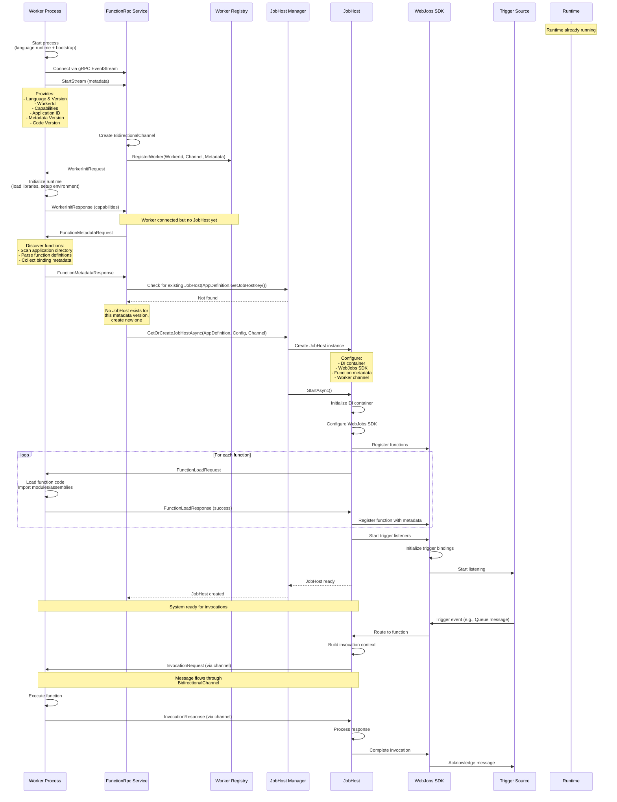
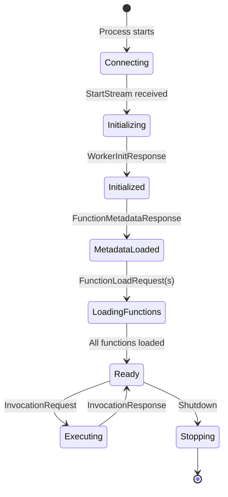
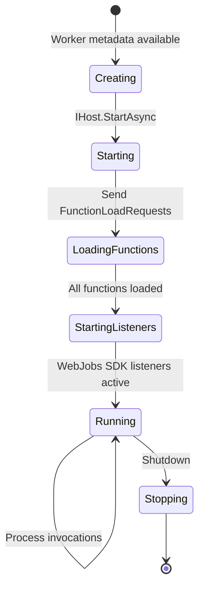

# Worker Initialization Flow (0 → 1)

## Overview

This document describes the detailed initialization flow when a worker connects to the Runtime for the first time and is assigned to a customer application. This covers the complete sequence from worker startup through the first invocation and response.

**Scenario**: A fresh worker process connects to an already-running Runtime and gets set up with a new JobHost for a customer application.

---

## Prerequisites

- **Runtime is running** with gRPC endpoint listening
- **No JobHost exists yet** for this application
- Worker has customer application code ready to load

---

## Complete Flow Diagram



---

## Detailed Step-by-Step Flow

### Step 1: Runtime Already Running

The Runtime process is started and ready:

```csharp
// Runtime startup (already complete)
var builder = WebApplication.CreateBuilder(args);

builder.Services.AddGrpc();
builder.Services.AddSingleton<IWorkerRegistry, WorkerRegistry>();
builder.Services.AddSingleton<IJobHostManager, JobHostManager>();

var app = builder.Build();
app.MapGrpcService<FunctionRpcService>();
await app.RunAsync(); // gRPC endpoint listening
```

**Runtime State:**
- gRPC server listening on port (e.g., 50051)
- Worker Registry is empty
- JobHost Manager has no JobHosts
- Ready to accept worker connections

---

### Step 2: Worker Connects and Provides Metadata

Worker process starts and immediately connects to the Runtime:

```csharp
// Worker startup
public class WorkerProcess
{
    public async Task StartAsync()
    {
        // Connect to Runtime
        var channel = GrpcChannel.ForAddress("http://localhost:50051");
        var client = new FunctionRpc.FunctionRpcClient(channel);
        
        // Establish bidirectional stream
        var call = client.EventStream();
        
        // Send StartStream with metadata
        await call.RequestStream.WriteAsync(new StreamingMessage
        {
            RequestId = Guid.NewGuid().ToString(),
            StartStream = new StartStream
            {
                WorkerId = Environment.GetEnvironmentVariable("WORKER_ID") ?? Guid.NewGuid().ToString(),
                WorkerCapabilities = new WorkerCapabilities
                {
                    RuntimeName = "python",
                    RuntimeVersion = "3.11",
                    SupportsSharedMemory = true,
                    // ... other capabilities
                },
                // Application Identity
                Properties = 
                {
                    { "ApplicationId", "my-function-app" },
                    { "MetadataVersion", "1.0.0" },
                    { "CodeVersion", "1.0.0" },
                    { "Language", "python" }
                }
            }
        });
        
        // Start reading responses
        await ProcessResponsesAsync(call.ResponseStream);
    }
}
```

**FunctionRpc Service handles connection:**

```csharp
public override async Task EventStream(
    IAsyncStreamReader<StreamingMessage> requestStream,
    IServerStreamWriter<StreamingMessage> responseStream,
    ServerCallContext context)
{
    // Read StartStream message
    await requestStream.MoveNext(context.CancellationToken);
    var startStreamMsg = requestStream.Current;
    
    if (startStreamMsg.ContentCase != StreamingMessage.ContentOneofCase.StartStream)
    {
        throw new InvalidOperationException("First message must be StartStream");
    }
    
    var startStream = startStreamMsg.StartStream;
    var workerId = startStream.WorkerId;
    
    _logger.LogInformation(
        "Worker {WorkerId} connected - Language: {Language}, App: {AppId}, " +
        "Metadata: {MetadataVersion}, Code: {CodeVersion}",
        workerId,
        startStream.Properties.GetValueOrDefault("Language"),
        startStream.Properties.GetValueOrDefault("ApplicationId"),
        startStream.Properties.GetValueOrDefault("MetadataVersion"),
        startStream.Properties.GetValueOrDefault("CodeVersion"));
    
    // Create bidirectional channel for this worker
    var bidirectionalChannel = new BidirectionalChannel();
    
    // Extract application identity from StartStream
    var applicationDefinition = new ApplicationDefinition(
        startStream.Properties.GetValueOrDefault("ApplicationId", "_Unknown"),
        startStream.Properties.GetValueOrDefault("MetadataVersion", "1.0.0"),
        startStream.Properties.GetValueOrDefault("CodeVersion", "1.0.0"));
    
    // Register worker in registry
    var workerState = new WorkerState
    {
        WorkerId = workerId,
        Status = WorkerStatus.Initializing,
        Language = startStream.Properties.GetValueOrDefault("Language"),
        Capabilities = startStream.WorkerCapabilities,
        Channel = bidirectionalChannel,
        ApplicationDefinition = applicationDefinition,
        ConnectedAt = DateTime.UtcNow
    };
    
    await _workerRegistry.RegisterWorkerAsync(workerState);
    
    // Continue with initialization
    await InitializeWorkerAsync(
        workerState, 
        requestStream, 
        responseStream, 
        context.CancellationToken);
}
```

**Worker Registry State:**

| Worker ID | Language | Status | Application | Metadata | Code | Channel | JobHost |
|-----------|----------|--------|-------------|----------|------|---------|--------|
| worker-py-001 | python | Initializing | my-function-app | 1.0.0 | 1.0.0 | ✅ Created | null |

---

### Step 3: Worker Initialization

Before creating a JobHost, the worker must be initialized:

```csharp
private async Task InitializeWorkerAsync(
    WorkerState workerState,
    IAsyncStreamReader<StreamingMessage> requestStream,
    IServerStreamWriter<StreamingMessage> responseStream,
    CancellationToken cancellationToken)
{
    // Send WorkerInitRequest
    var workerInitRequest = new StreamingMessage
    {
        RequestId = Guid.NewGuid().ToString(),
        WorkerInitRequest = new WorkerInitRequest
        {
            HostVersion = typeof(FunctionRpcService).Assembly.GetName().Version.ToString(),
            WorkerDirectory = Environment.CurrentDirectory,
            // Additional initialization parameters
        }
    };
    
    await responseStream.WriteAsync(workerInitRequest, cancellationToken);
    
    _logger.LogInformation("Sent WorkerInitRequest to worker {WorkerId}", workerState.WorkerId);
    
    // Wait for WorkerInitResponse
    await requestStream.MoveNext(cancellationToken);
    var initResponseMsg = requestStream.Current;
    
    if (initResponseMsg.ContentCase != StreamingMessage.ContentOneofCase.WorkerInitResponse)
    {
        throw new InvalidOperationException("Expected WorkerInitResponse");
    }
    
    var initResponse = initResponseMsg.WorkerInitResponse;
    
    if (initResponse.Result.Status == StatusResult.Types.Status.Failure)
    {
        throw new WorkerInitializationException(
            $"Worker initialization failed: {initResponse.Result.Exception}");
    }
    
    // Update worker capabilities from response
    workerState.Capabilities = initResponse.Capabilities;
    workerState.Status = WorkerStatus.Initialized;
    
    _logger.LogInformation(
        "Worker {WorkerId} initialized successfully - Capabilities: {Capabilities}",
        workerState.WorkerId,
        JsonSerializer.Serialize(initResponse.Capabilities));
    
    // Continue to metadata retrieval
    await RetrieveFunctionMetadataAsync(
        workerState,
        requestStream,
        responseStream,
        cancellationToken);
}
```

**Worker-side handling:**

```python
# Python worker example
async def handle_worker_init_request(request):
    # Initialize Python runtime environment
    import sys
    import importlib
    
    # Setup sys.path for customer code
    sys.path.insert(0, request.worker_directory)
    
    # Initialize logging
    setup_logging()
    
    # Initialize any language-specific features
    initialize_extensions()
    
    # Return capabilities
    return WorkerInitResponse(
        result=StatusResult(status=StatusResult.Success),
        capabilities=WorkerCapabilities(
            runtime_name="python",
            runtime_version="3.11.5",
            supports_shared_memory=True,
            # ... other capabilities
        )
    )
```

**Worker Registry Updated:**

| Worker ID | Language | Status | Application | Metadata | Code | Capabilities | JobHost |
|-----------|----------|--------|-------------|----------|------|--------------|--------|
| worker-py-001 | python | Initialized | my-function-app | 1.0.0 | 1.0.0 | ✅ Reported | null |

---

### Step 4: Function Metadata Retrieval

Before creating a JobHost, the Runtime needs to know what functions exist:

```csharp
private async Task RetrieveFunctionMetadataAsync(
    WorkerState workerState,
    IAsyncStreamReader<StreamingMessage> requestStream,
    IServerStreamWriter<StreamingMessage> responseStream,
    CancellationToken cancellationToken)
{
    // Send FunctionMetadataRequest (Worker-indexed approach)
    var metadataRequest = new StreamingMessage
    {
        RequestId = Guid.NewGuid().ToString(),
        FunctionsMetadataRequest = new FunctionMetadataRequest
        {
            FunctionAppDirectory = workerState.ApplicationDefinition.ApplicationId
        }
    };
    
    await responseStream.WriteAsync(metadataRequest, cancellationToken);
    
    _logger.LogInformation(
        "Requesting function metadata from worker {WorkerId}",
        workerState.WorkerId);
    
    // Wait for FunctionMetadataResponse
    await requestStream.MoveNext(cancellationToken);
    var metadataResponseMsg = requestStream.Current;
    
    if (metadataResponseMsg.ContentCase != StreamingMessage.ContentOneofCase.FunctionMetadataResponse)
    {
        throw new InvalidOperationException("Expected FunctionMetadataResponse");
    }
    
    var metadataResponse = metadataResponseMsg.FunctionMetadataResponse;
    
    if (!metadataResponse.Result.IsSuccessful)
    {
        throw new FunctionMetadataException(
            $"Failed to retrieve function metadata: {metadataResponse.Result.Exception}");
    }
    
    // Store function metadata
    workerState.FunctionMetadata = metadataResponse.FunctionMetadataResults
        .Select(fm => new FunctionDefinition
        {
            FunctionId = fm.FunctionId,
            Name = fm.Name,
            ScriptFile = fm.ScriptFile,
            EntryPoint = fm.EntryPoint,
            Language = fm.Language,
            Bindings = fm.Bindings.Select(b => new BindingMetadata
            {
                Name = b.Name,
                Type = b.Type,
                Direction = b.Direction
            }).ToList()
        })
        .ToList();
    
    _logger.LogInformation(
        "Received {Count} function(s) from worker {WorkerId}: {Functions}",
        workerState.FunctionMetadata.Count,
        workerState.WorkerId,
        string.Join(", ", workerState.FunctionMetadata.Select(f => f.Name)));
    
    workerState.Status = WorkerStatus.MetadataLoaded;
    
    // Now ready to create JobHost
    await CreateJobHostForWorkerAsync(
        workerState,
        requestStream,
        responseStream,
        cancellationToken);
}
```

**Worker-side function discovery:**

```python
# Python worker example
async def handle_function_metadata_request(request):
    functions = []
    
    # Scan the function app directory
    app_directory = request.function_app_directory
    
    for root, dirs, files in os.walk(app_directory):
        for file in files:
            if file == 'function.json':
                function_json_path = os.path.join(root, file)
                
                # Parse function.json
                with open(function_json_path) as f:
                    function_config = json.load(f)
                
                # Extract function metadata
                function_name = os.path.basename(root)
                script_file = function_config.get('scriptFile', '__init__.py')
                entry_point = function_config.get('entryPoint', 'main')
                
                # Extract bindings
                bindings = []
                for binding in function_config.get('bindings', []):
                    bindings.append(BindingInfo(
                        name=binding['name'],
                        type=binding['type'],
                        direction=binding['direction']
                    ))
                
                functions.append(FunctionMetadata(
                    function_id=f"{function_name}-{uuid.uuid4()}",
                    name=function_name,
                    script_file=script_file,
                    entry_point=entry_point,
                    language="python",
                    bindings=bindings
                ))
    
    return FunctionMetadataResponse(
        result=StatusResult(status=StatusResult.Success),
        function_metadata_results=functions,
        use_default_metadata_indexing=False
    )
```

**Worker Registry Updated:**

| Worker ID | Status | Application | Metadata | Code | Function Count | JobHost |
|-----------|--------|-------------|----------|------|----------------|--------|
| worker-py-001 | MetadataLoaded | my-function-app | 1.0.0 | 1.0.0 | 3 functions | null |

**Function Metadata Collected:**
- `HttpTrigger1` (HTTP trigger)
- `QueueProcessor` (Queue trigger)  
- `TimerFunction` (Timer trigger)

---

### Step 5: JobHost Creation

Now that worker is initialized and metadata is available, create the JobHost:

```csharp
private async Task CreateJobHostForWorkerAsync(
    WorkerState workerState,
    IAsyncStreamReader<StreamingMessage> requestStream,
    IServerStreamWriter<StreamingMessage> responseStream,
    CancellationToken cancellationToken)
{
    var appDefinition = workerState.ApplicationDefinition;
    
    // Check if JobHost already exists for this application's metadata version
    // (JobHost is keyed by ApplicationId:MetadataVersion, not CodeVersion)
    var jobHostKey = appDefinition.GetJobHostKey();
    var existingJobHost = await _jobHostManager.GetJobHostAsync(jobHostKey);
    
    if (existingJobHost != null)
    {
        // JobHost already exists for this metadata version
        // This allows blue/green deployments with different CodeVersions
        _logger.LogInformation(
            "JobHost already exists for {AppId}:{MetadataVersion}, " +
            "associating worker {WorkerId} (CodeVersion: {CodeVersion})",
            appDefinition.ApplicationId,
            appDefinition.MetadataVersion,
            workerState.WorkerId,
            appDefinition.CodeVersion);
        
        workerState.JobHostId = existingJobHost.Id;
    }
    else
    {
        // Create new JobHost for this metadata version
        _logger.LogInformation(
            "No JobHost exists for {AppId}:{MetadataVersion}, creating new one",
            appDefinition.ApplicationId,
            appDefinition.MetadataVersion);
        
        // Prepare JobHost configuration
        var jobHostConfig = new JobHostConfiguration
        {
            ApplicationDefinition = appDefinition,
            FunctionMetadata = workerState.FunctionMetadata,
            WorkerChannel = workerState.Channel, // Pass the bidirectional channel
            ConnectionStrings = GetConnectionStrings(appDefinition),
            EnvironmentVariables = GetEnvironmentVariables(appDefinition),
            Language = workerState.Language
        };
        
        // Create and start JobHost (or get existing if another worker created it)
        var jobHost = await _jobHostManager.GetOrCreateJobHostAsync(jobHostConfig);
        
        workerState.JobHostId = jobHost.Id;
        workerState.Status = WorkerStatus.Ready;
        
        _logger.LogInformation(
            "JobHost {JobHostId} ready for {AppId}:{MetadataVersion} (CodeVersion: {CodeVersion})",
            jobHost.Id,
            appDefinition.ApplicationId,
            appDefinition.MetadataVersion,
            appDefinition.CodeVersion);
    }
    
    // Start processing messages bidirectionally
    await ProcessWorkerMessagesAsync(
        workerState,
        requestStream,
        responseStream,
        cancellationToken);
}
```

**JobHostManager creates or retrieves the JobHost:**

```csharp
public class JobHostManager : IJobHostManager
{
    // Keyed by ApplicationId:MetadataVersion - allows multiple CodeVersions to share JobHost
    private readonly ConcurrentDictionary<string, JobHostState> _jobHosts = new();
    private readonly SemaphoreSlim _createLock = new(1, 1);
    
    public async Task<JobHost> GetOrCreateJobHostAsync(JobHostConfiguration config)
    {
        var appDef = config.ApplicationDefinition;
        var key = appDef.GetJobHostKey(); // ApplicationId:MetadataVersion
        
        // Fast path: JobHost already exists
        if (_jobHosts.TryGetValue(key, out var existingState))
        {
            // Track the new CodeVersion using this JobHost
            existingState.TrackCodeVersion(appDef.CodeVersion);
            
            _logger.LogInformation(
                "Reusing existing JobHost for {AppId}:{MetadataVersion} (now serving CodeVersions: {CodeVersions})",
                appDef.ApplicationId,
                appDef.MetadataVersion,
                string.Join(", ", existingState.ActiveCodeVersions));
            
            return existingState.JobHost;
        }
        
        // Slow path: need to create new JobHost
        await _createLock.WaitAsync();
        try
        {
            // Double-check after acquiring lock
            if (_jobHosts.TryGetValue(key, out existingState))
            {
                existingState.TrackCodeVersion(appDef.CodeVersion);
                return existingState.JobHost;
            }
            
            // Create JobHost with its own DI container
            var jobHost = new JobHost(config, _logger);
            
            // Start the JobHost
            await jobHost.StartAsync(CancellationToken.None);
            
            var state = new JobHostState(appDef, jobHost);
            state.TrackCodeVersion(appDef.CodeVersion);
            _jobHosts[key] = state;
            
            _logger.LogInformation(
                "JobHost created and started for {AppId}:{MetadataVersion} (CodeVersion: {CodeVersion}) with {FunctionCount} functions",
                appDef.ApplicationId,
                appDef.MetadataVersion,
                appDef.CodeVersion,
                config.FunctionMetadata.Count);
            
            return jobHost;
        }
        finally
        {
            _createLock.Release();
        }
    }
    
    private class JobHostState
    {
        public ApplicationDefinition AppDefinition { get; }
        public JobHost JobHost { get; }
        public HashSet<string> ActiveCodeVersions { get; } = new();
        
        public JobHostState(ApplicationDefinition appDef, JobHost jobHost)
        {
            AppDefinition = appDef;
            JobHost = jobHost;
        }
        
        public void TrackCodeVersion(string codeVersion)
        {
            ActiveCodeVersions.Add(codeVersion);
        }
    }
}
```

---

### Step 6: JobHost Initialization

The JobHost sets itself up with WebJobs SDK and begins listening:

```csharp
public class JobHost : IHost
{
    private readonly IHost _innerHost;
    private readonly JobHostConfiguration _config;
    private readonly BidirectionalChannel _workerChannel;
    private readonly IFunctionMetadataProvider _metadataProvider;
    private Task _messageProcessingTask;
    
    public JobHost(JobHostConfiguration config, ILogger logger)
    {
        _config = config;
        _workerChannel = config.WorkerChannel; // Channel from worker
        
        // Build inner IHost with DI container
        var hostBuilder = new HostBuilder()
            .ConfigureServices(services =>
            {
                // Add WebJobs SDK services
                services.AddWebJobs(webJobsBuilder =>
                {
                    // Add trigger bindings
                    webJobsBuilder.AddAzureStorageCoreServices();
                    webJobsBuilder.AddAzureStorageQueues();
                    webJobsBuilder.AddTimers();
                    webJobsBuilder.AddHttp();
                    // ... other extensions
                });
                
                // Configure application settings
                services.Configure<JobHostOptions>(options =>
                {
                    options.ApplicationId = config.ApplicationDefinition.ApplicationId;
                    options.MetadataVersion = config.ApplicationDefinition.MetadataVersion;
                    options.CodeVersion = config.ApplicationDefinition.CodeVersion;
                });
                
                // Register function metadata provider
                services.AddSingleton<IFunctionMetadataProvider>(
                    new StaticFunctionMetadataProvider(config.FunctionMetadata));
                
                // Register worker channel for invocations
                services.AddSingleton(_workerChannel);
                
                // Register custom function executor that sends invocations to worker
                services.AddSingleton<IFunctionExecutor, WorkerFunctionExecutor>();
            })
            .ConfigureLogging(logging =>
            {
                logging.AddConsole();
                logging.SetMinimumLevel(LogLevel.Information);
            });
        
        _innerHost = hostBuilder.Build();
        _metadataProvider = _innerHost.Services.GetRequiredService<IFunctionMetadataProvider>();
    }
    
    public async Task StartAsync(CancellationToken cancellationToken)
    {
        _logger.LogInformation(
            "Starting JobHost for {AppId}:{MetadataVersion} (CodeVersion: {CodeVersion})",
            _config.ApplicationDefinition.ApplicationId,
            _config.ApplicationDefinition.MetadataVersion,
            _config.ApplicationDefinition.CodeVersion);
        
        // Start processing messages from worker
        _messageProcessingTask = Task.Run(
            () => ProcessWorkerMessagesAsync(cancellationToken),
            cancellationToken);
        
        // Load functions into worker
        await LoadFunctionsAsync(cancellationToken);
        
        // Start the inner host (WebJobs SDK starts listening)
        await _innerHost.StartAsync(cancellationToken);
        
        _logger.LogInformation(
            "JobHost started - {FunctionCount} functions loaded, triggers listening",
            _config.FunctionMetadata.Count);
    }
    
    private async Task LoadFunctionsAsync(CancellationToken cancellationToken)
    {
        foreach (var function in _config.FunctionMetadata)
        {
            var loadRequest = new StreamingMessage
            {
                RequestId = Guid.NewGuid().ToString(),
                FunctionLoadRequest = new FunctionLoadRequest
                {
                    FunctionId = function.FunctionId,
                    Metadata = new RpcFunctionMetadata
                    {
                        Name = function.Name,
                        ScriptFile = function.ScriptFile,
                        EntryPoint = function.EntryPoint,
                        Language = _config.Language,
                        // Add bindings
                    }
                }
            };
            
            // Send to worker via channel
            await _workerChannel.WorkerMessageWriter.WriteAsync(
                new MessageToWorker(loadRequest),
                cancellationToken);
            
            _logger.LogDebug("Sent FunctionLoadRequest for {FunctionName}", function.Name);
            
            // Wait for FunctionLoadResponse (processed in background task)
            // In production, use TaskCompletionSource to await specific response
        }
    }
    
    private async Task ProcessWorkerMessagesAsync(CancellationToken cancellationToken)
    {
        try
        {
            await foreach (var message in _workerChannel.HostMessageReader.ReadAllAsync(cancellationToken))
            {
                await HandleWorkerMessageAsync(message, cancellationToken);
            }
        }
        catch (OperationCanceledException)
        {
            // Expected during shutdown
        }
    }
    
    private async Task HandleWorkerMessageAsync(MessageFromWorker message, CancellationToken cancellationToken)
    {
        switch (message.Message.ContentCase)
        {
            case StreamingMessage.ContentOneofCase.FunctionLoadResponse:
                await HandleFunctionLoadResponseAsync(message.Message.FunctionLoadResponse);
                break;
                
            case StreamingMessage.ContentOneofCase.InvocationResponse:
                await HandleInvocationResponseAsync(message.Message.InvocationResponse);
                break;
                
            case StreamingMessage.ContentOneofCase.RpcLog:
                HandleRpcLog(message.Message.RpcLog);
                break;
                
            // ... other message types
        }
    }
}
```

**WebJobs SDK starts trigger listeners:**

```csharp
// Inside WebJobs SDK (simplified)
public class JobHostContext
{
    public async Task StartAsync(CancellationToken cancellationToken)
    {
        // For each function with a trigger binding
        foreach (var function in _functionMetadataProvider.GetFunctions())
        {
            var triggerBinding = function.Bindings.FirstOrDefault(b => b.IsTrigger);
            
            if (triggerBinding != null)
            {
                // Create trigger listener (e.g., QueueListener, TimerListener)
                var listener = await _triggerBindingProvider.TryCreateAsync(
                    new TriggerBindingContext(function, triggerBinding));
                
                // Start listening
                await listener.StartAsync(cancellationToken);
                
                _logger.LogInformation(
                    "Started {TriggerType} listener for function {FunctionName}",
                    triggerBinding.Type,
                    function.Name);
            }
        }
    }
}
```

**Worker receives and processes FunctionLoadRequests:**

```python
# Python worker
async def handle_function_load_request(request):
    function_id = request.function_id
    metadata = request.metadata
    
    # Import the function module
    module_path = metadata.script_file.replace('/', '.').replace('.py', '')
    module = importlib.import_module(module_path)
    
    # Get the function entry point
    function = getattr(module, metadata.entry_point)
    
    # Store in function registry
    _function_registry[function_id] = {
        'function': function,
        'metadata': metadata
    }
    
    return FunctionLoadResponse(
        function_id=function_id,
        result=StatusResult(status=StatusResult.Success)
    )
```

**System State After Step 6:**

| Component | State |
|-----------|-------|
| Worker | Ready, 3 functions loaded |
| JobHost | Running, triggers listening |
| WebJobs SDK | Queue/Timer/HTTP listeners active |
| Channel | Bidirectional, messages flowing |

---

### Step 7: First Invocation (Listener → JobHost → Worker)

A trigger event occurs and flows through the system:

```csharp
// 1. Trigger fires (e.g., message arrives in queue)
public class QueueListener : IListener
{
    public async Task ProcessMessageAsync(QueueMessage message, CancellationToken cancellationToken)
    {
        _logger.LogInformation("Queue message received: {MessageId}", message.MessageId);
        
        // Find the function with this trigger
        var function = _functionMetadataProvider.GetFunctionByTrigger("queueTrigger", "myqueue");
        
        // Create invocation context
        var invocationContext = new InvocationContext
        {
            FunctionId = function.FunctionId,
            InvocationId = Guid.NewGuid().ToString(),
            ExecutionContext = new ExecutionContext
            {
                InvocationId = invocationId,
                FunctionName = function.Name
            }
        };
        
        // Execute function via JobHost
        await _functionExecutor.TryExecuteAsync(
            new FunctionData
            {
                InvocationId = invocationContext.InvocationId,
                FunctionId = function.FunctionId,
                InputData = BuildInputData(message)
            },
            cancellationToken);
    }
}

// 2. JobHost's WorkerFunctionExecutor builds invocation request
public class WorkerFunctionExecutor : IFunctionExecutor
{
    private readonly BidirectionalChannel _workerChannel;
    private readonly ConcurrentDictionary<string, TaskCompletionSource<InvocationResponse>> _pendingInvocations = new();
    
    public async Task<IDelayedException> TryExecuteAsync(FunctionData functionData, CancellationToken cancellationToken)
    {
        var invocationRequest = new StreamingMessage
        {
            RequestId = functionData.InvocationId,
            InvocationRequest = new InvocationRequest
            {
                InvocationId = functionData.InvocationId,
                FunctionId = functionData.FunctionId,
                InputData =
                {
                    functionData.InputData.Select(kvp => new ParameterBinding
                    {
                        Name = kvp.Key,
                        Data = new TypedData { String = kvp.Value.ToString() }
                    })
                },
                TriggerMetadata =
                {
                    // Binding data, sys properties, etc.
                }
            }
        };
        
        // Create task completion source to await response
        var tcs = new TaskCompletionSource<InvocationResponse>();
        _pendingInvocations[functionData.InvocationId] = tcs;
        
        _logger.LogInformation(
            "Sending invocation request {InvocationId} for function {FunctionId}",
            functionData.InvocationId,
            functionData.FunctionId);
        
        // 3. Send to worker via channel
        await _workerChannel.WorkerMessageWriter.WriteAsync(
            new MessageToWorker(invocationRequest),
            cancellationToken);
        
        // Wait for response (with timeout)
        using var timeoutCts = CancellationTokenSource.CreateLinkedTokenSource(cancellationToken);
        timeoutCts.CancelAfter(TimeSpan.FromMinutes(5));
        
        try
        {
            var response = await tcs.Task.WaitAsync(timeoutCts.Token);
            
            _logger.LogInformation(
                "Invocation {InvocationId} completed with status: {Status}",
                functionData.InvocationId,
                response.Result.Status);
            
            return response.Result.Status == StatusResult.Types.Status.Success
                ? null
                : new ExceptionDispatchInfo(new FunctionInvocationException(response.Result.Exception));
        }
        catch (OperationCanceledException)
        {
            _logger.LogError("Invocation {InvocationId} timed out", functionData.InvocationId);
            throw new FunctionTimeoutException();
        }
        finally
        {
            _pendingInvocations.TryRemove(functionData.InvocationId, out _);
        }
    }
    
    public void CompleteInvocation(string invocationId, InvocationResponse response)
    {
        if (_pendingInvocations.TryGetValue(invocationId, out var tcs))
        {
            tcs.SetResult(response);
        }
    }
}
```

**Message Flow Through Channel:**

```
Trigger Source
    ↓
WebJobs SDK (QueueListener)
    ↓
FunctionExecutor (builds InvocationRequest)
    ↓
BidirectionalChannel.WorkerMessageWriter ← [InvocationRequest written to channel]
    ↓
gRPC EventStream (reads from channel)
    ↓
IServerStreamWriter<StreamingMessage> (gRPC sends over network)
    ↓
Worker's gRPC client (receives message)
```

---

### Step 8: Response Flows Back (Worker → JobHost)

Worker executes the function and sends response back:

```python
# Python worker receives invocation request
async def handle_invocation_request(request):
    invocation_id = request.invocation_id
    function_id = request.function_id
    
    logger.info(f"Executing invocation {invocation_id} for function {function_id}")
    
    try:
        # Get the function from registry
        func_info = _function_registry[function_id]
        function = func_info['function']
        
        # Build function arguments from input data
        args = {}
        for param_binding in request.input_data:
            args[param_binding.name] = extract_value(param_binding.data)
        
        # Execute the customer function
        result = await function(**args)
        
        # Build response
        response = InvocationResponse(
            invocation_id=invocation_id,
            result=StatusResult(status=StatusResult.Success),
            return_value=TypedData(string=str(result)) if result else None
        )
        
        logger.info(f"Invocation {invocation_id} completed successfully")
        
    except Exception as ex:
        logger.error(f"Invocation {invocation_id} failed: {ex}")
        
        response = InvocationResponse(
            invocation_id=invocation_id,
            result=StatusResult(
                status=StatusResult.Failure,
                exception=str(ex)
            )
        )
    
    # Send response back through gRPC
    await send_message(StreamingMessage(invocation_response=response))
```

**Response flows back through channel:**

```
Worker Process (executes function)
    ↓
Worker's gRPC client (sends InvocationResponse)
    ↓
IAsyncStreamReader<StreamingMessage> (gRPC receives over network)
    ↓
BidirectionalChannel.HostMessageWriter ← [InvocationResponse written to channel]
    ↓
JobHost reads from HostMessageReader
    ↓
HandleInvocationResponseAsync (processes response)
    ↓
WorkerFunctionExecutor.CompleteInvocation (completes TaskCompletionSource)
    ↓
WebJobs SDK (invocation completed)
    ↓
QueueListener (acknowledges/completes message)
```

**JobHost handles the response:**

```csharp
private async Task HandleInvocationResponseAsync(InvocationResponse response)
{
    _logger.LogInformation(
        "Received invocation response for {InvocationId}: {Status}",
        response.InvocationId,
        response.Result.Status);
    
    // Get the function executor
    var executor = _innerHost.Services.GetRequiredService<IFunctionExecutor>() as WorkerFunctionExecutor;
    
    // Complete the pending invocation
    executor?.CompleteInvocation(response.InvocationId, response);
    
    // Process output bindings if any
    if (response.OutputData.Any())
    {
        await ProcessOutputBindingsAsync(response);
    }
    
    // Emit telemetry
    EmitInvocationTelemetry(response);
}
```

---

## Complete Message Sequence

### Initialization Phase

| # | From | To | Message | Purpose |
|---|------|-----|---------|---------|
| 1 | Worker | Runtime | `StartStream` | Provide worker identity and capabilities |
| 2 | Runtime | Worker | `WorkerInitRequest` | Initialize worker runtime |
| 3 | Worker | Runtime | `WorkerInitResponse` | Confirm initialization |
| 4 | Runtime | Worker | `FunctionMetadataRequest` | Request function discovery |
| 5 | Worker | Runtime | `FunctionMetadataResponse` | Provide function metadata |
| 6 | Runtime | Worker | `FunctionLoadRequest` (x3) | Load each function |
| 7 | Worker | Runtime | `FunctionLoadResponse` (x3) | Confirm function loaded |

### Invocation Phase

| # | From | To | Message | Purpose |
|---|------|-----|---------|---------|
| 8 | Trigger | JobHost | Trigger Event | Queue message, timer, etc. |
| 9 | JobHost | Worker | `InvocationRequest` | Execute function |
| 10 | Worker | JobHost | `InvocationResponse` | Return result |
| 11 | JobHost | Trigger | Completion | Acknowledge/complete trigger |

---

## Key Components and Their Roles

### BidirectionalChannel

```csharp
public class BidirectionalChannel
{
    // Messages from worker to host
    private readonly Channel<MessageFromWorker> _hostMessageChannel = 
        Channel.CreateUnbounded<MessageFromWorker>();
    
    // Messages from host to worker
    private readonly Channel<MessageToWorker> _workerMessageChannel = 
        Channel.CreateUnbounded<MessageToWorker>();
    
    public ChannelReader<MessageToWorker> WorkerMessageReader => _workerMessageChannel.Reader;
    public ChannelWriter<MessageToWorker> WorkerMessageWriter => _workerMessageChannel.Writer;
    
    public ChannelReader<MessageFromWorker> HostMessageReader => _hostMessageChannel.Reader;
    public ChannelWriter<MessageFromWorker> HostMessageWriter => _hostMessageChannel.Writer;
}
```

**Purpose**: Decouples gRPC streaming from JobHost message processing

### FunctionRpc Service

**Responsibilities:**
- Accept gRPC connections from workers
- Create BidirectionalChannel for each worker
- Register workers in Worker Registry
- Orchestrate initialization sequence
- Create JobHost when needed
- Bridge between gRPC streams and channels

### Worker Registry

**Responsibilities:**
- Track all connected workers
- Store worker metadata and state
- Provide lookup by WorkerId, Language, Application
- Maintain worker → JobHost associations

### JobHost Manager

**Responsibilities:**
- Create and manage JobHost instances
- One JobHost per ApplicationDefinition
- Track JobHost → Worker associations
- Handle JobHost lifecycle

### JobHost

**Responsibilities:**
- Host WebJobs SDK for one application
- Manage trigger listeners
- Load functions into worker
- Route invocations to worker via channel
- Process responses from worker

---

## State Transitions

### Worker State



### JobHost State



---

## Performance Characteristics

### Cold Start Breakdown

| Phase | Duration | Notes |
|-------|----------|-------|
| Worker process start | 500ms-2s | Language runtime initialization |
| gRPC connection | 50-100ms | Network roundtrip |
| StartStream exchange | 10-20ms | Metadata transfer |
| WorkerInitRequest/Response | 100-500ms | Runtime setup |
| FunctionMetadataRequest/Response | 200-1000ms | Function discovery |
| JobHost creation | 200-500ms | DI container, WebJobs SDK |
| FunctionLoadRequest/Response (x3) | 300-1500ms | Per-function load time |
| Trigger listener startup | 100-300ms | Connection to trigger sources |
| **Total Cold Start** | **~1.5-6s** | Varies by language/complexity |

### Warm Invocation

Once system is initialized:
- Trigger → JobHost: ~1-5ms
- JobHost → Worker (channel): ~1-2ms  
- Function execution: varies (user code)
- Worker → JobHost (channel): ~1-2ms
- Total overhead: ~5-10ms

---

## Error Handling

### Connection Failures

```csharp
public override async Task EventStream(...)
{
    try
    {
        // ... initialization flow
    }
    catch (RpcException ex) when (ex.StatusCode == StatusCode.Cancelled)
    {
        _logger.LogWarning("Worker connection cancelled");
        await CleanupWorkerAsync(workerId);
    }
    catch (Exception ex)
    {
        _logger.LogError(ex, "Error in worker EventStream");
        await CleanupWorkerAsync(workerId);
        throw;
    }
}

private async Task CleanupWorkerAsync(string workerId)
{
    var worker = await _workerRegistry.GetWorkerAsync(workerId);
    if (worker?.JobHostId != null)
    {
        // Don't stop JobHost - other workers may be using it
        // Just remove worker from registry
        await _workerRegistry.RemoveWorkerAsync(workerId);
    }
}
```

### Initialization Failures

```csharp
if (initResponse.Result.Status == StatusResult.Types.Status.Failure)
{
    _logger.LogError(
        "Worker {WorkerId} initialization failed: {Error}",
        workerId,
        initResponse.Result.Exception);
    
    await _workerRegistry.RemoveWorkerAsync(workerId);
    
    throw new WorkerInitializationException(initResponse.Result.Exception);
}
```

### Invocation Failures

```csharp
if (invocationResponse.Result.Status == StatusResult.Types.Status.Failure)
{
    _logger.LogError(
        "Invocation {InvocationId} failed: {Error}",
        invocationResponse.InvocationId,
        invocationResponse.Result.Exception);
    
    // Return exception to WebJobs SDK for retry/poison queue handling
    return new ExceptionDispatchInfo(
        new FunctionInvocationException(invocationResponse.Result.Exception));
}
```

---

## Comparison to Placeholder Flow

| Aspect | 0→1 Flow (This Doc) | Placeholder Flow |
|--------|---------------------|------------------|
| **Worker State** | Fresh connection | Already connected and warm |
| **JobHost** | Created on-demand | Placeholder → Customer transition |
| **Function Metadata** | Retrieved from worker | Already cached |
| **Function Load** | All functions loaded | Functions reloaded during specialization |
| **Startup Time** | 1.5-6s | 2-5s (specialization only) |
| **Use Case** | Scale-out, new apps | Placeholder optimization |

